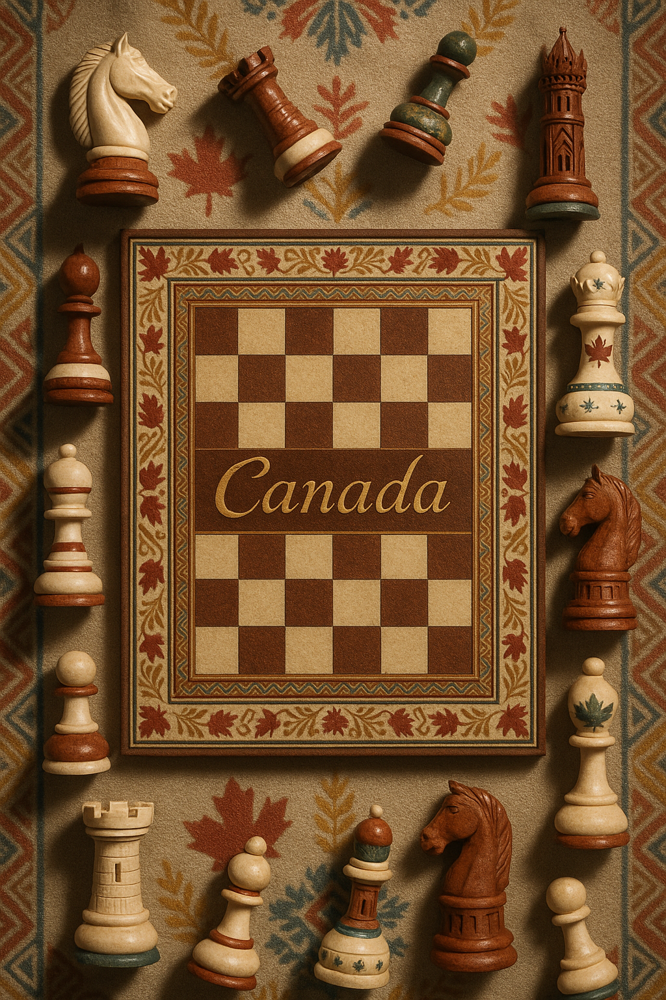
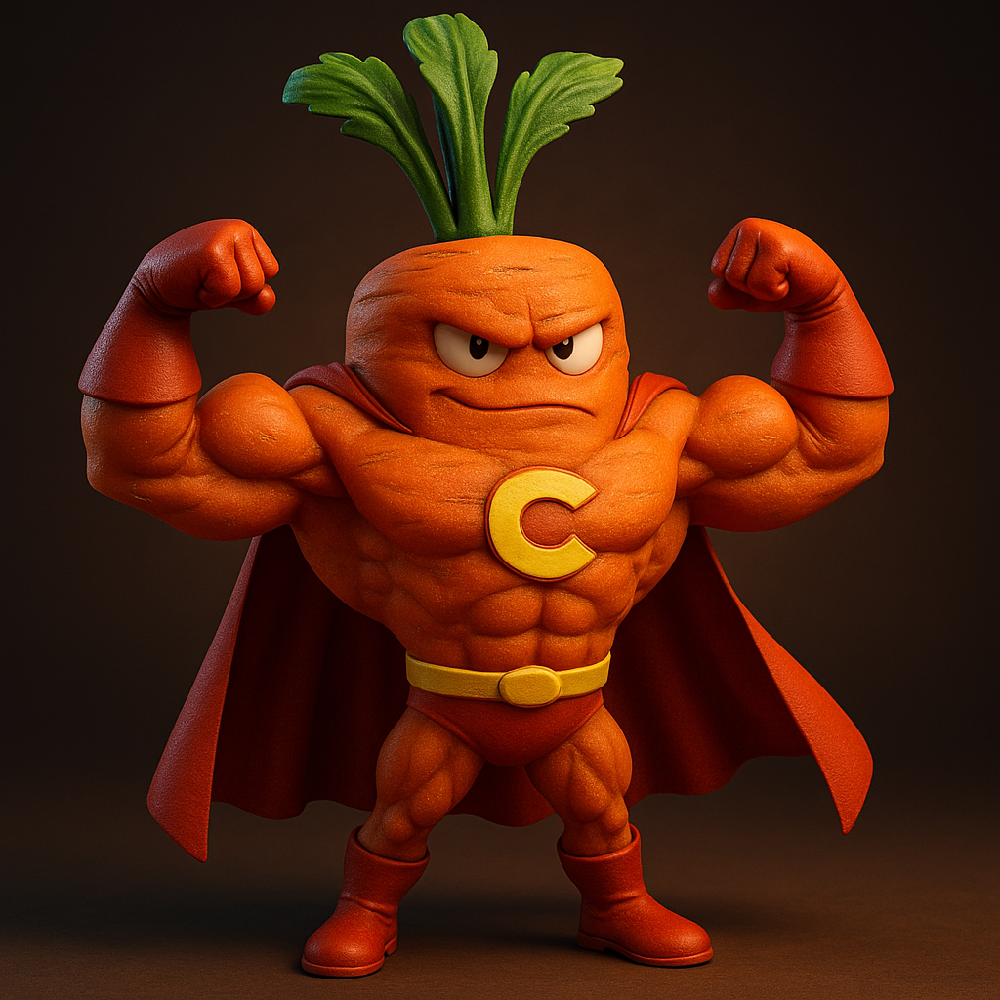
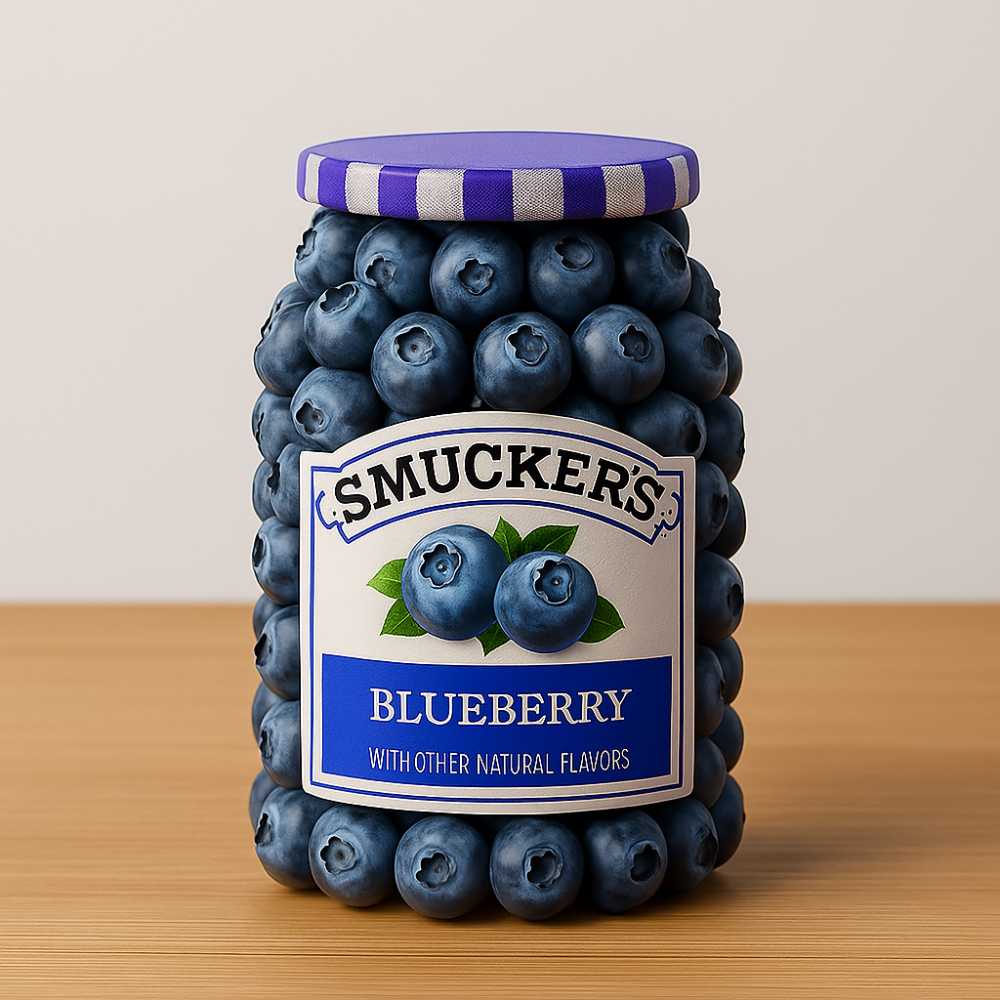
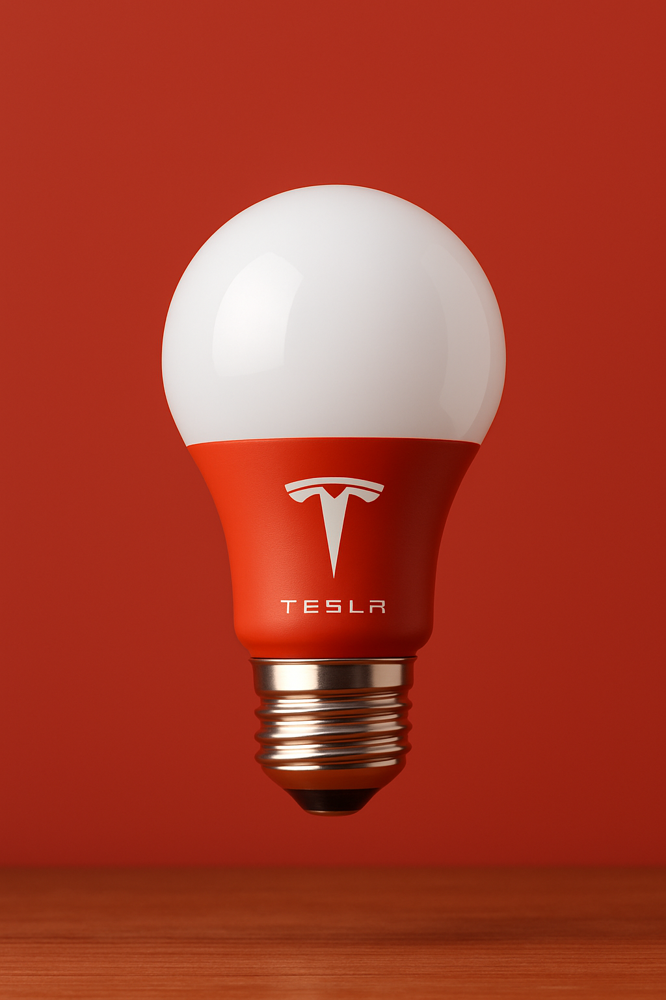
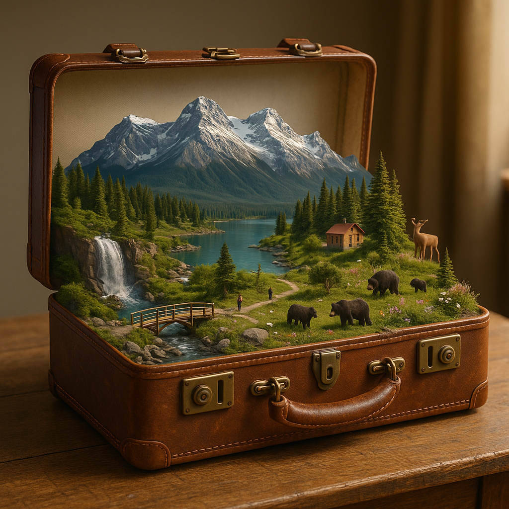
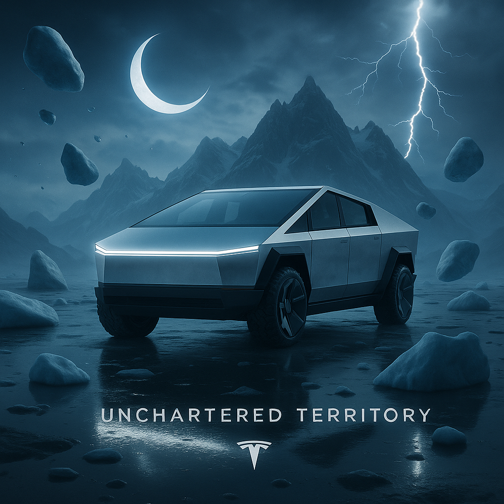
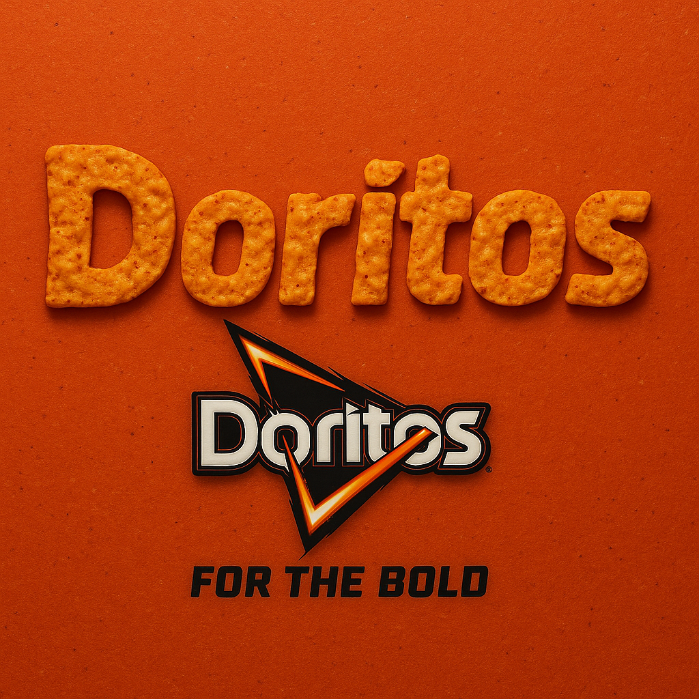
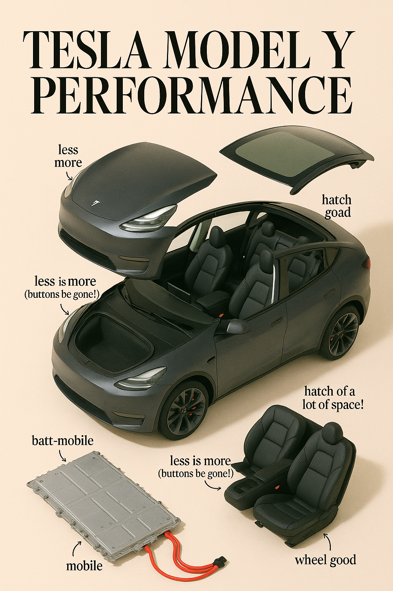

<a id="readme-top"></a>
# HighScore AI Image Gallery ✨
## GPT-4o Image Prompt Template

[](LICENSE)
[](README.md)
[](README_cn.md)
[](README_ja.md)

🎉 欢迎来到 GPT‑4o 图片精选！

这是一个精选的 GPT-4o 与 gpt-image-1 生成图像与提示词合集。借助 ChatGPT 和 Sora，全面展示 OpenAI 在 AI 图像生成方面的前沿能力，并不断探索创意表达的新可能。

案例主要来源于 Twitter/X 🐦 和 Sora 社区 🎬，希望这些案例能为您带来启发 💡，为你的灵感加速 🚀。

本作品基于 Jamez Bondos 的 [awesome-gpt4o-images](https://github.com/jamez-bondos/awesome-gpt4o-images)，© 2025 Jamez Bondos，采用 [CC BY 4.0](https://creativecommons.org/licenses/by/4.0/) 许可协议。
原始来源：https://github.com/jamez-bondos/awesome-gpt4o-images


---

<a id="table-of-contents"></a>
## 目录

- [🎨 GPT‑4o介绍](#gpt4o-intro)
- [📖 案例目录](#cases-toc)
- [🛠️ 工具介绍](#tools-intro)
- [💡 提示词技巧](#prompting-tips)
- [🤝 如何贡献](#how-to-contribute)
- [🙏 致谢](#acknowledgements)

---

<a id="gpt4o-intro"></a>
## 🎨 GPT‑4o介绍

GPT‑4o 是 OpenAI 最新的多模态大模型，既能以文本提示一键生成高质量图片，也支持图生图编辑，涵盖局部修改、风格转换及多图融合等高级操作。

- 🧠 多模态：同时解析文本、图像，精准把握创作意图
- ✍️ 精准出图：支持复杂提示词，快速生成高质量图像
- 🎨 多样风格：吉卜力、厚涂、像素、3D 毛绒等任你选
- 🖼️ 真实构图：空间、透视、光影自然可信
- ✏️ 易于再编辑：替换背景、改细节，二次创作无压力
- ⚡️ 极速交互：响应更快，适合实时创意迭代


---

<a id="cases-toc"></a>
## 📖 案例目录

*   [案例 113：Cultural Chess Board Photography](#cases-113)
*   [案例 112：Anthropomorphic Superhero Character](#cases-112)
*   [案例 111：Ingredient-Sculpted Product Photography](#cases-111)
*   [案例 110：Studio Product Photography](#cases-110)
*   [案例 109：Miniature World in Vintage Suitcase](#cases-109)
*   [案例 108：Miniature Tropical Paradise on Palm](#cases-108)
*   [案例 107：Surreal Brand Advertisement](#cases-107)
*   [案例 106：Raindrop Country Typography](#cases-106)
*   [案例 105：Brand Word Typography Design](#cases-105)
*   [案例 104：Museum Glass Cube Display](#cases-104)
*   [案例 103：Glossy Gadget Unfolded A Fashion Editorial Explosion](#cases-103)
*   [案例 102：火柴盒Superfast收藏版](#cases-102)
*   [案例 101：泡泡食物](#cases-101)
*   [案例 100：实物与手绘涂鸦创意广告](#cases-100)
*   [案例 99：黑白肖像艺术](#cases-99)
*   [案例 98：磨砂玻璃后的虚实对比剪影](#cases-98)
*   [案例 97：可爱温馨针织玩偶](#cases-97)
*   [案例 96：定制动漫手办](#cases-96)
*   [案例 95：自拍生成摇头娃娃](#cases-95)
*   [案例 94：三只动物与地标自拍](#cases-94)
*   [案例 93：玻璃质感重塑](#cases-93)
*   [案例 92：透视3D出屏效果](#cases-92)
*   [案例 91：谷歌地图变身古代藏宝图](#cases-91)
*   [案例 90：品牌化键盘键帽](#cases-90)
*   [案例 89：镀铬emoji徽章](#cases-89)
*   [案例 88：儿童涂色页插画（含彩色参考图）](#cases-88)
*   [案例 87：字母与单词含义融合](#cases-87)
*   [案例 86：双重曝光](#cases-86)
*   [案例 85：超现实交互场景](#cases-85)
*   [案例 84：动物硅胶腕托](#cases-84)
*   [案例 83：发光线条解剖图](#cases-83)
*   [案例 82：特色城市天气预报](#cases-82)
*   [案例 81：半透明玻璃质感变换](#cases-81)
*   [案例 80：代码风格名片](#cases-80)
*   [案例 79：乐高城市景观](#cases-79)
*   [案例 78：玻璃材质重塑](#cases-78)
*   [案例 77：水晶球故事场景](#cases-77)
*   [案例 76：怀旧动漫风格电影海报](#cases-76)
*   [案例 75：社交媒体相框融合](#cases-75)
*   [案例 74：Logo 形状创意书架](#cases-74)
*   [案例 73：定制Q版钥匙串](#cases-73)
*   [案例 72：金色吊坠项链](#cases-72)
*   [案例 71：迷你 Cyberpunk 傾斜移軸景觀](#cases-71)
*   [案例 70：原创宝可梦生成](#cases-70)
*   [案例 69：剪影艺术](#cases-69)
*   [案例 68：未来主义 Logo 交易卡](#cases-68)
*   [案例 67：超写实3D游戏](#cases-67)
*   [案例 66：创意丝绸宇宙](#cases-66)
*   [案例 65：奇幻水下场景冰棒](#cases-65)
*   [案例 64：蒸汽朋克机械鱼](#cases-64)
*   [案例 63：Emoji 奶油雪糕](#cases-63)
*   [案例 62：可爱珐琅别针](#cases-62)
*   [案例 61：虚构推文截图 (爱因斯坦)](#cases-61)
*   [案例 60：Emoji 簇绒地毯](#cases-60)
*   [案例 59：彩色矢量艺术海报](#cases-59)
*   [案例 58：云彩艺术](#cases-58)
*   [案例 57：8位像素图标](#cases-57)
*   [案例 56：迷你 3D 建筑](#cases-56)
*   [案例 55：创意绿植花盆](#cases-55)
*   [案例 54：“极其平凡”的iPhone自拍](#cases-54)
*   [案例 53：Emoji 充气感靠垫](#cases-53)
*   [案例 52：纸艺风格 Emoji 图标](#cases-52)
*   [案例 51：护照入境印章](#cases-51)
*   [案例 50：物理破坏效果卡片 (劳拉)](#cases-50)
*   [案例 49：时尚杂志封面风格](#cases-49)
*   [案例 48：体素风格 3D 图标转换](#cases-48)
*   [案例 47：键盘ESC 键帽微型立体模型](#cases-47)
*   [案例 45：3D Q版大学拟人化形象](#cases-45)
*   [案例 44：RPG 风格角色卡片制作](#cases-44)
*   [案例 43：Q版可爱俄罗斯套娃 (戴珍珠耳环的少女)](#cases-43)
*   [案例 42：3D Q版情侣水晶球](#cases-42)
*   [案例 41：微型立体场景 (孙悟空三打白骨精)](#cases-41)
*   [案例 39：奇幻卡通插画](#cases-39)
*   [案例 37：柔和风格3D广告](#cases-37)
*   [案例 36：极简主义 3D 插画 (Markdown 格式)](#cases-36)
*   [案例 35：毛茸茸南瓜灯](#cases-35)
*   [案例 33：全家福婚纱照](#cases-33)
*   [案例 32：折叠式纸雕立体绘本](#cases-32)
*   [案例 31：动漫贴纸集合](#cases-31)
*   [案例 30：35mm 胶片风格飞岛](#cases-30)
*   [案例 29：名画人物 OOTD](#cases-29)
*   [案例 28：扁平贴纸设计](#cases-28)
*   [案例 27：Q 版表情包制作](#cases-27)
*   [案例 26：名画人物麦片广告](#cases-26)
*   [案例 25：极简主义 3D 插画](#cases-25)
*   [案例 24：Funko Pop 公仔制作](#cases-24)
*   [案例 23：《泰坦尼克号》模仿](#cases-23)
*   [案例 21：Q版角色表情包](#cases-21)
*   [案例 20：手办与真人同框](#cases-20)
*   [案例 19：玩具盒中的国家立体模型](#cases-19)
*   [案例 18：皮克斯3D风格](#cases-18)
*   [案例 17：复古CRT电脑启动屏幕](#cases-17)
*   [案例 16：二次元风格徽章](#cases-16)
*   [案例 14：《海贼王》主题手办制作](#cases-14)
*   [案例 13：3D Q版风格](#cases-13)
*   [案例 12：3D 情侣珠宝盒摆件](#cases-12)
*   [案例 11：PS2 游戏封面 (GTA x Shrek)](#cases-11)
*   [案例 10：讽刺漫画生成](#cases-10)
*   [案例 9：极简未来主义海报](#cases-9)
*   [案例 8：乐高收藏品](#cases-8)
*   [案例 7：个性化房间设计](#cases-7)
*   [案例 6：角色穿越传送门](#cases-6)
*   [案例 5：吉卜力风格](#cases-5)
*   [案例 4：3D Q版中式婚礼图](#cases-4)
*   [案例 2：3D Q版人物立体相框](#cases-2)
*   [案例 1：Q版求婚场景](#cases-1)

---

<a id="cases"></a>
## 🧩 案例

<a id="cases-113"></a>
### 案例 113：Cultural Chess Board Photography 

[原文链接](https://x.com/TheRelianceAI/status/1937064180017971501)

<br>
<sub>Image © 2025 <a href="https://github.com/highscore-ai">@highscore-ai</a>, <a href="https://creativecommons.org/licenses/by/4.0/">CC BY 4.0</a> • Prompt by <a href="https://x.com/TheRelianceAI">@TheRelianceAI</a></sub>

**提示词**

```
A highly realistic vertical photograph of a traditional chessboard viewed from above, set against a textured surface inspired by [COUNTRY]'s artistic heritage. The chessboard features intricate patterns and national motifs, with the word "[COUNTRY]" written across the board in elegant golden calligraphy. All the chess pieces are off the board, arranged around it on the fabric — some lying on their side, others upright — as if waiting to be placed. Each piece is uniquely reimagined in shape, ornament, and texture, reflecting the architecture, cultural symbols, and color palette of [COUNTRY]. Rich materials, soft directional light, cinematic shadows, ultra-detailed editorial still life style, symmetrical top-down framing, 9:16 format.
```


---

[⬆️ 返回案例目录](#cases-toc)
<a id="cases-112"></a>
### 案例 112：Anthropomorphic Superhero Character 

[原文链接](https://x.com/Kerroudjm/status/1937253913305948321)

<br>
<sub>Image © 2025 <a href="https://github.com/highscore-ai">@highscore-ai</a>, <a href="https://creativecommons.org/licenses/by/4.0/">CC BY 4.0</a> • Prompt by <a href="https://x.com/Kerroudjm">@Kerroudjm</a></sub>

**提示词**

```
Create a high-quality 3D-rendered digital illustration of an anthropomorphic [OBJECT/FOOD/ANIMAL] transformed into a muscular superhero. Use the shape, texture, and colors of the object as the foundation for its design, costume, and personality. The superhero is posing with both arms bent, flexing its biceps to show strength. Its gloves, boots, and cape should follow the same color palette as the object. The lighting should be dramatic and studio-style, with a gradient background that complements the object's natural tones. The result should be fun, bold, detailed, and in 1:1 format.
```


---

[⬆️ 返回案例目录](#cases-toc)
<a id="cases-111"></a>
### 案例 111：Ingredient-Sculpted Product Photography 

[原文链接](https://x.com/azed_ai/status/1934250327693476182)

<br>
<sub>Image © 2025 <a href="https://github.com/highscore-ai">@highscore-ai</a>, <a href="https://creativecommons.org/licenses/by/4.0/">CC BY 4.0</a> • Prompt by <a href="https://x.com/azed_ai">@azed_ai</a></sub>

**提示词**

```
A realistic product photo of a [brand name] [bottle or jar] sculpted entirely from fresh [ingredient name], arranged perfectly to form the shape of the original packaging, including a detailed and accurate label on the front. The background is a clean, soft light gray with a natural wooden surface. Studio lighting, soft shadows, 1:1 square composition, professional product photography style, ultra-detailed textures, vibrant and glossy finish
```


---

[⬆️ 返回案例目录](#cases-toc)
<a id="cases-110"></a>
### 案例 110：Studio Product Photography 

[原文链接](https://x.com/azed_ai/status/1934631664153760241)

<br>
<sub>Image © 2025 <a href="https://github.com/highscore-ai">@highscore-ai</a>, <a href="https://creativecommons.org/licenses/by/4.0/">CC BY 4.0</a> • Prompt by <a href="https://x.com/azed_ai">@azed_ai</a></sub>

**提示词**

```
A high-quality studio product photo of a [brand name]-branded [product type], [floating / standing] against a solid background in the brand's signature color. The product features the brand logo prominently and uses the official brand color palette. Clean composition, soft shadows, ultra-realistic materials and textures, no text, no props, professional commercial lighting, sharp focus, minimalist aesthetic.
```


---

[⬆️ 返回案例目录](#cases-toc)
<a id="cases-109"></a>
### 案例 109：Miniature World in Vintage Suitcase 

[原文链接](https://x.com/TheRelianceAI/status/1935018868214227039)

<br>
<sub>Image © 2025 <a href="https://github.com/highscore-ai">@highscore-ai</a>, <a href="https://creativecommons.org/licenses/by/4.0/">CC BY 4.0</a> • Prompt by <a href="https://x.com/TheRelianceAI">@TheRelianceAI</a></sub>

**提示词**

```
A highly detailed miniature world representing [COUNTRY] inside an open vintage leather suitcase. The landscape overflows from the case — with iconic landmarks, native plants and animals, and small scenes of everyday life. The suitcase is placed on a wooden table, lit by warm natural light, blending magic and realism. ar 1:1
```


---

[⬆️ 返回案例目录](#cases-toc)
<a id="cases-108"></a>
### 案例 108：Miniature Tropical Paradise on Palm 

[原文链接](https://x.com/ValMotionAi/status/1935321700335247391)

<br>
<sub>Image © 2025 <a href="https://github.com/highscore-ai">@highscore-ai</a>, <a href="https://creativecommons.org/licenses/by/4.0/">CC BY 4.0</a> • Prompt by <a href="https://x.com/ValMotionAi">@ValMotionAi</a></sub>

**提示词**

```
A surreal miniature tropical paradise carved on top a palm , hyper-realistic style. The beach is on top the palm, complete with tiny people, palm trees, umbrellas, boats, and clear blue water. The water looks real and reflective, with tiny waves and floating beach toys. Lush greenery and natural textures blend seamlessly with the fruit's surface. Soft sunlight and a dreamy depth-of-field effect create a magical, vacation-like atmosphere ultra-detailed, macro photography style, whimsical and imaginative. 9:16
```


---

[⬆️ 返回案例目录](#cases-toc)
<a id="cases-107"></a>
### 案例 107：Surreal Brand Advertisement 

[原文链接](https://x.com/aziz4ai/status/1932718194403246588)

<br>
<sub>Image © 2025 <a href="https://github.com/highscore-ai">@highscore-ai</a>, <a href="https://creativecommons.org/licenses/by/4.0/">CC BY 4.0</a> • Prompt by <a href="https://x.com/aziz4ai">@aziz4ai</a></sub>

**提示词**

```
Create a surreal, cinematic advertisement for [brand name], captured with ultra-realistic DSLR photography. Depict the product or logo at the emotional core of the scene — surrounded by symbolic visual metaphors inspired by the brand's essence. Use imaginative landscapes, abstract dreamlike elements, or raw nature to convey a deeper story. Lighting should be crisp and cool-toned (high Kelvin, ~7500K) to ensure clean white balance and avoid yellow hues. Textures must be hyper-real and detailed, with subtle depth of field and natural HDR contrast. Overlay a short, poetic slogan (max 6 words) that speaks to the heart of the brand — without repeating the brand name. Style: surreal realism, DSLR-grade composition, cinematic elegance. Aspect ratio: 1:1. Visually unforgettable.
```


---

[⬆️ 返回案例目录](#cases-toc)
<a id="cases-106"></a>
### 案例 106：Raindrop Country Typography 

[原文链接](https://x.com/TheRelianceAI/status/1935637141444329685)

<br>
<sub>Image © 2025 <a href="https://github.com/highscore-ai">@highscore-ai</a>, <a href="https://creativecommons.org/licenses/by/4.0/">CC BY 4.0</a> • Prompt by <a href="https://x.com/TheRelianceAI">@TheRelianceAI</a></sub>

**提示词**

```
Raindrops on a glass window forming the word '[COUNTRY]'. In the largest central droplet, a miniature landscape representing [COUNTRY], filled with iconic scenery and atmospheric detail. The background is softly blurred, with magical lighting and a poetic, dreamlike mood.
```


---

[⬆️ 返回案例目录](#cases-toc)
<a id="cases-105"></a>
### 案例 105：Brand Word Typography Design 

[原文链接](https://x.com/aziz4ai/status/1935749368876867967)

<br>
<sub>Image © 2025 <a href="https://github.com/highscore-ai">@highscore-ai</a>, <a href="https://creativecommons.org/licenses/by/4.0/">CC BY 4.0</a> • Prompt by <a href="https://x.com/aziz4ai">@aziz4ai</a></sub>

**提示词**

```
Create the word [] made entirely from its real texture and styled using the identity of the most iconic brand associated with it. The word should: • Visually reflect the material (e.g. honey, chocolate, soda, candy). • Use the brand's signature colors and typography. • Include the brand logo beneath the word. • Add a short slogan (3–4 words) matching the product's vibe. • Be centered in a minimal background inspired by the product (e.g. breakfast table, soda splash, cookie tray). • Dimensions: 1:1 • Style: clean, bold, product-focused • Render: ultra-HD, HDR, 8K
```


---

[⬆️ 返回案例目录](#cases-toc)
<a id="cases-104"></a>
### 案例 104：Museum Glass Cube Display 

[原文链接](https://x.com/Kerroudjm/status/1935772501264543779)

<br>
<sub>Image © 2025 <a href="https://github.com/highscore-ai">@highscore-ai</a>, <a href="https://creativecommons.org/licenses/by/4.0/">CC BY 4.0</a> • Prompt by <a href="https://x.com/Kerroudjm">@Kerroudjm</a></sub>

**提示词**

```
A 1:1 ultra-realistic photo of a calm museum room with classical paintings on the walls. At the center, a transparent glass cube on a dark pedestal contains a miniature scene of [INSERT SUBJECT HERE], sculpted in photorealistic detail and lit from above. The contents push against the cube's edges as if frozen in motion. Three visitors observe: a woman on the right seen from behind (beige sweater, jeans, shoulder bag), a man on the left in 3/4 profile (dark denim shirt), and a third person blurred in the center background. Warm lighting, wooden floors, and soft focus complete the atmosphere.
```


---

[⬆️ 返回案例目录](#cases-toc)
<a id="cases-103"></a>
### 案例 103：Glossy Gadget Unfolded A Fashion Editorial Explosion 

[原文链接](https://x.com/Gdgtify/status/1936014835025613059)

<br>
<sub>Image © 2025 <a href="https://github.com/highscore-ai">@highscore-ai</a>, <a href="https://creativecommons.org/licenses/by/4.0/">CC BY 4.0</a> • Prompt by <a href="https://x.com/Gdgtify">@Gdgtify</a></sub>

**提示词**

```
A flattened diagram of a [Gadget] laid out like a fashion magazine editorial: glossy paper aesthetic, styled poses of the product in exploded view, annotated with clever, cheeky captions in a modern font. Pastel background, bold composition, don't repeat text.
```


---

[⬆️ 返回案例目录](#cases-toc)
<a id="cases-102"></a>
### 案例 102：火柴盒Superfast收藏版 

[原文链接](https://x.com/TraffAlex/status/1935451423803851187)

<br>
<sub>Image © 2025 <a href="https://github.com/highscore-ai">@highscore-ai</a>, <a href="https://creativecommons.org/licenses/by/4.0/">CC BY 4.0</a> • Prompt by <a href="https://x.com/TraffAlex">@TraffAlex</a></sub>

**提示词**

```
产品摄影，2024款特斯拉Model Y高性能版合金车模，复古1970年代风格火柴盒Superfast吸塑包装。亮黑色车漆，黑色性能轮毂，红色刹车卡钳，包装卡片采用复古插画风格，描绘山路与速度线条。工作室灯光，白色背景，充满怀旧收藏氛围。
```


---

[⬆️ 返回案例目录](#cases-toc)
<a id="cases-101"></a>
### 案例 101：泡泡食物 

[原文链接](https://x.com/aziz4ai/status/1934986353848017349)

<br>
<sub>Image © 2025 <a href="https://github.com/highscore-ai">@highscore-ai</a>, <a href="https://creativecommons.org/licenses/by/4.0/">CC BY 4.0</a> • Prompt by <a href="https://x.com/aziz4ai/">@aziz4ai</a></sub>

**提示词**

```
一张超逼真的DSLR相机拍摄照片，展示出\[品牌/产品]——多汁、酥脆、令人垂涎。由一只可爱的Q版卡通小手拿着，正准备咬上一口。背景为平面2D插画，采用柔和的马卡龙色调，看起来像能吃的一样，灵感来自其视觉识别风格——带有超现实、可爱风格的矢量元素，如糖屑、星星、柔和渐变和俏皮图形。加入一个醒目的口号，仅用**一个有力的单词**来形容口味（如“酥”、“化”、“赞”）。在食物上或口号旁边清晰展示品牌Logo。构图为居中、1:1方形比例，电影感柔光，真实食物与扁平插画背景形成强烈对比，4K分辨率。
```


**需上传参考图片：** A brand/product photo.


---

[⬆️ 返回案例目录](#cases-toc)
<a id="cases-100"></a>
### 案例 100：实物与手绘涂鸦创意广告 

[原文链接](https://x.com/azed_ai/status/1923016036120658122)

<br>
<sub>Image © 2025 <a href="https://github.com/jamez-bondos">@jamez-bondos</a>, <a href="https://creativecommons.org/licenses/by/4.0/">CC BY 4.0</a> • Prompt by <a href="https://x.com/azed_ai">@azed_ai</a></sub>

**提示词**

```
一则简约且富有创意的广告，设置在纯白背景上。
一个真实的 [真实物体] 与手绘黑色墨水涂鸦相结合，线条松散而俏皮。涂鸦描绘了：[涂鸦概念及交互：以巧妙、富有想象力的方式与物体互动]。在顶部或中部加入粗体黑色 [广告文案] 文字。在底部清晰放置 [品牌标志]。视觉效果应简洁、有趣、高对比度且构思巧妙。
```

*注意： 请将提示词中的 [真实物体]、[涂鸦概念及交互]、[广告文案] 和 [品牌标志] 替换为具体内容。
例如：
[真实物体]：咖啡豆
[涂鸦概念及交互]：巨型咖啡豆变成一个太空行星，一个小宇航员站在其表面上，并插上旗帜
[广告文案]：“Explore Bold Flavor”
[品牌标志]：星巴克 Logo*


---

[⬆️ 返回案例目录](#cases-toc)
<a id="cases-99"></a>
### 案例 99：黑白肖像艺术 

[原文链接](https://x.com/ZHO_ZHO_ZHO/status/1922150692145283299)

<br>
<sub>Image © 2025 <a href="https://github.com/jamez-bondos">@jamez-bondos</a>, <a href="https://creativecommons.org/licenses/by/4.0/">CC BY 4.0</a> • Prompt by <a href="https://x.com/ZHO_ZHO_ZHO">@ZHO_ZHO_ZHO</a></sub>

**提示词**

```
高分辨率的黑白肖像艺术作品，采用编辑类和艺术摄影风格。背景呈现柔和渐变效果，从中灰过渡到近乎纯白，营造出层次感与寂静氛围。细腻的胶片颗粒质感为画面增添了一种可触摸的、模拟摄影般的柔和质地，让人联想到经典的黑白摄影。

画面右侧，一个模糊却惊艳的哈利波特面容从阴影中隐约浮现，并非传统的摆拍，而像是被捕捉于思索或呼吸之间的瞬间。他的脸部只露出一部分：也许是一个眼睛、一块颧骨，还有唇角的轮廓，唤起神秘、亲密与优雅之感。他的五官精致而深刻，散发出忧郁与诗意之美，却不显矫饰。

一束温柔的定向光，柔和地漫射开来，轻抚他的面颊曲线，或在眼中闪现光点——这是画面的情感核心。其余部分以大量负空间占据，刻意保持简洁，使画面自由呼吸。画面中没有文字、没有标志——只有光影与情绪交织。

整体氛围抽象却深具人性，仿佛一瞥即逝的目光，或半梦半醒间的记忆：亲密、永恒、令人怅然的美。
```


---

[⬆️ 返回案例目录](#cases-toc)
<a id="cases-98"></a>
### 案例 98：磨砂玻璃后的虚实对比剪影 

[原文链接](https://x.com/umesh_ai/status/1921487841634156999)

<br>
<sub>Image © 2025 <a href="https://github.com/jamez-bondos">@jamez-bondos</a>, <a href="https://creativecommons.org/licenses/by/4.0/">CC BY 4.0</a> • Prompt by <a href="https://x.com/umesh_ai">@umesh_ai</a></sub>

**提示词**

```
一张黑白照片，展示了一个[主体]在磨砂或半透明表面后的模糊剪影。其[部分]轮廓清晰，紧贴表面，与其余朦胧、模糊的身影形成鲜明对比。背景是柔和的灰色渐变色调，增强了神秘和艺术的氛围。
```

*注意： 请在 [主体] 和 [部分] 中填入具体且富有画面感的描述，突出“模糊主体 + 清晰局部”的反差效果。
例如：[主体] 可写为“手持红色光剑的西斯领主”，[部分] 可写为“另一只聚集暗黑原力的手”。*


---

[⬆️ 返回案例目录](#cases-toc)
<a id="cases-97"></a>
### 案例 97：可爱温馨针织玩偶 

[原文链接](https://x.com/ZHO_ZHO_ZHO/status/1921148024861938077)

<br>
<sub>Image © 2025 <a href="https://github.com/jamez-bondos">@jamez-bondos</a>, <a href="https://creativecommons.org/licenses/by/4.0/">CC BY 4.0</a> • Prompt by <a href="https://x.com/ZHO_ZHO_ZHO">@ZHO_ZHO_ZHO</a></sub>

**提示词**

```
一张特写、构图专业的照片，展示一个手工钩织的毛线玩偶被双手轻柔地托着。玩偶造型圆润，【上传图片】人物得可爱Q版形象，色彩对比鲜明，细节丰富。持玩偶的双手自然、温柔，手指姿态清晰可见，皮肤质感与光影过渡自然，展现出温暖且真实的触感。背景轻微虚化，表现为室内环境，有温暖的木质桌面和从窗户洒入的自然光，营造出舒适、亲密的氛围。整体画面传达出精湛的工艺感与被珍视的温馨情绪。
```


**需上传参考图片：** 上传一张照片作为参考，生成其可爱Q版针织玩偶形象。


---

[⬆️ 返回案例目录](#cases-toc)
<a id="cases-96"></a>
### 案例 96：定制动漫手办 

[原文链接](https://x.com/dotey/status/1920851135516082246)

<br>
<sub>Image © 2025 <a href="https://github.com/jamez-bondos">@jamez-bondos</a>, <a href="https://creativecommons.org/licenses/by/4.0/">CC BY 4.0</a> • Prompt by <a href="https://x.com/dotey">@dotey</a></sub>

**提示词**

```
生成一张摆放于桌面上的动漫风格手办照片，以日常随手用手机拍摄的轻松休闲视角呈现。手办模型以附件中人物照片为基础，精确还原照片中人物的全身姿势、面部表情以及服装造型，确保手办全身完整呈现。整体设计精致细腻，头发与服饰采用自然柔和的渐变色彩与细腻质感，风格偏向日系动漫风，细节丰富，质感真实，观感精美。
```


**需上传参考图片：** 请上传一张包含人物全身姿势、面部表情及服装造型的照片，用于生成手办模型。


---

[⬆️ 返回案例目录](#cases-toc)
<a id="cases-95"></a>
### 案例 95：自拍生成摇头娃娃 

[原文链接](https://x.com/thisdudelikesAI/status/1920433372243136730)

<br>
<sub>Image © 2025 <a href="https://github.com/jamez-bondos">@jamez-bondos</a>, <a href="https://creativecommons.org/licenses/by/4.0/">CC BY 4.0</a> • Prompt by <a href="https://x.com/thisdudelikesAI">@thisdudelikesAI</a></sub>

**提示词**

```
将这张照片变成一个摇头娃娃：头部稍微放大，保持面部准确，身体卡通化。[把它放在书架上]。
```

*注意： 请将提示词中的[把它放在书架上]替换为您想要的特定场景或背景，例如“把它放在书架上”或“把它放在办公桌上”，或“把它放在中性背景上”，或“生成透明背景”。*

**需上传参考图片：** 需要上传一张自拍照作为生成摇头娃娃的基础。


---

[⬆️ 返回案例目录](#cases-toc)
<a id="cases-94"></a>
### 案例 94：三只动物与地标自拍 

[原文链接](https://x.com/berryxia_ai/status/1920795648946782583)

<br>
<sub>Image © 2025 <a href="https://github.com/jamez-bondos">@jamez-bondos</a>, <a href="https://creativecommons.org/licenses/by/4.0/">CC BY 4.0</a> • Prompt by <a href="https://x.com/berryxia_ai">@berryxia_ai</a></sub>

**提示词**

```
三只[动物类型]在标志性[地标]前的特写自拍照，它们表情各异，拍摄于黄金时刻，采用电影般的灯光。动物们靠近镜头，头挨着头，模仿自拍姿势，展现出喜悦、惊讶和平静的表情。背景展示了[地标]完整的建筑细节，光线柔和，氛围温暖。采用摄影感、写实卡通风格拍摄，高细节，1:1 宽高比。
```

*注意： 可替换提示词中的 [动物类型] 和 [地标] 为具体描述。*


---

[⬆️ 返回案例目录](#cases-toc)
<a id="cases-93"></a>
### 案例 93：玻璃质感重塑 

[原文链接](https://x.com/egeberkina/status/1920448389960909085)

<br>
<sub>Image © 2025 <a href="https://github.com/jamez-bondos">@jamez-bondos</a>, <a href="https://creativecommons.org/licenses/by/4.0/">CC BY 4.0</a> • Prompt by <a href="https://x.com/egeberkina">@egeberkina</a></sub>

**提示词**

```
对参考图片进行重新纹理化，基于下方的 JSON 美学定义
{
  "style": "photorealistic 3D render",
  "material": "glass with transparent and iridescent effects",
  "surface_texture": "smooth, polished with subtle reflections and refractive effects",
  "lighting": {
    "type": "studio HDRI",
    "intensity": "high",
    "direction": "angled top-left key light and ambient fill",
    "accent_colors": ["blue", "green", "purple"],
    "reflections": true,
    "refractions": true,
    "dispersion_effects": true,
    "bloom": true
  },
  "color_scheme": {
    "primary": "transparent with iridescent blue, green, and purple hues",
    "secondary": "crystal-clear with subtle chromatic shifts",
    "highlights": "soft, glowing accents reflecting rainbow-like effects",
    "rim_light": "soft reflective light around edges"
  },
  "background": {
    "color": "black",
    "vignette": true,
    "texture": "none"
  },
  "post_processing": {
    "chromatic_aberration": true,
    "glow": true,
    "high_contrast": true,
    "sharp_details": true
  }
}
```

*注意： 本提示词请使用 GPT-4o 生成图片；使用Sora可能无法生成正确的风格。*

**需上传参考图片：** 需要上传一张图像作为重新纹理化的基础。


---

[⬆️ 返回案例目录](#cases-toc)
<a id="cases-92"></a>
### 案例 92：透视3D出屏效果 

[原文链接](https://x.com/ZHO_ZHO_ZHO/status/1920355982703509588)

<br>
<sub>Image © 2025 <a href="https://github.com/jamez-bondos">@jamez-bondos</a>, <a href="https://creativecommons.org/licenses/by/4.0/">CC BY 4.0</a> • Prompt by <a href="https://x.com/ZHO_ZHO_ZHO">@ZHO_ZHO_ZHO</a></sub>

**提示词**

```
超写实，从上往下俯视角拍摄，一个美丽的ins模特【安妮海瑟薇 / 见参考图片】，有着精致美丽的妆容和时尚的造型，站在一部被人托起的智能手机屏幕上，画面营造出强烈的透视错觉。强调女孩从手机中站出来的三维效果。她戴着黑框眼镜，穿着高街风，俏皮地摆着可爱的pose。手机屏幕被处理成深色地板，像是一个小舞台。场景使用强烈的强制透视（forced perspective）表现手掌、手机与女孩之间的比例差异。背景为干净的灰色，使用柔和室内光，浅景深，整体风格为超现实写实合成。透视特别强
```

*注意： 可将提示词中的【安妮海瑟薇】替换为其他人物名称。或者使用一张人物照片作为参考图片。*

**需上传参考图片：** 可使用一张人物照片作为参考图片。本示例的参考图片是[《戴珍珠耳环的少女》](https://commons.wikimedia.org/w/index.php?curid=55017931)。


---

[⬆️ 返回案例目录](#cases-toc)
<a id="cases-91"></a>
### 案例 91：谷歌地图变身古代藏宝图 

[原文链接](https://x.com/umesh_ai/status/1919701229363466328)

<br>
<sub>Image © 2025 <a href="https://github.com/jamez-bondos">@jamez-bondos</a>, <a href="https://creativecommons.org/licenses/by/4.0/">CC BY 4.0</a> • Prompt by <a href="https://x.com/umesh_ai">@umesh_ai</a></sub>

**提示词**

```
将图像转换为绘制在古老羊皮纸上的古代藏宝图。地图包含详细的元素，如海洋上的帆船、海岸线上的古老港口或城堡、通向标记宝藏地点的大“X”的虚线路径、山脉、棕榈树和装饰性的罗盘玫瑰。整体风格让人联想到旧时的海盗冒险电影。
```


**需上传参考图片：** 需要上传一张谷歌地图截图或其他地图图片作为转换的基础。


---

[⬆️ 返回案例目录](#cases-toc)
<a id="cases-90"></a>
### 案例 90：品牌化键盘键帽 

[原文链接](https://x.com/egeberkina/status/1918291652210311278)

<br>
<sub>Image © 2025 <a href="https://github.com/jamez-bondos">@jamez-bondos</a>, <a href="https://creativecommons.org/licenses/by/4.0/">CC BY 4.0</a> • Prompt by <a href="https://x.com/egeberkina">@egeberkina</a></sub>

**提示词**

```
一个超逼真的3D渲染图，展示了四个机械键盘键帽，排列成紧密的2x2网格，所有键帽相互接触。从等轴测角度观察。一个键帽是透明的，上面用红色印刷着“{just}”字样。另外三个键帽采用颜色：{黑色、紫色和白色}。一个键帽上带有Github的Logo。另外两个键帽上分别写着“{fork}”和“{it}”。逼真的塑料纹理，圆润的雕刻键帽，柔和的阴影，干净的浅灰色背景。
```

*注意： 替换品牌名、标语、键帽颜色*


---

[⬆️ 返回案例目录](#cases-toc)
<a id="cases-89"></a>
### 案例 89：镀铬emoji徽章 

[原文链接](https://x.com/egeberkina/status/1919398870867440124)

<br>
<sub>Image © 2025 <a href="https://github.com/jamez-bondos">@jamez-bondos</a>, <a href="https://creativecommons.org/licenses/by/4.0/">CC BY 4.0</a> • Prompt by <a href="https://x.com/egeberkina">@egeberkina</a></sub>

**提示词**

```
高精度的 3D 渲染图，按照 emoji 图标 {👍} 展示一个金属质感的徽章，固定在竖直的商品卡片上，具有超光滑的镀铬质感和圆润的 3D 图标造型，风格化的未来主义设计，带有柔和的反光与干净的阴影。纸质卡片顶部中央带有一个冲切的欧式挂孔，徽章上方是醒目的标题 “{Awesome}”，下方配有趣味标语 “{Smash that ⭐ if you like it!}”。背景为柔和的灰色，使用柔光摄影棚灯光，整体风格极简。
```

*注意： 替换 {👍} emoji 图标；替换标题和标语。*


---

[⬆️ 返回案例目录](#cases-toc)
<a id="cases-88"></a>
### 案例 88：儿童涂色页插画（含彩色参考图） 

[原文链接](https://x.com/dotey/status/1919522110395080838)

<br>
<sub>Image © 2025 <a href="https://github.com/jamez-bondos">@jamez-bondos</a>, <a href="https://creativecommons.org/licenses/by/4.0/">CC BY 4.0</a> • Prompt by <a href="https://x.com/dotey">@dotey</a></sub>

**提示词**

```
一张黑白线描涂色插画，适合直接打印在标准尺寸（8.5x11英寸）的纸张上，无纸张边框。整体插画风格清新简洁，使用清晰流畅的黑色轮廓线条，无阴影、无灰阶、无颜色填充，背景纯白，便于涂色。
【同时为了方便不会涂色的用户，请在右下角用小图生成一个完整的彩色版本供参考】
适合人群：【6-9岁小朋友】
画面描述：
【一只独角兽在森林的草地上漫步，阳光明媚，蓝天白云】
```

*注意： 可替换提示词中的【】内容，例如适合人群和画面描述。*


---

[⬆️ 返回案例目录](#cases-toc)
<a id="cases-87"></a>
### 案例 87：字母与单词含义融合 

[原文链接](https://x.com/dotey/status/1918529055340576812)

<br>
<sub>Image © 2025 <a href="https://github.com/jamez-bondos">@jamez-bondos</a>, <a href="https://creativecommons.org/licenses/by/4.0/">CC BY 4.0</a> • Prompt by <a href="https://x.com/dotey">@dotey</a></sub>

**提示词**

```
在字母中融入单词的含义，将图形和字母巧妙融合在一起。
单词：{ beautify }
下面加上单词的简要说明
```

*注意： 替换单词{ beautify }为想要融合的单词*


---

[⬆️ 返回案例目录](#cases-toc)
<a id="cases-86"></a>
### 案例 86：双重曝光 

[原文链接](https://sora.com/g/gen_01jtc9btfzef080z31v8w9rtbw)

<br>
<sub>Image © 2025 <a href="https://github.com/jamez-bondos">@jamez-bondos</a>, <a href="https://creativecommons.org/licenses/by/4.0/">CC BY 4.0</a> • Prompt by <a href="https://sora.com/explore?user=rezzycheck">rezzycheck (Sora)</a></sub>

**提示词**

```
双重曝光，Midjourney 风格，融合、混合、叠加的双重曝光图像，双重曝光风格。一幅由 Yukisakura 创作的杰出杰作，展现了一个奇妙的双重曝光构图，将阿拉贡·阿拉松之子的剪影与生机勃勃春季里中土世界视觉上引人注目、崎岖的地貌和谐地交织在一起。沐浴阳光的松树林、山峰和一匹孤独的马穿过小径的景象从他身形的纹理中向外回响，增添了叙事和孤独的层次感。当简洁分明的单色背景保持着锐利的对比度时，美妙的张力逐渐形成，将所有焦点吸引到层次丰富的双重曝光上。其特点是阿拉贡剪影内部充满活力的全彩色方案，以及用情感的精确性描摹每个轮廓的清晰、刻意的线条。(Detailed:1.45). (Detailed background:1.4).
```

*注意： 中文提示词由英文原文翻译而来，基本能达到预期效果，不过使用英文提示词可能会获得更好的结果。*


---

[⬆️ 返回案例目录](#cases-toc)
<a id="cases-85"></a>
### 案例 85：超现实交互场景 

[原文链接](https://x.com/umesh_ai/status/1917444534239191544)

<br>
<sub>Image © 2025 <a href="https://github.com/jamez-bondos">@jamez-bondos</a>, <a href="https://creativecommons.org/licenses/by/4.0/">CC BY 4.0</a> • Prompt by <a href="https://x.com/umesh_ai">@umesh_ai</a></sub>

**提示词**

```
一幅铅笔素描画，描绘了 [Subject 1] 与 [Subject 2] 互动的场景，其中 [Subject 2] 以逼真的全彩风格呈现，与 [Subject 1] 及背景的手绘素描风格形成超现实的对比。
```

*注意： 替换提示词中的[主体1]和[主体2]为具体的主体描述，例如"一个女孩"和"一朵玫瑰"。*


---

[⬆️ 返回案例目录](#cases-toc)
<a id="cases-84"></a>
### 案例 84：动物硅胶腕托 

[原文链接](https://x.com/ZHO_ZHO_ZHO/status/1918525296577327574)

<br>
<sub>Image © 2025 <a href="https://github.com/jamez-bondos">@jamez-bondos</a>, <a href="https://creativecommons.org/licenses/by/4.0/">CC BY 4.0</a> • Prompt by <a href="https://x.com/ZHO_ZHO_ZHO">@ZHO_ZHO_ZHO</a></sub>

**提示词**

```
创建图片 一个可爱Q版的硅胶护腕托，外形基于【🐼】表情，采用柔软的食品级硅胶材质，表面为亲肤哑光质感，内部填充慢回弹棉，拟人化卡通风格，表情生动，双手张开趴在桌面上，呈现出拥抱手腕的姿势，整体造型圆润软萌，颜色为【🐼】配色，风格治愈可爱，适合办公使用，背景为白色纯色，柔和布光，产品摄影风格，前视角或45度俯视，高清细节，突出硅胶质感与舒适功能
```

*注意： 可替换提示词中的【🐼】为其他动物 Emoji。*


---

[⬆️ 返回案例目录](#cases-toc)
<a id="cases-83"></a>
### 案例 83：发光线条解剖图 

[原文链接](https://x.com/umesh_ai/status/1914644426334314545)

<br>
<sub>Image © 2025 <a href="https://github.com/jamez-bondos">@jamez-bondos</a>, <a href="https://creativecommons.org/licenses/by/4.0/">CC BY 4.0</a> • Prompt by <a href="https://x.com/umesh_ai">@umesh_ai</a></sub>

**提示词**

```
一幅数字插画，描绘了一个 [SUBJECT]，其结构由一组发光、干净且纯净的蓝色线条勾勒而成。画面设定在深色背景之上，以突出 [SUBJECT] 的形态与特征。某个特定部位，如 [PART]，通过红色光晕加以强调，以表示该区域的重要性或特殊意义。整体风格兼具教育性与视觉吸引力，设计上仿佛是一种先进的成像技术。
```

*注意： 可替换提示词中的 `[SUBJECT]` (主体) 和 `[PART]` (部位)。*


---

[⬆️ 返回案例目录](#cases-toc)
<a id="cases-82"></a>
### 案例 82：特色城市天气预报 

[原文链接](https://x.com/dotey/status/1917988595228438771)

<br>
<sub>Image © 2025 <a href="https://github.com/jamez-bondos">@jamez-bondos</a>, <a href="https://creativecommons.org/licenses/by/4.0/">CC BY 4.0</a> • Prompt by <a href="https://x.com/dotey">@dotey</a></sub>

**提示词**

```
以清晰的45°俯视角度，展示一个等距微缩模型场景，内容为[上海东方明珠塔、外滩]等城市特色建筑，天气效果巧妙融入场景中，柔和的多云天气与城市轻柔互动。使用基于物理的真实渲染（PBR）和逼真的光照效果，纯色背景，清晰简洁。画面采用居中构图，凸显出三维模型精准而细腻的美感。在图片上方展示“[上海 多云 20°C]”，并附有多云天气图标。
```

*注意： 城市、天气、温度和建筑名称可根据需求替换 [] 中的内容。图片由 Sora 生成。*


**案例提交：** [luoshui-coder](https://github.com/luoshui-coder)

---

[⬆️ 返回案例目录](#cases-toc)
<a id="cases-81"></a>
### 案例 81：半透明玻璃质感变换 

[原文链接](https://x.com/azed_ai/status/1917948899098243407)

<br>
<sub>Image © 2025 <a href="https://github.com/jamez-bondos">@jamez-bondos</a>, <a href="https://creativecommons.org/licenses/by/4.0/">CC BY 4.0</a> • Prompt by <a href="https://x.com/azed_ai">@azed_ai</a></sub>

**提示词**

```
将附图变换为柔软的3D半透明玻璃，具有磨砂哑光效果和细致的纹理，原始色彩，以浅灰色背景为中心，在空间中轻轻漂浮，柔和的阴影，自然的光线
```


**需上传参考图片：** 需要上传一张实物参考图

**案例提交：** [luoshui-coder](https://github.com/luoshui-coder)

---

[⬆️ 返回案例目录](#cases-toc)
<a id="cases-80"></a>
### 案例 80：代码风格名片 

[原文链接1](https://x.com/umesh_ai/status/1915696926596415492) | [原文链接2](https://x.com/fr0gger_/status/1916743281339498760) | [原文链接3](https://x.com/dotey/status/1917412535130563006)

<br>
<sub>Image © 2025 <a href="https://github.com/jamez-bondos">@jamez-bondos</a>, <a href="https://creativecommons.org/licenses/by/4.0/">CC BY 4.0</a> • Prompt by <a href="https://x.com/umesh_ai">@umesh_ai</a></sub>

**提示词**

```
特写镜头：一只手正拿着一张设计成 VS Code 中 JSON 文件外观的名片。名片上的代码以真实的 JSON 语法高亮格式呈现。窗口界面包含典型的工具栏图标和标题栏，标题显示为 Business Card.json，整体风格与 VS Code 界面完全一致。背景略微虚化，突出展示名片内容。
名片上的 JSON 代码如下所示：
{
  "name": "Jamez Bondos",
  "title": "Your Title",
  "email": "your@email.com",
  "link": "yourwebsite"
}
```

*注意： 替换最后的JSON代码中的name、title、email和link数据。提示词由原文链接中简化而来。*


**案例提交：** [Kong-F](https://github.com/Kong-F)

---

[⬆️ 返回案例目录](#cases-toc)
<a id="cases-79"></a>
### 案例 79：乐高城市景观 

[原文链接](https://x.com/dotey/status/1917713810346872902)

<br>
<sub>Image © 2025 <a href="https://github.com/jamez-bondos">@jamez-bondos</a>, <a href="https://creativecommons.org/licenses/by/4.0/">CC BY 4.0</a> • Prompt by <a href="https://x.com/dotey">@dotey</a></sub>

**提示词**

```
创建一幅高度精细且色彩鲜艳的乐高版上海外滩景象。前景呈现经典的外滩历史建筑群，用乐高砖块精致还原西式与新古典主义风格的建筑立面，包括钟楼、穹顶、柱廊等细节。乐高小人们正在沿江漫步、拍照、观光，街道两旁停靠着经典样式的乐高汽车。背景是壮观的黄浦江，以蓝色半透明乐高砖拼接，江面上有乐高渡轮和游览船。对岸的浦东陆家嘴高楼林立，包括东方明珠塔、上海中心、金茂大厦和环球金融中心，这些超现代乐高摩天大楼色彩丰富、造型逼真。天空为乐高明亮蓝色，点缀少量白色乐高积木云朵，整体呈现充满活力与现代感的视觉效果。
```

*注意： 可以用 AI 参考提示词示例生成其他城市景观。原图由 Sora 生成。*


---

[⬆️ 返回案例目录](#cases-toc)
<a id="cases-78"></a>
### 案例 78：玻璃材质重塑 

[原文链接](https://x.com/egeberkina/status/1917631056980721743)

<br>
<sub>Image © 2025 <a href="https://github.com/jamez-bondos">@jamez-bondos</a>, <a href="https://creativecommons.org/licenses/by/4.0/">CC BY 4.0</a> • Prompt by <a href="https://x.com/egeberkina">@egeberkina</a></sub>

**提示词**

```
retexture the image attached based on the json below:

{
  "style": "photorealistic",
  "material": "glass",
  "background": "plain white",
  "object_position": "centered",
  "lighting": "soft, diffused studio lighting",
  "camera_angle": "eye-level, straight-on",
  "resolution": "high",
  "aspect_ratio": "2:3",
  "details": {
    "reflections": true,
    "shadows": false,
    "transparency": true
  }
}
```

*注意： 此提示词通过 JSON 结构精确控制输出风格，并将上传图片重塑为指定材质。*

**需上传参考图片：** 需要上传一张要进行材质重塑的物体图片。


---

[⬆️ 返回案例目录](#cases-toc)
<a id="cases-77"></a>
### 案例 77：水晶球故事场景 

[原文链接](https://x.com/dotey/status/1916530529324699858)

<br>
<sub>Image © 2025 <a href="https://github.com/jamez-bondos">@jamez-bondos</a>, <a href="https://creativecommons.org/licenses/by/4.0/">CC BY 4.0</a> • Prompt by <a href="https://x.com/dotey">@dotey</a></sub>

**提示词**

```
一枚精致的水晶球静静摆放在窗户旁温暖柔和的桌面上，背景虚化而朦胧，暖色调的阳光轻柔地穿透水晶球，折射出点点金光，温暖地照亮了四周的微暗空间。水晶球内部自然地呈现出一个以 {嫦娥奔月} 为主题的迷你立体世界，细腻精美而梦幻的3D景观，人物与物体皆是可爱的Q版造型，精致而美观，彼此之间充满灵动的情感互动。整体氛围充满了东亚奇幻色彩，细节极为丰富，呈现出魔幻现实主义般的奇妙质感。整个场景如诗如梦，华美而典雅，散发着温馨柔和的光芒，仿佛在温暖的光影中被赋予了生命。
```

*注意： 可替换提示词中括号 {} 内文字为故事场景描述，成语、故事、小故事都可以。*


---

[⬆️ 返回案例目录](#cases-toc)
<a id="cases-76"></a>
### 案例 76：怀旧动漫风格电影海报 

[原文链接](https://sora.com/g/gen_01jsfxrdpjfpebnyed8yaz42nf)

<br>
<sub>Image © 2025 <a href="https://github.com/jamez-bondos">@jamez-bondos</a>, <a href="https://creativecommons.org/licenses/by/4.0/">CC BY 4.0</a> • Prompt by <a href="https://sora.com/explore?user=user-sydD5ZkXZsDaL0BriQa010dQ">photis (Sora)</a></sub>

**提示词**

```
{The Lord of the Rings} 风格的动漫电影海报，动漫画风为《恶魔高中 DXD（High School DXD）》风格。海报上可见明显的折痕痕迹，因长时间反复折叠，造成部分区域出现褶皱处的物理性损伤和擦痕，颜色也在某些地方出现了褪色。表面遍布无规律的折痕、翻折印记与划痕，这些都是在不断搬动过程中逐渐积累的微小损耗，如同熵增不可逆的过程在不断扩展。
然而，留存在我们心中的美好记忆却始终完整无缺。当你凝视这张充满怀旧氛围的海报时，所感受到的，正是那些随时间累积、变得无比珍贵的收藏品所承载的情感本质。
```

*注意： 可替换提示词中的电影名{The Lord of the Rings}为其他电影，某些电影可能会触发内容审核。参考的动漫风格也可以修改。*


---

[⬆️ 返回案例目录](#cases-toc)
<a id="cases-75"></a>
### 案例 75：社交媒体相框融合 

[原文链接](https://x.com/dotey/status/1917042797506662560)

<br>
<sub>Image © 2025 <a href="https://github.com/jamez-bondos">@jamez-bondos</a>, <a href="https://creativecommons.org/licenses/by/4.0/">CC BY 4.0</a> • Prompt by <a href="https://x.com/dotey">@dotey</a></sub>

**提示词**

```
根据所附照片创建一个风格化的3D Q版人物角色，准确保留人物的面部特征和服装细节。角色的左手比心（手指上方有红色爱心元素），姿势俏皮地坐在一个巨大的Instagram相框边缘，双腿悬挂在框外。相框顶部显示用户名『Beauty』，四周漂浮着社交媒体图标（点赞、评论、转发）。
```

*注意： 可替换提示词中的用户名『Beauty』及图标。原图由 Sora 生成。*

**需上传参考图片：** 需要上传一张图片作为参考。


---

[⬆️ 返回案例目录](#cases-toc)
<a id="cases-74"></a>
### 案例 74：Logo 形状创意书架 

[原文链接](https://x.com/umesh_ai/status/1916517976414495161)

<br>
<sub>Image © 2025 <a href="https://github.com/jamez-bondos">@jamez-bondos</a>, <a href="https://creativecommons.org/licenses/by/4.0/">CC BY 4.0</a> • Prompt by <a href="https://x.com/umesh_ai">@umesh_ai</a></sub>

**提示词**

```
拍摄一张现代书架的照片，其造型灵感来源于 [LOGO] 的形状。书架由流畅、互相连接的曲线构成，形成多个大小不一的分区。整体材质为光滑的哑光黑色金属，曲线内部设有木质层板。柔和暖色的 LED 灯带勾勒出内侧曲线轮廓。书架安装在一个中性色调的墙面上，上面摆放着色彩丰富的书籍、小型绿植和极简风格的艺术摆件。整体氛围富有创意、优雅且略带未来感。
```

*注意： 可替换提示词中的 `[LOGO]` 为具体品牌 Logo 描述（例如 "Apple logo", "McDonald's logo"）。*


---

[⬆️ 返回案例目录](#cases-toc)
<a id="cases-73"></a>
### 案例 73：定制Q版钥匙串 

[原文链接](https://x.com/azed_ai/status/1916521742052503804)

<br>
<sub>Image © 2025 <a href="https://github.com/jamez-bondos">@jamez-bondos</a>, <a href="https://creativecommons.org/licenses/by/4.0/">CC BY 4.0</a> • Prompt by <a href="https://x.com/azed_ai">@azed_ai</a></sub>

**提示词**

```
一张特写照片，展示一个被人手握住的可爱多彩钥匙串。钥匙串的造型为 [参考图片] 的 Q 版风格。钥匙串由柔软橡胶材质制成，带有粗黑描边，连接在一个小巧的银色钥匙圈上，背景为中性色调。
```

*注意： 提示词中的 `[参考图片]` 部分需要与上传的图片配合使用。*

**需上传参考图片：** 需要上传一张人物或物体的照片作为钥匙串图案主体。

**案例提交：** [Kong-F](https://github.com/Kong-F)

---

[⬆️ 返回案例目录](#cases-toc)
<a id="cases-72"></a>
### 案例 72：金色吊坠项链 

[原文链接](https://x.com/azed_ai/status/1915770501705925106)

<br>
<sub>Image © 2025 <a href="https://github.com/jamez-bondos">@jamez-bondos</a>, <a href="https://creativecommons.org/licenses/by/4.0/">CC BY 4.0</a> • Prompt by <a href="https://x.com/azed_ai">@azed_ai</a></sub>

**提示词**

```
一张照片级写实的特写图像，展示一条由女性手握持的金质吊坠项链。吊坠上刻有 [图像 / 表情符号] 的浮雕图案，悬挂在一条抛光金链上。背景为柔和虚化的中性米色调，采用自然光照，肤色真实，风格为产品摄影，画面比例为 16:9。
```

*注意： 可替换提示词中的 `[image /emoji]` 为具体图像描述或 Emoji。*

**需上传参考图片：** （可选）可上传图片作为浮雕图案。


---

[⬆️ 返回案例目录](#cases-toc)
<a id="cases-71"></a>
### 案例 71：迷你 Cyberpunk 傾斜移軸景觀 


<br>
<sub>Image © 2025 <a href="https://github.com/terry623">terry623</a>, <a href="https://creativecommons.org/licenses/by/4.0/">CC BY 4.0</a> • Prompt by <a href="https://github.com/terry623">terry623</a></sub>

**提示词**

```
從上方俯瞰的超高細節迷你【Cyberpunk】景觀，採用傾斜移軸鏡頭效果。場景中充滿如玩具般的元素，全部以高解析度 CG 呈現。光線戲劇化，營造出大片的氛圍，色彩鮮明，對比強烈，強調景深效果與擬真微觀視角，使觀者仿佛俯瞰一個玩具世界般的迷你現實，畫面中包含大量視覺笑點與極具重複觀看價值的細節設計
```

*注意： 可替換提示詞中的【Cyberpunk】為其他風格或場景，如「未來城市」、「蒸汽朋克」、「中世紀村莊」等。*


**案例提交：** [terry623](https://github.com/terry623)

---

[⬆️ 返回案例目录](#cases-toc)
<a id="cases-70"></a>
### 案例 70：原创宝可梦生成 

[原文链接](https://x.com/Anima_Labs/status/1915044265895379166)

<br>
<sub>Image © 2025 <a href="https://github.com/jamez-bondos">@jamez-bondos</a>, <a href="https://creativecommons.org/licenses/by/4.0/">CC BY 4.0</a> • Prompt by <a href="https://x.com/Anima_Labs">@Anima_Labs</a></sub>

**提示词**

```
根据此物体（提供的照片）创作一个原创生物。该生物应看起来像是属于一个奇幻怪物捕捉宇宙，具有受复古日式RPG怪物艺术影响的可爱或酷炫设计。图像必须包含：
  – 生物的全身视图，灵感来自物体的形状、材料或用途。
  – 在其脚边有一个小球体或胶囊（类似于精灵球），其设计图案和颜色与物体的外观相匹配——不是标准的精灵球，而是自定义设计。
  – 为生物发明的名字，显示在其旁边或下方。 – 其元素类型（例如火、水、金属、自然、电……），基于物体的核心属性。插图应看起来像是来自奇幻生物百科全书，线条清晰，阴影柔和，设计富有表现力且以角色为驱动。
```

*注意： 如果第一次提示无效，尝试开启新对话或要求它绕过问题。*

**需上传参考图片：** 需要上传一张物体、食物等的照片作为灵感来源。


---

[⬆️ 返回案例目录](#cases-toc)
<a id="cases-69"></a>
### 案例 69：剪影艺术 

[原文链接](https://x.com/umesh_ai/status/1915417277953962048)

<br>
<sub>Image © 2025 <a href="https://github.com/jamez-bondos">@jamez-bondos</a>, <a href="https://creativecommons.org/licenses/by/4.0/">CC BY 4.0</a> • Prompt by <a href="https://x.com/umesh_ai">@umesh_ai</a></sub>

**提示词**

```
一个 [PROMPT] 的基础轮廓剪影。背景为亮黄色，剪影为纯黑色实心填充。
```

*注意： 可替换提示词中的 `[PROMPT]` 为具体对象，例如 "dragon on a castle", "woman's profile" 等。*


---

[⬆️ 返回案例目录](#cases-toc)
<a id="cases-68"></a>
### 案例 68：未来主义 Logo 交易卡 

[原文链接](https://x.com/hewarsaber/status/1912933875166171515)

<br>
<sub>Image © 2025 <a href="https://github.com/jamez-bondos">@jamez-bondos</a>, <a href="https://creativecommons.org/licenses/by/4.0/">CC BY 4.0</a> • Prompt by <a href="https://x.com/hewarsaber">@hewarsaber</a></sub>

**提示词**

```
{
    "prompt": "A futuristic trading card with a dark, moody neon aesthetic and soft sci-fi lighting. The card features a semi-transparent, rounded rectangle with slightly muted glowing edges, appearing as if made of holographic glass. At the center is a large glowing logo of {{logo}}, with no additional text or label, illuminated with a smooth gradient of {{colors}}, but not overly bright. The reflections on the card surface should be subtle, with a slight glossy finish catching ambient light. The background is a dark carbon fiber texture or deep gradient with soft ambient glows bleeding into the edges. Add subtle light rays streaming down diagonally from the top, giving the scene a soft cinematic glow. Apply light motion blur to the edges and reflections to give the scene a sense of depth and energy, as if it's part of a high-end tech animation still. Below the card, include realistic floor reflections that mirror the neon edges and logo—slightly diffused for a grounded, futuristic look. Text elements are minimal and softly lit: top-left shows '{{ticker}}', top-right has a stylized signature, and the bottom displays '{{company_name}}' with a serial number '{{card_number}}', a revenue badge reading '{{revenue}}', and the year '{{year}}'. Typography should have a faint glow with slight blurring, and all elements should feel premium, elegant, and softly illuminated—like a high-end cyberpunk collectible card.",
    "style": {
        "lighting": "Neon glow, soft reflections",
        "font": "Modern sans-serif, clean and minimal",
        "layout": "Centered, structured like a digital collectible card",
        "materials": "Glass, holographic plastic, glowing metal edges"
    },
    "parameters": {
        "logo": "Tesla logo",
        "ticker": "TSLA",
        "company_name": "Tesla Inc.",
        "card_number": "#0006",
        "revenue": "$96.8B",
        "year": "2025",
        "colors": [
            "red",
            "white",
            "dark gray"
        ]
    },
    "medium": "3D render, high-resolution digital art",
    "size": "1080px by 1080px"
}
```

*注意： 提示词采用类 JSON 结构描述卡片元素。可修改 `parameters` 对象中的值（如 logo, ticker, company_name, colors 等）来自定义卡片。对于自定义 Logo，需在 `parameters.logo` 中注明（例如："Framer logo (attached image)"）并上传图片。本提示词为结构化JSON，保持英文。*

**需上传参考图片：** （可选）上传自定义 Logo 图片。


---

[⬆️ 返回案例目录](#cases-toc)
<a id="cases-67"></a>
### 案例 67：超写实3D游戏 

[原文链接](https://x.com/ZHO_ZHO_ZHO/status/1913648013144137840)

<br>
<sub>Image © 2025 <a href="https://github.com/jamez-bondos">@jamez-bondos</a>, <a href="https://creativecommons.org/licenses/by/4.0/">CC BY 4.0</a> • Prompt by <a href="https://x.com/ZHO_ZHO_ZHO">@ZHO_ZHO_ZHO</a></sub>

**提示词**

```
超写实的 3D 渲染画面，重现了2008年《命令与征服：红色警戒3》中娜塔莎的角色设计，完全依照原版建模。场景设定在一个昏暗杂乱的2008年代卧室里，角色正坐在地毯上，面对一台正在播放《命令与征服：红色警戒3》的老式电视和游戏机手柄。

整个房间充满了2008年代的怀旧氛围：零食包装袋、汽水罐、海报以及纠缠在一起的电线。娜塔莎·沃尔科娃在画面中被抓拍到转头的一瞬，回眸看向镜头，她那标志性的空灵美丽面容上带着一抹纯真的微笑。她的上半身微微扭转，动态自然，仿佛刚刚被闪光灯惊到而做出的反应。

闪光灯轻微地过曝了她的脸和衣服，使她的轮廓在昏暗的房间中更加突出。整张照片显得原始而自然，强烈的明暗对比在她身后投下深邃的阴影，画面充满触感，带有一种真实的2008年胶片快照的模拟质感。
```


**案例提交：** [wowmarcomei](https://github.com/wowmarcomei)

---

[⬆️ 返回案例目录](#cases-toc)
<a id="cases-66"></a>
### 案例 66：创意丝绸宇宙 

[原文链接](https://x.com/ZHO_ZHO_ZHO/status/1914864217867608175)

<br>
<sub>Image © 2025 <a href="https://github.com/jamez-bondos">@jamez-bondos</a>, <a href="https://creativecommons.org/licenses/by/4.0/">CC BY 4.0</a> • Prompt by <a href="https://x.com/ZHO_ZHO_ZHO">@ZHO_ZHO_ZHO</a></sub>

**提示词**

```
将 {❄️} 变成一个柔软的 3D 丝绸质感物体。整个物体表面包裹着顺滑流动的丝绸面料，带有超现实的褶皱细节、柔和的高光与阴影。该物体轻轻漂浮在干净的浅灰色背景中央，营造出轻盈优雅的氛围。整体风格超现实、触感十足且现代，传递出舒适与精致趣味的感觉。工作室灯光，高分辨率渲染。
```

*注意： 可替换提示词中的 {❄️} 替换为你的目标值。*


**案例提交：** [wowmarcomei](https://github.com/wowmarcomei)

---

[⬆️ 返回案例目录](#cases-toc)
<a id="cases-65"></a>
### 案例 65：奇幻水下场景冰棒 

[原文链接](https://x.com/madpencil_/status/1920037538372128998)

<br>
<sub>Image © 2025 <a href="https://github.com/jamez-bondos">@jamez-bondos</a>, <a href="https://creativecommons.org/licenses/by/4.0/">CC BY 4.0</a> • Prompt by <a href="https://x.com/madpencil_">@madpencil_</a></sub>

**提示词**

```
倾斜的第一人称视角拍摄，一只手握着一支超现实的冰棒。冰棒有着透明的蓝色外壳，里面展现了一个水下场景：一个小潜水员、几条小鱼和漂浮的气泡，还有翻滚的海浪，一根绿色的冰棒棍贯穿中心。冰棒略微融化，底部是一根木棍，手正握着这根木棍。背景是柔焦的纽约街景，采用高端产品摄影风格。
```


---

[⬆️ 返回案例目录](#cases-toc)
<a id="cases-64"></a>
### 案例 64：蒸汽朋克机械鱼 

[原文链接](https://github.com/f-is-h/f-is-h/blob/main/images/streampank-fish-4.png)

<br>
<sub>Image © 2025 <a href="https://github.com/f-is-h">@f-is-h</a>, <a href="https://creativecommons.org/licenses/by/4.0/">CC BY 4.0</a> • Prompt by <a href="https://github.com/f-is-h">@f-is-h</a></sub>

**提示词**

```
一个蒸汽朋克风格的机械鱼，身体为黄铜风格，可以清楚的看到其动作时的机械齿轮结构。
能略微看到它的机械牙齿，整齐并且紧闭，上下牙齿都可以看到。每颗牙齿均呈三角状，材质为金刚石。
尾鳍为金属丝编织结构，其它部分的鱼鳍是半透明的琥珀色玻璃，其中有一些不太明显的气泡。
眼睛是多面红宝石，能清晰的看到它反射出来的光泽。
鱼有身上能清晰的看到"f-is-h"字样，其中字母全部为小写，并且注意横线位置。
图片是正方形的，整个画面中可以看到鱼的全身，在画面正中，鱼头向右，并且有一定的留白画面并不局促，画面的左右留出更多的空间。背景中有淡淡的蒸汽朋克风的齿轮纹理。
整个鱼看起非常炫酷。这是一张高清图片，整张照片的细节非常丰富，并且有独特的质感与美感。画面不要太暗。
```

*注意： 此图片展示了蒸汽朋克风格与金属材质的精美结合，呈现出精致的机械感和复古未来主义风格。*


**案例提交：** [f-is-h](https://github.com/f-is-h)

---

[⬆️ 返回案例目录](#cases-toc)
<a id="cases-63"></a>
### 案例 63：Emoji 奶油雪糕 

[原文链接](https://x.com/ZHO_ZHO_ZHO/status/1914574278911000967)

<br>
<sub>Image © 2025 <a href="https://github.com/jamez-bondos">@jamez-bondos</a>, <a href="https://creativecommons.org/licenses/by/4.0/">CC BY 4.0</a> • Prompt by <a href="https://x.com/ZHO_ZHO_ZHO">@ZHO_ZHO_ZHO</a></sub>

**提示词**

```
生成图片：将【🍓】变成变成一根奶油雪糕，奶油在雪糕顶上呈曲线流动状看起来美味可口，45度悬浮在空中，q版 3d 可爱风格，一致色系的纯色背景
```

*注意： 可替换提示词中的【🍓】为其他 Emoji。*


---

[⬆️ 返回案例目录](#cases-toc)
<a id="cases-62"></a>
### 案例 62：可爱珐琅别针 

[原文链接](https://x.com/gnrlyxyz/status/1914303110853583302)

<br>
<sub>Image © 2025 <a href="https://github.com/jamez-bondos">@jamez-bondos</a>, <a href="https://creativecommons.org/licenses/by/4.0/">CC BY 4.0</a> • Prompt by <a href="https://x.com/gnrlyxyz">@gnrlyxyz</a></sub>

**提示词**

```
将附图中的人物转换成可爱的珐琅徽章风格。使用光亮金属描边和鲜艳的珐琅填色。不添加任何额外元素。方形效果图格式，白色背景。
```


**需上传参考图片：** 需要上传一张人物或物体的照片作为转换主体。

**案例提交：** [StevenSong-sTs](https://github.com/StevenSong-sTs)

---

[⬆️ 返回案例目录](#cases-toc)
<a id="cases-61"></a>
### 案例 61：虚构推文截图 (爱因斯坦) 

[原文链接](https://x.com/egeberkina/status/1914299716394778713)

<br>
<sub>Image © 2025 <a href="https://github.com/jamez-bondos">@jamez-bondos</a>, <a href="https://creativecommons.org/licenses/by/4.0/">CC BY 4.0</a> • Prompt by <a href="https://x.com/egeberkina">@egeberkina</a></sub>

**提示词**

```
爱因斯坦刚刚完成相对论后发布的一条超写实风格的推文。包含一张自拍照，照片中清晰可见背景中的粉笔板和潦草的公式。推文下方显示尼古拉·特斯拉点赞了该内容。
```


---

[⬆️ 返回案例目录](#cases-toc)
<a id="cases-60"></a>
### 案例 60：Emoji 簇绒地毯 

[原文链接](https://x.com/gizakdag/status/1913925062568144924)

<br>
<sub>Image © 2025 <a href="https://github.com/jamez-bondos">@jamez-bondos</a>, <a href="https://creativecommons.org/licenses/by/4.0/">CC BY 4.0</a> • Prompt by <a href="https://x.com/gizakdag">@gizakdag</a></sub>

**提示词**

```
创建一张图像，展示一个彩色、手工簇绒的地毯，形状为 🦖 表情符号，铺设在一个简约的地板背景上。地毯设计大胆、俏皮，具有柔软蓬松的质感和粗线条的细节。从上方俯拍，使用自然光照，整体风格略带古怪的 DIY 美感。色彩鲜艳，轮廓卡通化，材质具触感且温馨舒适——类似于手工簇绒艺术地毯。
```

*注意： 可替换提示词中的 🦖 为其他 Emoji。*


---

[⬆️ 返回案例目录](#cases-toc)
<a id="cases-59"></a>
### 案例 59：彩色矢量艺术海报 

[原文链接](https://x.com/michaelrabone/status/1913865394139316291)

<br>
<sub>Image © 2025 <a href="https://github.com/jamez-bondos">@jamez-bondos</a>, <a href="https://creativecommons.org/licenses/by/4.0/">CC BY 4.0</a> • Prompt by <a href="https://x.com/michaelrabone">@michaelrabone</a></sub>

**提示词**

```
地点是"英国伦敦"，生成一张夏季的彩色矢量艺术海报，顶部有大的"LONDON"标题，下方有较小的"UNITED KINGDOM"标题
```

*注意： 可替换提示词中的城市和国家名称（例如将"英国伦敦"替换为"中国北京"以生成示例图，大小标题也跟着更换）。此风格提示词也可用于食物、电影、音乐等主题。*


---

[⬆️ 返回案例目录](#cases-toc)
<a id="cases-58"></a>
### 案例 58：云彩艺术 

[原文链接](https://x.com/umesh_ai/status/1913628737872027805)

<br>
<sub>Image © 2025 <a href="https://github.com/jamez-bondos">@jamez-bondos</a>, <a href="https://creativecommons.org/licenses/by/4.0/">CC BY 4.0</a> • Prompt by <a href="https://x.com/umesh_ai">@umesh_ai</a></sub>

**提示词**

```
生成一张照片：捕捉了白天的场景，天空中散落的云彩组成了 [主体/物体] 的形状，位于 [地点] 的上方。
```

*注意： 可替换提示词中的 `[SUBJECT/OBJECT]`（云彩形状的主体）和 `[LOCATION]`（地点）。示例图的主体是中国龙，地点是长城。*


---

[⬆️ 返回案例目录](#cases-toc)
<a id="cases-57"></a>
### 案例 57：8位像素图标 

[原文链接](https://x.com/egeberkina/status/1913654508330058064)

<br>
<sub>Image © 2025 <a href="https://github.com/jamez-bondos">@jamez-bondos</a>, <a href="https://creativecommons.org/licenses/by/4.0/">CC BY 4.0</a> • Prompt by <a href="https://x.com/egeberkina">@egeberkina</a></sub>

**提示词**

```
创建一个极简主义的 8 位像素风格的 [🍔] 标志，居中放置在纯白背景上。使用有限的复古调色板，搭配像素化细节、锐利边缘和干净的块状形态。标志应简洁、具有标志性，并能在像素艺术风格中清晰识别——灵感来自经典街机游戏美学。
```

*注意： 可替换提示词中的 `[🍔]` 为其他 Emoji 或对象。提示词翻译自英文版本，请参考原文链接*


---

[⬆️ 返回案例目录](#cases-toc)
<a id="cases-56"></a>
### 案例 56：迷你 3D 建筑 

[原文链接](https://x.com/dotey/status/1913759515700285569)

<br>
<sub>Image © 2025 <a href="https://github.com/jamez-bondos">@jamez-bondos</a>, <a href="https://creativecommons.org/licenses/by/4.0/">CC BY 4.0</a> • Prompt by <a href="https://x.com/dotey">@dotey</a></sub>

**提示词**

```
3D Q版迷你风格，一个充满奇趣的迷你星巴克咖啡馆，外观就像一个巨大的外带咖啡杯，还有盖子和吸管。建筑共两层，大大的玻璃窗清晰地展示出内部温馨而精致的设计：木质的家具、温暖的灯光以及忙碌的咖啡师们。街道上有可爱的小人偶漫步或坐着，四周布置着长凳、街灯和植物盆栽，营造出迷人的城市一角。整体采用城市微缩景观风格，细节丰富、逼真，画面光线柔和、呈现出午后的惬意感受。
```

*注意： 可以让 AI 参考上面的提示词，为你生成其他建筑的类似提示词。例如：参考上面的提示词，写一个类似的提示词，针对【DunkinDonuts】，【甜甜圈】造型*


---

[⬆️ 返回案例目录](#cases-toc)
<a id="cases-55"></a>
### 案例 55：创意绿植花盆 

[原文链接](https://x.com/azed_ai/status/1923739813414568075)

<br>
<sub>Image © 2025 <a href="https://github.com/jamez-bondos">@jamez-bondos</a>, <a href="https://creativecommons.org/licenses/by/4.0/">CC BY 4.0</a> • Prompt by <a href="https://x.com/azed_ai">@azed_ai</a></sub>

**提示词**

```
一张高质量的照片，展示一个可爱的陶瓷[物体/动物]形状的花盆，表面光滑，里面装满了各种生机勃勃的多肉植物和绿色植物，包括尖刺的十二卷、莲座状的石莲花和精致的白色小花。花盆带有一个友好的面孔，放置在柔和的中性背景上，采用漫射自然光照明，展示了细腻的纹理和色彩对比，构图简洁、极具简约风格。
```

*注意： 可替换提示词中的 [物体/动物] 为具体的物体、动物名称或表情符号。*


---

[⬆️ 返回案例目录](#cases-toc)
<a id="cases-54"></a>
### 案例 54：“极其平凡”的iPhone自拍 

[原文链接](https://x.com/jiamimaodashu/status/1912653073190879410)

<br>
<sub>Image © 2025 <a href="https://github.com/jamez-bondos">@jamez-bondos</a>, <a href="https://creativecommons.org/licenses/by/4.0/">CC BY 4.0</a> • Prompt by <a href="https://x.com/jiamimaodashu">@jiamimaodashu</a></sub>

**提示词**

```
请画一张极其平凡无奇的iPhone 自拍照，没有明确的主体或构图感，就像是随手一拍的快照。照片略带运动模糊，阳光或店内灯光不均导致轻微曝光过度。角度尴尬、构图混乱，整体呈现出一种刻意的平庸感-就像是从口袋里拿手机时不小心拍到的一张自拍。主角是陈奕迅和谢霆锋，晚上，旁边是香港会展中心，在香港维多利亚港旁边。
```

*注意： 这个提示词旨在生成一张看起来非常随意、甚至有点“失败”的快照风格照片。*


---

[⬆️ 返回案例目录](#cases-toc)
<a id="cases-53"></a>
### 案例 53：Emoji 充气感靠垫 

[原文链接](https://x.com/gizakdag/status/1912858535643197927)

<br>
<sub>Image © 2025 <a href="https://github.com/jamez-bondos">@jamez-bondos</a>, <a href="https://creativecommons.org/licenses/by/4.0/">CC BY 4.0</a> • Prompt by <a href="https://x.com/gizakdag">@gizakdag</a></sub>

**提示词**

```
创建一个高分辨率的 3D 渲染图，将 [🥹] 设计成一个充气、鼓胀的物体。形状应柔软、圆润、充满空气——类似于一个毛绒气球或充气玩具。使用光滑的哑光材质，带有细微的布料折痕和缝线，以强化充气效果。整体形态应略带不规则且柔软塌陷，搭配柔和阴影和软光照，以突出体积感与真实感。将其置于干净、简约的背景上（浅灰色或浅蓝色），整体风格应保持俏皮而具雕塑感。
```

*注意： 可将提示词中的 [🥹] 替换为其他 Emoji。*


---

[⬆️ 返回案例目录](#cases-toc)
<a id="cases-52"></a>
### 案例 52：纸艺风格 Emoji 图标 

[原文链接](https://x.com/egeberkina/status/1912521263085482464)

<br>
<sub>Image © 2025 <a href="https://github.com/jamez-bondos">@jamez-bondos</a>, <a href="https://creativecommons.org/licenses/by/4.0/">CC BY 4.0</a> • Prompt by <a href="https://x.com/egeberkina">@egeberkina</a></sub>

**提示词**

```
一个纸艺风格的“🔥”图标，漂浮在纯白背景上。这个表情符号由彩色剪纸手工制作而成，具有可见的纸张纹理、折痕和分层形状。它在下方投下柔和的阴影，营造出轻盈感和立体感。整体设计简洁、有趣、干净，图像居中，周围留有大量留白。使用柔和的影棚光照以突出纸张的质感与边缘。
```

*注意： 可将提示词中的 "🔥" 替换为其他 Emoji。*


---

[⬆️ 返回案例目录](#cases-toc)
<a id="cases-51"></a>
### 案例 51：护照入境印章 

[原文链接1](https://x.com/M_w14_/status/1912146666410459618) | [原文链接2](https://x.com/ZHO_ZHO_ZHO/status/1912188562944250035)

<br>
<sub>Image © 2025 <a href="https://github.com/jamez-bondos">@jamez-bondos</a>, <a href="https://creativecommons.org/licenses/by/4.0/">CC BY 4.0</a> • Prompt by <a href="https://x.com/M_w14_">@M_w14_</a></sub>

**提示词**

```
创建一个逼真的护照页，并盖上[北京, 中国]的入境章。章面应以粗体英文写明“欢迎来到北京”，并设计成圆形或椭圆形，并带有装饰性边框。章面应包含“ARRIVAL”字样和一个虚构的日期，例如“2025年4月16日”。在章面中加入{故宫}的微妙轮廓作为背景细节。使用深蓝色或红色墨水并略加晕染，以增强真实感。章面应略微倾斜，如同手工压印。护照页应清晰可见纸张纹理和安全图案。
```

*注意： 可替换提示词中括号内的城市、国家、地标和日期。示例图使用罗马、意大利、罗马斗兽场、日期2025年4月16日。中文提示词 by [@ZHO_ZHO_ZHO](https://x.com/ZHO_ZHO_ZHO)*


---

[⬆️ 返回案例目录](#cases-toc)
<a id="cases-50"></a>
### 案例 50：物理破坏效果卡片 (劳拉) 

[原文链接1](https://x.com/op7418/status/1912782048160542886) | [原文链接2](https://x.com/hc_dsn/status/1912367201476309396)

<br>
<sub>Image © 2025 <a href="https://github.com/jamez-bondos">@jamez-bondos</a>, <a href="https://creativecommons.org/licenses/by/4.0/">CC BY 4.0</a> • Prompt by <a href="https://x.com/op7418">@op7418</a></sub>

**提示词**

```
一幅超写实、电影感的插画，描绘了劳拉·克劳馥动态地撞穿一张“考古探险”集换卡牌的边框。她正处于跳跃中或用绳索摆荡，穿着标志性的冒险装备，可能正在使用双枪射击，枪口的火焰帮助将卡牌古老的石雕边框震碎，在破口周围制造出可见的维度破裂效果，如能量裂纹和空间扭曲，使灰尘和碎片四散飞溅。她的身体充满活力地向前冲出，带有明显的运动深度，突破了卡牌的平面，卡牌内部（背景）描绘着茂密的丛林遗迹或布满陷阱的古墓内部。卡牌的碎屑与 crumbling 的石头、飞舞的藤蔓、古钱币碎片和用过的弹壳混合在一起。“考古探险”的标题和“劳拉·克劳馥”的名字（带有一个风格化的文物图标）在卡牌剩余的、布满裂纹和风化痕迹的部分上可见。充满冒险感的、动态的灯光突出了她的运动能力和危险的环境。
```

*注意： 原推文提到核心词是 dimensional break effects 和 motion depth。*


---

[⬆️ 返回案例目录](#cases-toc)
<a id="cases-49"></a>
### 案例 49：时尚杂志封面风格 

[原文链接](https://x.com/dotey/status/1912536019905233194)

<br>
<sub>Image © 2025 <a href="https://github.com/jamez-bondos">@jamez-bondos</a>, <a href="https://creativecommons.org/licenses/by/4.0/">CC BY 4.0</a> • Prompt by <a href="https://x.com/dotey">@dotey</a></sub>

**提示词**

```
一位美丽的女子身穿粉色旗袍，头戴精致的花饰，秀发中点缀着色彩缤纷的花朵，颈间装饰着优雅的白色蕾丝领子。她的一只手轻托着几只大型蝴蝶。整体拍摄风格呈现高清细节质感，类似时尚杂志封面设计，照片上方中央位置标有文字「FASHION DESIGN」。画面背景采用简约的纯浅灰色，以突出人物主体。
```


---

[⬆️ 返回案例目录](#cases-toc)
<a id="cases-48"></a>
### 案例 48：体素风格 3D 图标转换 

[原文链接1](https://x.com/BrettFromDJ/status/1910387413404234076) | [原文链接2](https://x.com/ZHO_ZHO_ZHO/status/1910671581962985788)

<br>
<sub>Image © 2025 <a href="https://github.com/jamez-bondos">@jamez-bondos</a>, <a href="https://creativecommons.org/licenses/by/4.0/">CC BY 4.0</a> • Prompt by <a href="https://x.com/BrettFromDJ">@BrettFromDJ</a></sub>

**提示词**

```
三个步骤
1. 上传参考图
2. 上传要转换的照片
3. 提示词：将图片/描述/emoji转换为参考图一样的体素 3D 图标，Octane 渲染，8k
```

*注意： 中文提示词 by [@ZHO_ZHO_ZHO](https://x.com/ZHO_ZHO_ZHO)*

**需上传参考图片：** 体素风格图标的参考图从原文链接1获取；以及一张要转换的原始图标。


---

[⬆️ 返回案例目录](#cases-toc)
<a id="cases-47"></a>
### 案例 47：键盘ESC 键帽微型立体模型 

[原文链接](https://x.com/egeberkina/status/1911368319212408926)

<br>
<sub>Image © 2025 <a href="https://github.com/jamez-bondos">@jamez-bondos</a>, <a href="https://creativecommons.org/licenses/by/4.0/">CC BY 4.0</a> • Prompt by <a href="https://x.com/egeberkina">@egeberkina</a></sub>

**提示词**

```
一个超写实的等距视角 3D 渲染图，展示了一个微型电脑工作空间，置于一个半透明的机械键盘键帽内，键帽特别放置在一块真实哑光表面的机械键盘的 ESC 键上。
键帽内部，一个穿着舒适、有纹理连帽衫的小人坐在现代人体工学椅上，正专注地面对一块发光的超写实电脑屏幕工作。整个空间布满了逼真的微型科技配件：真实材质的台灯、带有反射效果的显示器、微小的扬声器格栅、缠绕的电缆以及陶瓷杯子。
场景底部由土壤、岩石和苔藓构成，拥有照片级的材质质感和自然瑕疵。键帽内的光照模拟清晨自然阳光，投下柔和阴影与温暖光调；而键帽外部则受周围键盘环境的冷色调反射影响。
“ESC”字样以微弱的磨砂玻璃效果蚀刻在半透明键帽顶部——根据视角不同，仅隐约可见。
周围的按键如 F1、Q、Shift 和 CTRL 均清晰可见，拥有真实材质纹理与光照。整体画面仿佛由高端手机相机拍摄，具备浅景深、完美白平衡与电影感细节。
```

*注意： 中文版本提示词由英文版本翻译而来，原提示词请查看英文版本*


---

[⬆️ 返回案例目录](#cases-toc)
<a id="cases-45"></a>
### 案例 45：3D Q版大学拟人化形象 

[原文链接](https://x.com/dotey/status/1911988003729203648)

<br>
<sub>Image © 2025 <a href="https://github.com/jamez-bondos">@jamez-bondos</a>, <a href="https://creativecommons.org/licenses/by/4.0/">CC BY 4.0</a> • Prompt by <a href="https://x.com/dotey">@dotey</a></sub>

**提示词**

```
给 {西北工业大学} 画一个拟人化的3D Q版美少女形象，体现学校 {航空航天航海三航} 特色
```

*注意： 可替换 {西北工业大学} 括号内的学校名称和特色描述以生成不同大学的拟人化形象。*


---

[⬆️ 返回案例目录](#cases-toc)
<a id="cases-44"></a>
### 案例 44：RPG 风格角色卡片制作 

[原文链接](https://x.com/berryxia_ai/status/1911334046724165905)

<br>
<sub>Image © 2025 <a href="https://github.com/jamez-bondos">@jamez-bondos</a>, <a href="https://creativecommons.org/licenses/by/4.0/">CC BY 4.0</a> • Prompt by <a href="https://x.com/berryxia_ai">@berryxia_ai</a></sub>

**提示词**

```
创建一张 RPG 收藏风格的数字角色卡。
角色设定为 {Programmer}，自信地站立，配有与其职业相关的工具或符号。
以 3D 卡通风格呈现，采用柔和光照，展现鲜明的个性。
添加技能条或属性数值，例如 [技能1 +x]、[技能2 +x]，如 Creativity +10、UI/UX +8。
卡片顶部添加标题横幅，底部放置角色名牌。
卡片边框应干净利落，如同真实的收藏公仔包装盒。
背景需与职业主题相匹配。
配色方面使用温暖的高光与符合职业特征的色调。
```

*注意： 可替换 {Programmer} 括号内的职业为Designer、Doctor等等*

**需上传参考图片：** 可选。可根据职业或角色描述生成，或上传照片作为参考。


---

[⬆️ 返回案例目录](#cases-toc)
<a id="cases-43"></a>
### 案例 43：Q版可爱俄罗斯套娃 (戴珍珠耳环的少女) 

[原文链接](https://x.com/ZHO_ZHO_ZHO/status/1911669883315818497)

<br>
<sub>Image © 2025 <a href="https://github.com/jamez-bondos">@jamez-bondos</a>, <a href="https://creativecommons.org/licenses/by/4.0/">CC BY 4.0</a> • Prompt by <a href="https://x.com/ZHO_ZHO_ZHO">@ZHO_ZHO_ZHO</a></sub>

**提示词**

```
把图片人物生成变成 Q 版可爱俄罗斯套娃🪆，大到小一共五个，放在精致的木桌上，横幅3:2比例
```


**需上传参考图片：** 需要上传一张人物图片作为转换对象 (原文使用了[《戴珍珠耳环的少女》](https://commons.wikimedia.org/w/index.php?curid=55017931))。


---

[⬆️ 返回案例目录](#cases-toc)
<a id="cases-42"></a>
### 案例 42：3D Q版情侣水晶球 

[原文链接](https://x.com/balconychy/status/1909908568129655248)

<br>
<sub>Image © 2025 <a href="https://github.com/jamez-bondos">@jamez-bondos</a>, <a href="https://creativecommons.org/licenses/by/4.0/">CC BY 4.0</a> • Prompt by <a href="https://x.com/balconychy">@balconychy</a></sub>

**提示词**

```
将附图中的人物转换成水晶球场景。 整体环境：水晶球放在窗户旁桌面上，背景模糊，暖色调。阳光透过球体，洒下点点金光，照亮了周围的黑暗。 水晶球内部：人物是可爱Q版3D造型，相互之间满眼的爱意。
```


**需上传参考图片：** 一张情侣照片 或 一张其他人物照片。


---

[⬆️ 返回案例目录](#cases-toc)
<a id="cases-41"></a>
### 案例 41：微型立体场景 (孙悟空三打白骨精) 

[原文链接](https://x.com/dotey/status/1911609122547449886)

<br>
<sub>Image © 2025 <a href="https://github.com/jamez-bondos">@jamez-bondos</a>, <a href="https://creativecommons.org/licenses/by/4.0/">CC BY 4.0</a> • Prompt by <a href="https://x.com/dotey">@dotey</a></sub>

**提示词**

```
微型立体场景呈现，运用移轴摄影的技法，呈现出Q版【孙悟空三打白骨精】场景
```

*注意： 提示词中括号内的【孙悟空三打白骨精】可以替换为其他中文场景，如“孙悟空大闹天宫”、“哪吒闹海”、“武松打虎”、“黛玉葬花”、“孙悟空三打白骨精”、“关云长过五关斩六将”等。*


---

[⬆️ 返回案例目录](#cases-toc)
<a id="cases-39"></a>
### 案例 39：奇幻卡通插画 

[原文链接](https://x.com/dotey/status/1905103477879267823)

<br>
<sub>Image © 2025 <a href="https://github.com/jamez-bondos">@jamez-bondos</a>, <a href="https://creativecommons.org/licenses/by/4.0/">CC BY 4.0</a> • Prompt by <a href="https://x.com/dotey">@dotey</a></sub>

**提示词**

```
一个卡通风格的角色，头部是一个带笑脸的电脑显示器，穿着手套和靴子，正开心地跳跃穿过一个发光的蓝色圆形传送门，背景是一片郁郁葱葱的奇幻森林景观。森林中细节丰富，有高大的树木、蘑菇、鲜花、宁静的河流、漂浮的岛屿，以及一个充满氛围的星夜天空，天空中有多个月亮。整体采用明亮鲜艳的色彩搭配柔和光效，风格为奇幻插画风。
```


---

[⬆️ 返回案例目录](#cases-toc)
<a id="cases-37"></a>
### 案例 37：柔和风格3D广告 

[原文链接](https://x.com/aziz4ai/status/1925301120252924356)

<br>
<sub>Image © 2025 <a href="https://github.com/jamez-bondos">@jamez-bondos</a>, <a href="https://creativecommons.org/licenses/by/4.0/">CC BY 4.0</a> • Prompt by <a href="https://x.com/op7418">@op7418</a></sub>

**提示词**

```
一个柔和的3D卡通风格[品牌产品]雕塑，由光滑的粘土般纹理和鲜艳的柔和色彩制成，放置在简约的等距场景中，该场景与产品特性相得益彰，构图简洁，光线柔和，阴影微妙，产品徽标和三个词的口号清晰显示在下方。
```

*注意： 可替换提示词中的 [品牌产品] 为具体的产品描述。*


---

[⬆️ 返回案例目录](#cases-toc)
<a id="cases-36"></a>
### 案例 36：极简主义 3D 插画 (Markdown 格式) 

[原文链接](https://x.com/dotey/status/1907131027253772399)

<br>
<sub>Image © 2025 <a href="https://github.com/jamez-bondos">@jamez-bondos</a>, <a href="https://creativecommons.org/licenses/by/4.0/">CC BY 4.0</a> • Prompt by <a href="https://x.com/dotey">@dotey</a></sub>

**提示词**

```
画一个马桶：

## 艺术风格简介：极简主义3D插画（Minimalist 3D Illustration）

### 🎨 视觉元素（Visual Elements）

#### 🟢 造型语言（Shape Language）
- 圆润的边缘、平滑柔和的外形，采用简化几何造型。

#### 🎨 色彩（Colors）
- **主色调：** 柔和米色、浅灰色、暖橙色。
- **强调色：** 暖橙色用于焦点元素。
- **明暗处理：** 柔和渐变，平滑过渡，避免强烈的阴影和高光。

#### 💡 光照（Lighting）
- **类型：** 柔和、漫反射光照。
- **光源方向：** 上方稍偏右。
- **阴影风格：** 微妙且漫射，无锐利或高对比度的阴影。

#### 🧱 材质（Materials）
- **表面纹理：** 哑光、平滑的表面，带有微妙的明暗变化。
- **反射性：** 低或无，避免明显的光泽。

#### 🖼️ 构图（Composition）
- **对象呈现：** 单一、居中的物体，周围留出大量负空间。
- **视角：** 轻微倾斜视角，呈现适度的三维感，但无明显的景深效果。
- **背景：** 纯色、低饱和度，与主体协调且不干扰视线。

#### ✒️ 字体排版（Typography）
- **字体风格：** 极简、无衬线字体。
- **文字位置：** 左下角，尺寸小巧且不突出。
- **字体颜色：** 灰色，与背景形成低对比度。

#### 🖥️ 渲染风格（Rendering Style）
- **技术手法：** 3D渲染，采用简化的低多边形风格。
- **细节程度：** 中等细节，以形状和色彩为主，避免复杂纹理和细节。

### 🎯 风格目标（Purpose）
> 创建干净、美观的视觉效果，强调简洁、亲和和现代感。
```


---

[⬆️ 返回案例目录](#cases-toc)
<a id="cases-35"></a>
### 案例 35：毛茸茸南瓜灯 

[原文链接1](https://x.com/gizakdag/status/1911075302941622512) | [原文链接2](https://x.com/dotey/status/1912276883196039520)

<br>
<sub>Image © 2025 <a href="https://github.com/jamez-bondos">@jamez-bondos</a>, <a href="https://creativecommons.org/licenses/by/4.0/">CC BY 4.0</a> • Prompt by <a href="https://x.com/gizakdag">gizakdag</a></sub>

**提示词**

```
将一个简单平面的矢量图标 [🎃] 转化为柔软、立体、毛茸茸的可爱物体。整体造型被浓密的毛发完全覆盖，毛发质感极其真实，带有柔和的阴影。物体居中悬浮于干净的浅灰色背景中，轻盈漂浮。整体风格超现实，富有触感和现代感，带来舒适和俏皮的视觉感受。采用摄影棚级灯光，高分辨率渲染，比例为1:1。
```

*注意： 中文提示词 by @dotey*


---

[⬆️ 返回案例目录](#cases-toc)
<a id="cases-33"></a>
### 案例 33：全家福婚纱照 

[原文链接](https://x.com/balconychy/status/1909426314643222595)

<br>
<sub>Image © 2025 <a href="https://github.com/jamez-bondos">@jamez-bondos</a>, <a href="https://creativecommons.org/licenses/by/4.0/">CC BY 4.0</a> • Prompt by <a href="https://x.com/balconychy">@balconychy</a></sub>

**提示词**

```
将照片里的转换成Q版 3D人物，父母婚礼服饰，孩子是美丽的花童。 父母，西式婚礼服饰，父亲礼服，母亲婚纱。孩子手捧鲜花。 背景是五彩鲜花做的拱门。 除了人物是3D Q版，环境其他都是写实。整体放在一个相框里。
```


**需上传参考图片：** 一张家庭照片。


---

[⬆️ 返回案例目录](#cases-toc)
<a id="cases-32"></a>
### 案例 32：折叠式纸雕立体绘本 

[原文链接](https://x.com/dotey/status/1923264349050675329)

<br>
<sub>Image © 2025 <a href="https://github.com/jamez-bondos">@jamez-bondos</a>, <a href="https://creativecommons.org/licenses/by/4.0/">CC BY 4.0</a> • Prompt by <a href="https://x.com/dotey">@dotey</a></sub>

**提示词**

```
多层折叠式纸雕立体绘本，放在一张书桌上，背景纯净突出主题，绘本呈现出立体翻页书般的风格，比例为3:2横版。翻开的书页呈现【魔童版哪吒大战敖丙】的场景，所有元素皆可精细折叠组合，呈现出逼真细腻的纸张折叠质感；构图统一采用正面视角，整体视觉风格梦幻唯美，色彩缤纷绚丽，充满奇幻而生动的故事氛围。
```

*注意： 请酌情修改中括号【】内的场景描述，也可以增加更多细节。*


---

[⬆️ 返回案例目录](#cases-toc)
<a id="cases-31"></a>
### 案例 31：动漫贴纸集合 

[原文链接](https://x.com/richardchang/status/1909086122959139312)

<br>
<sub>Image © 2025 <a href="https://github.com/jamez-bondos">@jamez-bondos</a>, <a href="https://creativecommons.org/licenses/by/4.0/">CC BY 4.0</a> • Prompt by <a href="https://x.com/richardchang">@richardchang</a></sub>

**提示词**

```
火影忍者贴纸
```


---

[⬆️ 返回案例目录](#cases-toc)
<a id="cases-30"></a>
### 案例 30：35mm 胶片风格飞岛 

[原文链接](https://x.com/dotey/status/1905020833451348283)

<br>
<sub>Image © 2025 <a href="https://github.com/jamez-bondos">@jamez-bondos</a>, <a href="https://creativecommons.org/licenses/by/4.0/">CC BY 4.0</a> • Prompt by <a href="https://x.com/dotey">@dotey</a></sub>

**提示词**

```
35 毫米胶片风格的照片：莫斯科漂浮在天空中的飞行岛屿上。
```


---

[⬆️ 返回案例目录](#cases-toc)
<a id="cases-29"></a>
### 案例 29：名画人物 OOTD 

[原文链接](https://x.com/ZHO_ZHO_ZHO/status/1909892294217781714)

<br>
<sub>Image © 2025 <a href="https://github.com/jamez-bondos">@jamez-bondos</a>, <a href="https://creativecommons.org/licenses/by/4.0/">CC BY 4.0</a> • Prompt by <a href="https://x.com/ZHO_ZHO_ZHO">@ZHO_ZHO_ZHO</a></sub>

**提示词**

```
为图片人物生成不同职业风的OOTD，时尚穿搭和配饰，和人物色系一致的纯色背景，Q版 3d，c4d渲染，保持人脸特征，姿势都要保持一致，人物的比例腿很修长

构图：9:16
顶部文字：OOTD，左侧为人物ootd q版形象，右侧为穿搭的单件展示

先来第一个职业：时尚设计师
```


**需上传参考图片：** [《戴珍珠耳环的少女》图片](https://commons.wikimedia.org/w/index.php?curid=55017931)。


---

[⬆️ 返回案例目录](#cases-toc)
<a id="cases-28"></a>
### 案例 28：扁平贴纸设计 

[原文链接](https://x.com/ZHO_ZHO_ZHO/status/1908044836953108490)

<br>
<sub>Image © 2025 <a href="https://github.com/jamez-bondos">@jamez-bondos</a>, <a href="https://creativecommons.org/licenses/by/4.0/">CC BY 4.0</a> • Prompt by <a href="https://x.com/ZHO_ZHO_ZHO">@ZHO_ZHO_ZHO</a></sub>

**提示词**

```
把这张照片设计成一个极简扁平插画风格的Q版贴纸，厚白边，保留人物特征，风格要可爱一些，人物要超出圆形区域边框，圆形区域要为纯色不要3d感，透明背景。
```


**需上传参考图片：** 一张清晰头像照片。


---

[⬆️ 返回案例目录](#cases-toc)
<a id="cases-27"></a>
### 案例 27：Q 版表情包制作 

[原文链接](https://x.com/dotey/status/1909800530739679488)

<br>
<sub>Image © 2025 <a href="https://github.com/jamez-bondos">@jamez-bondos</a>, <a href="https://creativecommons.org/licenses/by/4.0/">CC BY 4.0</a> • Prompt by <a href="https://x.com/dotey">@dotey</a></sub>

**提示词**

```
创作一套全新的 chibi sticker，共六个独特姿势，以用户形象为主角：
1. 双手比出剪刀手，俏皮地眨眼；
2. 泪眼汪汪、嘴唇微微颤动，呈现可爱哭泣的表情；
3. 张开双臂，做出热情的大大拥抱姿势；
4. 侧卧入睡，靠着迷你枕头，带着甜甜的微笑；
5. 自信满满地向前方伸手指，周围点缀闪亮特效；
6. 手势飞吻，周围飘散出爱心表情。
保留 chibi 美学风格：夸张有神的大眼睛、柔和的面部线条、活泼俏皮的短款黑色发型、配以大胆领口设计的白色服饰，背景使用充满活力的红色，并搭配星星或彩色纸屑元素进行装饰。周边适当留白。
Aspect ratio: 9:16
```


**需上传参考图片：** 一张清晰头像照片。


---

[⬆️ 返回案例目录](#cases-toc)
<a id="cases-26"></a>
### 案例 26：名画人物麦片广告 

[原文链接](https://x.com/ZHO_ZHO_ZHO/status/1909542765857587310)

<br>
<sub>Image © 2025 <a href="https://github.com/jamez-bondos">@jamez-bondos</a>, <a href="https://creativecommons.org/licenses/by/4.0/">CC BY 4.0</a> • Prompt by <a href="https://x.com/ZHO_ZHO_ZHO">@ZHO_ZHO_ZHO</a></sub>

**提示词**

```
《大师麦片》：根据我上传的照片的人物特征判断，为他生成一个符合他特质的燕麦片搭配（比如蔬菜、水果、酸奶、粗粮等等）和包装设计，然后生成他作为麦片包装盒封面人物 加 相应麦片搭配的广告封面，人物要保持特征、可爱Q版3d、c4d渲染风格，麦片所放置的地方的风格也要符合设定，比如放在厨房、超市 极简主义的设计台上等等，先做好设定，再生成图像。
```


**需上传参考图片：** [《戴珍珠耳环的少女》图片](https://commons.wikimedia.org/w/index.php?curid=55017931)。


---

[⬆️ 返回案例目录](#cases-toc)
<a id="cases-25"></a>
### 案例 25：极简主义 3D 插画 

[原文链接](https://x.com/0xdlk/status/1906843247432929642)

<br>
<sub>Image © 2025 <a href="https://github.com/jamez-bondos">@jamez-bondos</a>, <a href="https://creativecommons.org/licenses/by/4.0/">CC BY 4.0</a> • Prompt by <a href="https://x.com/0xdlk">@0xdlk</a></sub>

**提示词**

```
使用以下 JSON 配置文件生成一个马桶：
{
  "art_style_profile": {
    "style_name": "Minimalist 3D Illustration",
    "visual_elements": {
      "shape_language": "Rounded edges, smooth and soft forms with simplified geometry",
      "colors": {
        "primary_palette": ["Soft beige, light gray, warm orange"],
        "accent_colors": ["Warm orange for focal elements"],
        "shading": "Soft gradients with smooth transitions, avoiding harsh shadows or highlights"
      },
      "lighting": {
        "type": "Soft, diffused lighting",
        "source_direction": "Above and slightly to the right",
        "shadow_style": "Subtle and diffused, no sharp or high-contrast shadows"
      },
      "materials": {
        "surface_texture": "Matte, smooth surfaces with subtle shading",
        "reflectivity": "Low to none, avoiding glossiness"
      },
      "composition": {
        "object_presentation": "Single, central object displayed in isolation with ample negative space",
        "perspective": "Slightly angled, giving a three-dimensional feel without extreme depth",
        "background": "Solid, muted color that complements the object without distraction"
      },
      "typography": {
        "font_style": "Minimalistic, sans-serif",
        "text_placement": "Bottom-left corner with small, subtle text",
        "color": "Gray, low-contrast against the background"
      },
      "rendering_style": {
        "technique": "3D render with simplified, low-poly aesthetics",
        "detail_level": "Medium detail, focusing on form and color over texture or intricacy"
      }
    },
    "purpose": "To create clean, aesthetically pleasing visuals that emphasize simplicity, approachability, and modernity."
  }
}
```

*注意： 原提示词以 JSON 格式给出，JSON部分未翻译，请参考原文。*


---

[⬆️ 返回案例目录](#cases-toc)
<a id="cases-24"></a>
### 案例 24：Funko Pop 公仔制作 

[原文链接](https://x.com/dotey/status/1909047283485671924)

<br>
<sub>Image © 2025 <a href="https://github.com/jamez-bondos">@jamez-bondos</a>, <a href="https://creativecommons.org/licenses/by/4.0/">CC BY 4.0</a> • Prompt by <a href="https://x.com/dotey">@dotey</a></sub>

**提示词**

```
把照片中的人物变成 Funko Pop 公仔包装盒的风格，以等距视角（isometric）呈现，并在包装盒上标注标题为“JAMES BOND”。包装盒内展示的是照片中人物形象，旁边搭配有人物的必备物品（手枪、手表、西装、其他）同时，在包装盒旁边还应呈现该公仔本体的实物效果，采用逼真的、具有真实感的渲染风格。
```


**需上传参考图片：** 一张半身或者全身清晰照片。


---

[⬆️ 返回案例目录](#cases-toc)
<a id="cases-23"></a>
### 案例 23：《泰坦尼克号》模仿 

[原文链接](https://x.com/balconychy/status/1909916265067557299)

<br>
<sub>Image © 2025 <a href="https://github.com/jamez-bondos">@jamez-bondos</a>, <a href="https://creativecommons.org/licenses/by/4.0/">CC BY 4.0</a> • Prompt by <a href="https://x.com/balconychy">@balconychy</a></sub>

**提示词**

```
将附图中的人物转换成可爱Q版3D造型
场景：在豪华游轮最顶尖的船头，船头是尖的。
男士带着女士站在泰坦尼克号船头，男士双手搂着女士的腰，女士双臂伸展穿着连衣裙，迎着风，脸上洋溢着自由与畅快。
此时天色呈现出黄昏的暖色调，大海在船下延展。
除了人物用Q版3D造型以外，其他环境都是实物。
```


**需上传参考图片：** 一张情侣照片。


---

[⬆️ 返回案例目录](#cases-toc)
<a id="cases-21"></a>
### 案例 21：Q版角色表情包 

[原文链接](https://x.com/leon_yuan2001/status/1923712069209293014)

<br>
<sub>Image © 2025 <a href="https://github.com/jamez-bondos">@jamez-bondos</a>, <a href="https://creativecommons.org/licenses/by/4.0/">CC BY 4.0</a> • Prompt by <a href="https://x.com/leon_yuan2001">@leon_yuan2001</a></sub>

**提示词**

```
请创作一套以 [参考图片中的角色] 为主角的Q版表情包，共9个，排列成3x3网格。
设计要求：
- 透明背景。
- 1:1正方形构图。
- 统一的Q版吉卜力卡通风格，色彩鲜艳。
- 每个表情的动作、神态、内容各不相同，需要体现“骚、贱、萌、抓狂”等多样情绪，例如：翻白眼、捶地狂笑、灵魂出窍、原地石化、撒钱、干饭状态、社交恐惧发作等。可融入打工人和网络热梗元素。
- 每个表情形象完整，无残缺。
- 每个表情均带有统一的白色描边，呈现贴纸效果。
- 画面中无多余、分离的元素。
- 严格禁止出现任何文字，或确保文字内容准确无误（优先选择无文字）。
```

*注意： 请将提示词中的“[参考图片中的角色]”替换为对角色特征的具体描述，或直接上传参考图片。*

**需上传参考图片：** 需要上传一张角色图片作为表情包创作的主要参考。


---

[⬆️ 返回案例目录](#cases-toc)
<a id="cases-20"></a>
### 案例 20：手办与真人同框 

[原文链接](https://x.com/dotey/status/1920994118580183316)

<br>
<sub>Image © 2025 <a href="https://github.com/jamez-bondos">@jamez-bondos</a>, <a href="https://creativecommons.org/licenses/by/4.0/">CC BY 4.0</a> • Prompt by <a href="https://x.com/dotey">@dotey</a></sub>

**提示词**

```
以手机随手拍摄的日常风格，桌面上摆放着一款 【成龙】动漫手办，动作夸张帅气，装备齐全。同时，真实世界的对应人物也出现在镜头中，与手办摆出相似的姿势，形成手办与真实人物同框的有趣对比效果。整体构图和谐自然，传递温暖且富有生活气息的视觉体验。
```

*注意： 提示词中的【成龙】可以替换为任何你想要的手办角色名称，也可以是其他类型的角色。*


---

[⬆️ 返回案例目录](#cases-toc)
<a id="cases-19"></a>
### 案例 19：玩具盒中的国家立体模型 

[原文链接](https://x.com/TheRelianceAI/status/1925223613055017251)

<br>
<sub>Image © 2025 <a href="https://github.com/jamez-bondos">@jamez-bondos</a>, <a href="https://creativecommons.org/licenses/by/4.0/">CC BY 4.0</a> • Prompt by <a href="https://x.com/TheRelianceAI">@TheRelianceAI</a></sub>

**提示词**

```
一张超写实的俯拍摄影作品，展示了一个米色纸板盒内的3D打印立体模型，盒盖由两只人手撑开。盒子内部展现了[国家名称]的微缩景观，包含标志性地标、地形、建筑、河流、植被以及大量微小精细的人物模型。该立体模型充满了鲜活且符合地理特征的元素，全部采用触感舒适、玩具般的风格，使用哑光3D打印纹理制作，并带有可见的打印层纹。在顶部，盒盖内侧用大号、色彩鲜艳的凸起塑料字母显示“[国家名称]”字样——每个字母颜色各异，均为亮色。光线温暖且具有电影感，突出了纹理和阴影，营造出一种真实感和魅力，仿佛观看者正在打开一个神奇的国家微缩版本。
```

*注意： 请将提示词中的 `[国家名称]` 替换为具体的国家名称。*


---

[⬆️ 返回案例目录](#cases-toc)
<a id="cases-18"></a>
### 案例 18：皮克斯3D风格 

[原文链接](https://animeai.online/#demo-gallery)

<br>
<sub>Image © 2025 <a href="https://github.com/jamez-bondos">@jamez-bondos</a>, <a href="https://creativecommons.org/licenses/by/4.0/">CC BY 4.0</a> • Prompt by <a href="https://animeai.online">AnimeAI</a></sub>

**提示词**

```
以皮克斯 3D 风格重绘这张照片
```


**需上传参考图片：** 一张人物或者其他照片。


---

[⬆️ 返回案例目录](#cases-toc)
<a id="cases-17"></a>
### 案例 17：复古CRT电脑启动屏幕 

[原文链接](https://x.com/Gdgtify/status/1925176250626159053)

<br>
<sub>Image © 2025 <a href="https://github.com/jamez-bondos">@jamez-bondos</a>, <a href="https://creativecommons.org/licenses/by/4.0/">CC BY 4.0</a> • Prompt by <a href="https://x.com/Gdgtify">@Gdgtify</a></sub>

**提示词**

```
复古CRT电脑启动屏幕，最终显示为[形状或标志]的ASCII艺术。
```

*注意： 可替换提示词中的 [形状或标志] 为具体的形状或标志描述，例如上海天际线*


---

[⬆️ 返回案例目录](#cases-toc)
<a id="cases-16"></a>
### 案例 16：二次元风格徽章 

[原文链接](https://x.com/Alittlefatwhale/status/1922512847030124905)

<br>
<sub>Image © 2025 <a href="https://github.com/jamez-bondos">@jamez-bondos</a>, <a href="https://creativecommons.org/licenses/by/4.0/">CC BY 4.0</a> • Prompt by <a href="https://x.com/Alittlefatwhale">@Alittlefatwhale</a></sub>

**提示词**

```
基于附件中的人物，生成一个二次元风格的徽章的照片，要求：
材质：流苏
形状：圆形
画面主体：一只手手持徽章
```


**需上传参考图片：** 需要上传一张人物照片作为徽章图案的参考。


---

[⬆️ 返回案例目录](#cases-toc)
<a id="cases-14"></a>
### 案例 14：《海贼王》主题手办制作 

[原文链接](https://x.com/dotey/status/1909047547563213145)

<br>
<sub>Image © 2025 <a href="https://github.com/jamez-bondos">@jamez-bondos</a>, <a href="https://creativecommons.org/licenses/by/4.0/">CC BY 4.0</a> • Prompt by <a href="https://x.com/dotey">@dotey</a></sub>

**提示词**

```
把照片中的人物变成《海贼王》（One Piece）动漫主题手办包装盒的风格，以等距视角（isometric）呈现。包装盒内展示的是基于照片人物的《海贼王》动漫画风设计的形象，旁边搭配有日常必备物品（手枪、手表、西装和皮鞋）同时，在包装盒旁边还应呈现该手办本体的实物效果，采用逼真的、具有真实感的渲染风格。
```

*注意： 日常必备物品此处稍作修改。请参考原文。*

**需上传参考图片：** 一张半身或者全身照片。


---

[⬆️ 返回案例目录](#cases-toc)
<a id="cases-13"></a>
### 案例 13：3D Q版风格 

[原文链接](https://x.com/dotey/status/1908194518345678865)

<br>
<sub>Image © 2025 <a href="https://github.com/jamez-bondos">@jamez-bondos</a>, <a href="https://creativecommons.org/licenses/by/4.0/">CC BY 4.0</a> • Prompt by <a href="https://x.com/dotey">@dotey</a></sub>

**提示词**

```
将场景中的角色转化为3D Q版风格，同时保持原本的场景布置和服装造型不变。
```


**需上传参考图片：** 一张照片。


---

[⬆️ 返回案例目录](#cases-toc)
<a id="cases-12"></a>
### 案例 12：3D 情侣珠宝盒摆件 

[原文链接](https://x.com/dotey/status/1909332895115714835)

<br>
<sub>Image © 2025 <a href="https://github.com/jamez-bondos">@jamez-bondos</a>, <a href="https://creativecommons.org/licenses/by/4.0/">CC BY 4.0</a> • Prompt by <a href="https://x.com/dotey">@dotey</a></sub>

**提示词**

```
根据照片上的内容打造一款细致精美、萌趣可爱的3D渲染收藏摆件，装置在柔和粉彩色调、温馨浪漫的展示盒中。展示盒为浅奶油色搭配柔和的金色装饰，形似精致的便携珠宝盒。打开盒盖，呈现出一幕温暖浪漫的场景：两位Q版角色正甜蜜相望。盒顶雕刻着“FOREVER TOGETHER”（永远在一起）的字样，周围点缀着小巧精致的星星与爱心图案。
盒内站着照片上的女性，手中捧着一束小巧的白色花束。她的身旁是她的伴侣，照片上的男性。两人都拥有大而闪亮、充满表现力的眼睛，以及柔和、温暖的微笑，传递出浓浓的爱意和迷人的气质。
他们身后有一扇圆形窗户，透过窗户能看到阳光明媚的中国古典小镇天际线和轻柔飘浮的云朵。盒内以温暖的柔和光线进行照明，背景中漂浮着花瓣点缀气氛。整个展示盒和角色的色调优雅和谐，营造出一个奢华而梦幻的迷你纪念品场景。
尺寸：9:16
```


**需上传参考图片：** 一张情侣照片。


---

[⬆️ 返回案例目录](#cases-toc)
<a id="cases-11"></a>
### 案例 11：PS2 游戏封面 (GTA x Shrek) 

[原文链接](https://x.com/dotey/status/1904978767090524372)

<br>
<sub>Image © 2025 <a href="https://github.com/jamez-bondos">@jamez-bondos</a>, <a href="https://creativecommons.org/licenses/by/4.0/">CC BY 4.0</a> • Prompt by <a href="https://x.com/dotey">@dotey</a></sub>

**提示词**

```
你能制作一个PS2游戏封面的图像吗？标题为《Grand Theft Auto: Far Far Away》。是一个设定在《怪物史瑞克》宇宙中的GTA风格游戏。
```


---

[⬆️ 返回案例目录](#cases-toc)
<a id="cases-10"></a>
### 案例 10：讽刺漫画生成 

[原文链接](https://x.com/dotey/status/1910514811756065159)

<br>
<sub>Image © 2025 <a href="https://github.com/jamez-bondos">@jamez-bondos</a>, <a href="https://creativecommons.org/licenses/by/4.0/">CC BY 4.0</a> • Prompt by <a href="https://x.com/dotey">@dotey</a></sub>

**提示词**

```
一幅讽刺漫画风格的插画，采用复古美式漫画风格，背景是一个多层货架，货架上都是一样的红色棒球帽，帽子正面印有大字标语“MAKE AMERICA GREAT AGAIN”，帽侧贴着白色标签写着“MADE IN CHINA”，特写视角聚焦其中一顶红色棒球帽。画面下方有价格牌，原价“$50.00”被粗黑线X划掉，改为“$77.00”，色调为怀旧的土黄与暗红色调，阴影处理带有90年代复古印刷质感。整体构图风格夸张讽刺，具讽刺政治消费主义的意味。
```


---

[⬆️ 返回案例目录](#cases-toc)
<a id="cases-9"></a>
### 案例 9：极简未来主义海报 

[原文链接](https://x.com/ZHO_ZHO_ZHO/status/1921906728763105394)

<br>
<sub>Image © 2025 <a href="https://github.com/jamez-bondos">@jamez-bondos</a>, <a href="https://creativecommons.org/licenses/by/4.0/">CC BY 4.0</a> • Prompt by <a href="https://x.com/ZHO_ZHO_ZHO">@ZHO_ZHO_ZHO</a></sub>

**提示词**

```
一张纵向（3∶4）4K 分辨率的极简未来主义展览海报，背景为超浅冷灰 #f4f4f4。

海报中心有一枚流体 3D metaball，形态为【立体可口可乐经典汽水瓶】，材质磨砂玻璃并带细腻颗粒噪点。 流体渐变：Coca-Cola 红 #E41C23 → 珍珠白 #FFFFFF，呈现丝滑玻璃质感。

高位 softbox 柔光照明，投射长而柔的彩色阴影与淡淡光晕。

流体叠在文字之上，被遮挡的字母透过磨砂玻璃呈轻微高斯模糊。

· 主标题 “Coca-Cola” 经典红色 logo 位于中部，被唯一的流体部分遮挡；被遮挡的字母透过磨砂玻璃呈轻微高斯模糊。

· 副标题，Modern sans-serif 粗体全大写纯黑字体： “TASTE THE FEELING” 位于主标题下方，同样被流体局部覆盖并产生模糊，其余部分锐利。

整体留白干净、构图平衡、焦点锐利、HDR 高动态范围。
```

*注意： 提示词中的【立体可口可乐经典汽水瓶】可以替换为其他物品的描述，以生成不同主题的海报。*


---

[⬆️ 返回案例目录](#cases-toc)
<a id="cases-8"></a>
### 案例 8：乐高收藏品 

[原文链接](https://x.com/ZHO_ZHO_ZHO/status/1910644499354968091)

<br>
<sub>Image © 2025 <a href="https://github.com/jamez-bondos">@jamez-bondos</a>, <a href="https://creativecommons.org/licenses/by/4.0/">CC BY 4.0</a> • Prompt by <a href="https://x.com/ZHO_ZHO_ZHO">@ZHO_ZHO_ZHO</a></sub>

**提示词**

```
根据我上传的照片，生成一张纵向比例的照片，使用以下提示词：
经典乐高人偶风格，一个微缩场景 —— 一只动物站在我身旁。这只动物的配色与我相匹配。
请根据你对我的理解来创造这只动物（你可以选择任何你认为适合我的动物，不论是真实存在的，还是超现实的、幻想的，只要你觉得符合我的气质即可）。
整个场景设定在一个透明玻璃立方体内，布景极简。
微缩场景的底座是哑光黑色，配以银色装饰，风格简约且时尚。
底座上有一块优雅雕刻的标签牌，字体为精致的衬线体，上面写着该动物的名称。
底部设计中还巧妙融入了类似自然历史博物馆展示的生物学分类信息，以精细蚀刻的方式呈现。
整体构图像是一件高端收藏艺术品：精心打造、策展般呈现、灯光细致。
构图重在平衡。背景为渐变色，从深色到浅色过渡（颜色基于主色调进行选择）。
```


**需上传参考图片：** 一张半身或者全身单人照片。


---

[⬆️ 返回案例目录](#cases-toc)
<a id="cases-7"></a>
### 案例 7：个性化房间设计 

[原文链接](https://x.com/ZHO_ZHO_ZHO/status/1910698005193515370)

<br>
<sub>Image © 2025 <a href="https://github.com/jamez-bondos">@jamez-bondos</a>, <a href="https://creativecommons.org/licenses/by/4.0/">CC BY 4.0</a> • Prompt by <a href="https://x.com/ZHO_ZHO_ZHO">@ZHO_ZHO_ZHO</a></sub>

**提示词**

```
为我生成我的房间设计（床、书架、沙发、绿植、电脑桌和电脑），墙上挂着绘画，窗外是城市夜景。可爱 3d 风格，c4d 渲染，轴测图。
```

*注意： 原文提示词是根据 ChatGPT 的记忆内容为用户生成房间设计，此处稍作修改。请参考原文。*


---

[⬆️ 返回案例目录](#cases-toc)
<a id="cases-6"></a>
### 案例 6：角色穿越传送门 

[原文链接](https://x.com/dotey/status/1908910838636765204)

<br>
<sub>Image © 2025 <a href="https://github.com/jamez-bondos">@jamez-bondos</a>, <a href="https://creativecommons.org/licenses/by/4.0/">CC BY 4.0</a> • Prompt by <a href="https://x.com/dotey">@dotey</a></sub>

**提示词**

```
照片中的角色的 3D Q 版形象穿过传送门，牵着观众的手，在将观众拉向前时动态地回头一看。传送门外的背景是观众的现实世界，一个典型的程序员的书房，有书桌，显示器和笔记本电脑，传送门内是角色所处的3D Q 版世界，细节可以参考照片，整体呈蓝色调，和现实世界形成鲜明对比。传送门散发着神秘的蓝色和紫色色调，是两个世界之间的完美椭圆形框架处在画面中间。从第三人称视角拍摄的摄像机角度，显示观看者的手被拉入角色世界。2：3 的宽高比。
```


**需上传参考图片：** 一张半身或者全身单人照片。


---

[⬆️ 返回案例目录](#cases-toc)
<a id="cases-5"></a>
### 案例 5：吉卜力风格 

[原文链接](https://animeai.online/#demo-gallery)

<br>
<sub>Image © 2025 <a href="https://github.com/jamez-bondos">@jamez-bondos</a>, <a href="https://creativecommons.org/licenses/by/4.0/">CC BY 4.0</a> • Prompt by <a href="https://animeai.online">AnimeAI</a></sub>

**提示词**

```
以吉卜力风格重绘这张照片
```

*注意： 如果遇到违反内容政策的情况，提示词增加一句：如果背景里有不合适（敏感）的内容，可以进行修改或删除。*

**需上传参考图片：** 一张人物或者其他照片。


---

[⬆️ 返回案例目录](#cases-toc)
<a id="cases-4"></a>
### 案例 4：3D Q版中式婚礼图 

[原文链接](https://x.com/balconychy/status/1909418699150237917)

<br>
<sub>Image © 2025 <a href="https://github.com/jamez-bondos">@jamez-bondos</a>, <a href="https://creativecommons.org/licenses/by/4.0/">CC BY 4.0</a> • Prompt by <a href="https://x.com/balconychy">@balconychy</a></sub>

**提示词**

```
将照片里的两个人转换成Q版 3D人物，中式古装婚礼，大红颜色，背景“囍”字剪纸风格图案。 服饰要求：写实，男士身着长袍马褂，主体为红色，上面以金色绣龙纹图案，彰显尊贵大气 ，胸前系着大红花，寓意喜庆吉祥。女士所穿是秀禾服，同样以红色为基调，饰有精美的金色花纹与凤凰刺绣，展现出典雅华丽之感 ，头上搭配花朵发饰，增添柔美温婉气质。二者皆为中式婚礼中经典着装，蕴含着对新人婚姻美满的祝福。 头饰要求： 男士：中式状元帽，主体红色，饰有金色纹样，帽顶有精致金饰，尽显传统儒雅庄重。 女士：凤冠造型，以红色花朵为中心，搭配金色立体装饰与垂坠流苏，华丽富贵，古典韵味十足。
```


**需上传参考图片：** 一张情侣照片。


---

[⬆️ 返回案例目录](#cases-toc)
<a id="cases-2"></a>
### 案例 2：3D Q版人物立体相框 

[原文链接](https://x.com/dotey/status/1908238003169903060)

<br>
<sub>Image © 2025 <a href="https://github.com/jamez-bondos">@jamez-bondos</a>, <a href="https://creativecommons.org/licenses/by/4.0/">CC BY 4.0</a> • Prompt by <a href="https://x.com/dotey">@dotey</a></sub>

**提示词**

```
将场景中的角色转化为3D Q版风格，放在一张拍立得照片上，相纸被一只手拿着，照片中的角色正从拍立得照片中走出，呈现出突破二维相片边框、进入二维现实空间的视觉效果。
```


**需上传参考图片：** 一张半身或者全身单人照片。


---

[⬆️ 返回案例目录](#cases-toc)
<a id="cases-1"></a>
### 案例 1：Q版求婚场景 

[原文链接](https://x.com/balconychy/status/1909417750587486469)

<br>
<sub>Image © 2025 <a href="https://github.com/jamez-bondos">@jamez-bondos</a>, <a href="https://creativecommons.org/licenses/by/4.0/">CC BY 4.0</a> • Prompt by <a href="https://x.com/balconychy">@balconychy</a></sub>

**提示词**

```
将照片里的两个人转换成Q版 3D人物，场景换成求婚，背景换成淡雅五彩花瓣做的拱门，背景换成浪漫颜色，地上散落着玫瑰花瓣。除了人物采用Q版 3D人物风格，其他环境采用真实写实风格。
```


**需上传参考图片：** 一张情侣照片。


---

[⬆️ 返回案例目录](#cases-toc)


---

<a id="tools-intro"></a>
## 🛠️ 工具介绍 

以下是可以使用 GPT-4o 模型生成图片的应用：

- **💬 [ChatGPT](https://chatgpt.com)：** OpenAI官方出品，可使用 GPT-4o 生成高质量图片，支持多风格、多细节控制，适合创意表达与内容创作。

- **🎬 [Sora](https://sora.com)：** OpenAI官方出品，可通过 GPT-4o 生成逼真图像，支持图文结合、场景重建，适用于影视、动画等视觉创意场景。

- **🤖 [gpt-image-1 API](https://platform.openai.com/docs/guides/image-generation)：** OpenAI官方出品，可通过 API 方式调用最新的图像生成模型，可以得到
  - ✅ 更加精准、高保真的图像
  - 🎨 多样化的视觉风格
  - ✏️ 精确的图像编辑
  - 🌎 丰富的世界知识
  - 🔤 一致的文本渲染


<a id="acknowledgements"></a>
## 🙏 致谢

本案例集的内容很大程度上依赖于 AI 社区在 Twitter/X 上分享的创意提示词和精彩视觉效果。我们向所有案例的贡献者表示诚挚的感谢。😊

特别感谢以下用户分享了他们鼓舞人心的作品 ✨：

*   [-Zho- (@ZHO_ZHO_ZHO)](https://x.com/ZHO_ZHO_ZHO)
*   [Gizem Akdag (@gizakdag)](https://x.com/gizakdag)
*   [宝玉 (@dotey)](https://x.com/dotey)
*   [balconychy(贝壳里奇) (@balconychy)](https://x.com/balconychy)
*   [Daniel (@0xdlk)](https://x.com/0xdlk)
*   [RichChat (@richardchang)](https://x.com/richardchang)
*   [歸藏(guizang.ai) (@op7418)](https://x.com/op7418)
*   [katon (@hellokaton)](https://x.com/hellokaton)
*   [Berryxia.AI (@berryxia_ai)](https://x.com/berryxia_ai)
*   [Ege (@egeberkina)](https://x.com/egeberkina)
*   [Brett (@BrettFromDJ)](https://x.com/BrettFromDJ)
*   [89'S (@M_w14_)](https://x.com/M_w14_)
*   [jiamimao 猫叔 (@jiamimaodashu)](https://x.com/jiamimaodashu)
*   [Amira Zairi (@azed_ai)](https://x.com/azed_ai)
*   [Umesh (@umesh_ai)](https://x.com/umesh_ai)
*   [Michael Rabone (@michaelrabone)](https://x.com/michaelrabone)
*   [gnrly.xyz (@gnrlyxyz)](https://x.com/gnrlyxyz)
*   [f-is-h (@f-is-h)](https://github.com/f-is-h)
*   [Madpencil (@madpencil_)](https://x.com/madpencil_)
*   [Hewar (@hewarsaber)](https://x.com/hewarsaber)
*   [Anima (@Anima_Labs)](https://x.com/Anima_Labs)
*   [terry623 (@terry623)](https://github.com/terry623)
*   [photis (Sora Profile)](https://sora.com/explore?user=user-sydD5ZkXZsDaL0BriQa010dQ)
*   [Ryan Hart (@thisdudelikesAI)](https://x.com/thisdudelikesAI)
*   [Gadgetify (@Gdgtify)](https://x.com/Gdgtify)
*   [Ilyas Salaoui (@TheRelianceAI)](https://x.com/TheRelianceAI)
*   [Leon (@leon_yuan2001)](https://x.com/leon_yuan2001)
*   [AZIZ | AI (@aziz4ai)](https://x.com/aziz4ai)
*   [小肥鲸 (@Alittlefatwhale)](https://x.com/Alittlefatwhale)
*   以及其他可能通过转推或间接分享而被收录其提示词的创作者们。

如果您的作品被收录在此，而您希望更改署名或将其移除，请随时与我们联系。✉️

[⬆️ 返回顶部](#readme-top)
