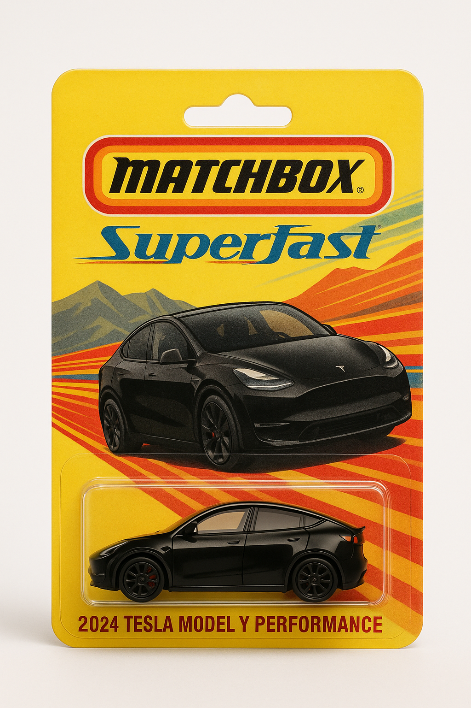
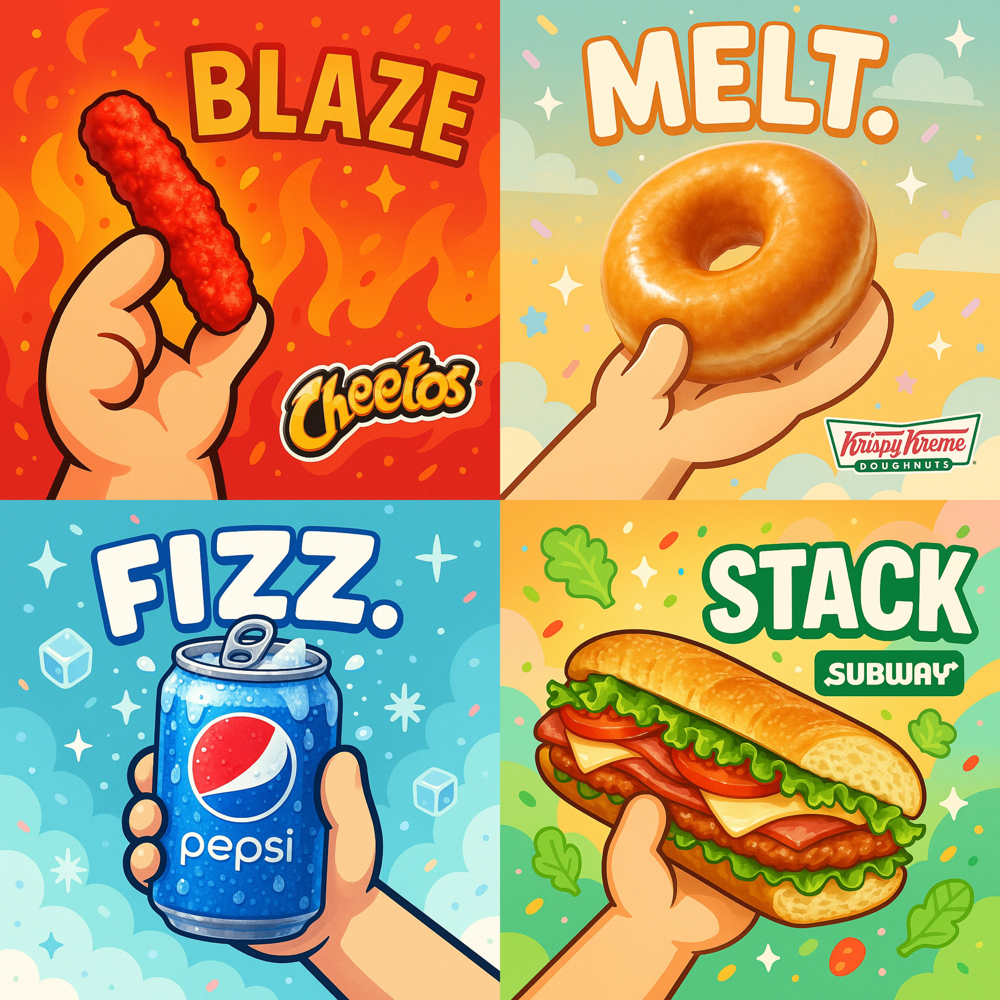

<a id="readme-top"></a>
# Awesome GPT-4o Images ✨

[](LICENSE)
[](README.md)
[](README_cn.md)
[](README_ja.md)

🎉 GPT-4oで生成された画像のキュレーションコレクションへようこそ！

これは、GPT-4oとgpt-image-1によって生成された画像とプロンプトの厳選されたコレクションです。ChatGPTとSoraの力を借りて作成され、OpenAIのAI画像生成における最先端の能力を紹介し、AIの創造的可能性を継続的に拡張しています。

ほとんどの例はTwitter/X 🐦とSora 🎬から提供されています。これらがアイデアを刺激し💡、あなたの創造性を加速させることを願っています🚀。

この作品は、Jamez Bondosによるawesome-gpt4o-imagesをベースにしており、© 2025 Jamez Bondos、CC BY 4.0ライセンスの下で公開されています。
原典：https://github.com/jamez-bondos/awesome-gpt4o-images

---

<a id="table-of-contents"></a>
## Contents

- [🎨 GPT‑4oとは](#gpt4o-intro)
- [📖 ケース一覧](#cases-toc)
- [🛠️ ツール紹介](#tools-intro)
- [💡 プロンプトのコツ](#prompting-tips)
- [🤝 貢献方法](#how-to-contribute)
- [🙏 謝辞](#acknowledgements)

---

<a id="gpt4o-intro"></a>
## 🎨 What is GPT‑4o

🎨 GPT‑4oとは
GPT‑4oは、テキストプロンプトから高品質な画像を生成するだけでなく、画像から画像への編集も提供するマルチモーダルモデルです。ターゲットを絞った修正、スタイル転送、複数画像のブレンドが可能です。

- 🧠 マルチモーダル理解：テキストと画像を同時に解析し、創造的な意図を正確に把握
- ✍️ 正確なレンダリング：複雑なプロンプトを処理し、高品質な画像を迅速に生成
- 🎨 多様なスタイル：ジブリ、絵画風、ピクセルアート、3Dぬいぐるみなど、お好みのスタイルを選択
- 🖼️ リアルな構図：本物のような空間の奥行き、遠近法、照明
- ✏️ 簡単な後編集：背景の交換、詳細の調整—第二ラウンドの作成もシームレス
- ⚡️ 超高速対話：リアルタイムのアイデア出しと反復に適した短い応答時間

---

<a id="cases-toc"></a>
## 📖 ケース一覧

*   [ケース 102：マッチボックス Superfast コレクション版 (by @TraffAlex)](#cases-102)
*   [ケース 101：バブルフード (by @aziz4ai)](#cases-101)
*   [ケース 100：実物と手描き落書きのクリエイティブ広告 (by @azed_ai)](#cases-100)
*   [ケース 99：モノクロポートレートアート (by @ZHO_ZHO_ZHO)](#cases-99)
*   [ケース 98：すりガラス越しの虚実対比シルエット (by @umesh_ai)](#cases-98)
*   [ケース 97：かわいくて温かみのあるニット人形 (by @ZHO_ZHO_ZHO)](#cases-97)
*   [ケース 96：アニメフィギュアのカスタムメイド (by @dotey)](#cases-96)
*   [ケース 95：自撮り写真からボブルヘッドフィギュアを生成 (by @thisdudelikesAI)](#cases-95)
*   [ケース 94：三匹の動物とランドマークでの自撮り (by @berryxia_ai)](#cases-94)
*   [ケース 93：ガラス質感の再構築 (by @egeberkina)](#cases-93)
*   [ケース 92：遠近法を用いた3D飛び出し効果 (by @ZHO_ZHO_ZHO)](#cases-92)
*   [ケース 91：Googleマップが古代の宝の地図に変身 (by @umesh_ai)](#cases-91)
*   [ケース 90：ブランド化されたキーボードのキーキャップ (by @egeberkina)](#cases-90)
*   [ケース 89：クロムメッキされた絵文字バッジ (by @egeberkina)](#cases-89)
*   [ケース 88：子供用の塗り絵イラスト（カラー参考画像付き） (by @dotey)](#cases-88)
*   [ケース 87：アルファベットと単語の意味の融合 (by @dotey)](#cases-87)
*   [ケース 86：ダブルエクスポージャー (by rezzycheck (Sora))](#cases-86)
*   [ケース 85：シュールなインタラクティブシーン (by @umesh_ai)](#cases-85)
*   [ケース 84：動物シリコンリストレスト (by @ZHO_ZHO_ZHO)](#cases-84)
*   [ケース 83：発光ラインによる解剖図 (by @umesh_ai)](#cases-83)
*   [ケース 82：特徴的な都市の天気予報 (by @dotey)](#cases-82)
*   [ケース 81：半透明ガラスのテクスチャ変化 (by @azed_ai)](#cases-81)
*   [ケース 80：コード風スタイルの名刺 (by @umesh_ai)](#cases-80)
*   [ケース 79：レゴのシティスケープ (by @dotey)](#cases-79)
*   [ケース 78：ガラス素材のリモデリング (by @egeberkina)](#cases-78)
*   [ケース 77：水晶球ストーリーシーン (by @dotey)](#cases-77)
*   [ケース 76：ノスタルジックなアニメ風映画ポスター (by photis (Sora))](#cases-76)
*   [ケース 75：ソーシャルメディアフレームの融合 (by @dotey)](#cases-75)
*   [ケース 74：ロゴの形をした創造的な本棚 (by @umesh_ai)](#cases-74)
*   [ケース 73：ちび風カスタムキーホルダー (by @azed_ai)](#cases-73)
*   [ケース 72：ゴールドのペンダントネックレス (by @azed_ai)](#cases-72)
*   [ケース 71：ミニチュア サイバーパンク ティルトシフト風景 (by terry623)](#cases-71)
*   [ケース 70：オリジナルポケモン生成 (by @Anima_Labs)](#cases-70)
*   [ケース 69：シルエットアート (by @umesh_ai)](#cases-69)
*   [ケース 68：未来主義ロゴトレーディングカード (by @hewarsaber)](#cases-68)
*   [ケース 67：超リアルな3Dゲーム (by @ZHO_ZHO_ZHO)](#cases-67)
*   [ケース 66：クリエイティブなシルクの宇宙 (by @ZHO_ZHO_ZHO)](#cases-66)
*   [ケース 65：ファンタジー水中シーンのアイスキャンディー (by @madpencil_)](#cases-65)
*   [ケース 64：スチームパンク機械魚 (by @f-is-h)](#cases-64)
*   [ケース 63：エモジ クリームアイスクリーム (by @ZHO_ZHO_ZHO)](#cases-63)
*   [ケース 62：かわいいエナメルピン (by @gnrlyxyz)](#cases-62)
*   [ケース 61：架空のツイートスクリーンショット（アインシュタイン） (by @egeberkina)](#cases-61)
*   [ケース 60：Emoji タフテッドカーペット (by @gizakdag)](#cases-60)
*   [ケース 59：カラフルなベクターアートポスター (by @michaelrabone)](#cases-59)
*   [ケース 58：雲のアート (by @umesh_ai)](#cases-58)
*   [ケース 57：8ビットピクセルアイコン (by @egeberkina)](#cases-57)
*   [ケース 56：ミニチュア3D建築 (by @dotey)](#cases-56)
*   [ケース 55：クリエイティブな観葉植物の鉢 (by @azed_ai)](#cases-55)
*   [ケース 54：極めて平凡な"iPhoneの自撮り (by @jiamimaodashu)](#cases-54)
*   [ケース 53：Emoji 膨らませたようなクッション (by @gizakdag)](#cases-53)
*   [ケース 52：ペーパークラフト風の絵文字アイコン (by @egeberkina)](#cases-52)
*   [ケース 51：パスポートの入国スタンプ (by @M_w14_)](#cases-51)
*   [ケース 50：物理破壊エフェクトカード（ララ） (by @op7418)](#cases-50)
*   [ケース 49：ファッション雑誌の表紙スタイル (by @dotey)](#cases-49)
*   [ケース 48：ボクセルスタイルの3Dアイコン変換 (by @BrettFromDJ)](#cases-48)
*   [ケース 47：キーボードのESCキーキャップのミニチュア立体模型 (by @egeberkina)](#cases-47)
*   [ケース 45：3Dちび風大学の擬人化キャラクター (by @dotey)](#cases-45)
*   [ケース 44：RPG風キャラクターカード制作 (by @berryxia_ai)](#cases-44)
*   [ケース 43：ちび風かわいいマトリョーシカ（真珠の耳飾りの少女） (by @ZHO_ZHO_ZHO)](#cases-43)
*   [ケース 42：3Dちび風カップルのスノードーム (by @balconychy)](#cases-42)
*   [ケース 41：ミニチュア立体シーン（孫悟空、三度白骨精を倒す） (by @dotey)](#cases-41)
*   [ケース 39：ファンタジーカートゥーンイラスト (by @dotey)](#cases-39)
*   [ケース 37：ソフトな雰囲気の3D広告 (by @aziz4ai)](#cases-37)
*   [ケース 36：ミニマリスト3Dイラスト（Markdown形式） (by @dotey)](#cases-36)
*   [ケース 35：もふもふのかぼちゃランタン (by gizakdag)](#cases-35)
*   [ケース 33：家族のウェディングフォト (by @balconychy)](#cases-33)
*   [ケース 32：折り畳み式ペーパークラフト立体絵本 (by @dotey)](#cases-32)
*   [ケース 31：アニメステッカーコレクション (by @richardchang)](#cases-31)
*   [ケース 30：35mmフィルム風の浮遊島 (by @dotey)](#cases-30)
*   [ケース 29：名画の人物 OOTD (by @ZHO_ZHO_ZHO)](#cases-29)
*   [ケース 28：フラットステッカーデザイン (by @ZHO_ZHO_ZHO)](#cases-28)
*   [ケース 27：ちび風スタンプ制作 (by @dotey)](#cases-27)
*   [ケース 26：名画の人物によるシリアル広告 (by @ZHO_ZHO_ZHO)](#cases-26)
*   [ケース 25：ミニマリスト3Dイラスト (by @0xdlk)](#cases-25)
*   [ケース 24：Funko Pop フィギュア制作 (by @dotey)](#cases-24)
*   [ケース 23：『タイタニック』の模倣 (by @balconychy)](#cases-23)
*   [ケース 21：ちび風キャラクターの表情スタンプ (by @leon_yuan2001)](#cases-21)
*   [ケース 20：フィギュアと実物が同じフレームに収まっている (by @dotey)](#cases-20)
*   [ケース 19：おもちゃ箱の中の国の立体模型 (by @TheRelianceAI)](#cases-19)
*   [ケース 18：ピクサー3Dスタイル (by AnimeAI)](#cases-18)
*   [ケース 17：レトロなCRTコンピューター起動画面 (by @Gdgtify)](#cases-17)
*   [ケース 16：アニメ風バッジ (by @Alittlefatwhale)](#cases-16)
*   [ケース 14：『ワンピース』テーマのフィギュア制作 (by @dotey)](#cases-14)
*   [ケース 13：3Dちび風スタイル (by @dotey)](#cases-13)
*   [ケース 12：3D カップルジュエリーボックスのオブジェ (by @dotey)](#cases-12)
*   [ケース 11：PS2ゲームカバー（GTA × シュレック） (by @dotey)](#cases-11)
*   [ケース 10：風刺漫画の生成 (by @dotey)](#cases-10)
*   [ケース 9：ミニマリスト未来主義ポスター (by @ZHO_ZHO_ZHO)](#cases-9)
*   [ケース 8：レゴコレクション (by @ZHO_ZHO_ZHO)](#cases-8)
*   [ケース 7：パーソナライズされた部屋のデザイン (by @ZHO_ZHO_ZHO)](#cases-7)
*   [ケース 6：キャラクターがポータルを通過する (by @dotey)](#cases-6)
*   [ケース 5：ジブリ風 (by AnimeAI)](#cases-5)
*   [ケース 4：3Dちび風中国式結婚式イラスト (by @balconychy)](#cases-4)
*   [ケース 2：3Dちび風キャラクターの立体フォトフレーム (by @dotey)](#cases-2)
*   [ケース 1：ちび風プロポーズシーン (by @balconychy)](#cases-1)

---

<a id="cases"></a>
## 🧩 ケース

<a id="cases-102"></a>
### ケース 102：マッチボックス Superfast コレクション版 (by [@TraffAlex](https://x.com/TraffAlex))

[ソースリンク](https://x.com/TraffAlex/status/1935451423803851187)

<br>
<sub>Image © 2025 <a href="https://github.com/highscore-ai">@highscore-ai</a>, <a href="https://creativecommons.org/licenses/by/4.0/">CC BY 4.0</a> • Prompt by <a href="https://x.com/TraffAlex">@TraffAlex</a></sub>

**プロンプト**

```
プロダクト写真、2024年テスラ モデルY パフォーマンスのダイキャストカー、1970年代風のマッチボックス「Superfast」ブリスターパックに収められたもの。光沢のある黒い塗装、ブラックパフォーマンスホイール、赤いブレーキキャリパー。レトロな山道とスピードラインを描いたパッケージカードアート。スタジオ照明、白背景、ノスタルジックなコレクター向けの雰囲気。
```


---

[⬆️ ケース一覧に戻る](#cases-toc)

<a id="cases-101"></a>
### ケース 101：バブルフード (by [@aziz4ai](https://x.com/aziz4ai/))

[ソースリンク](https://x.com/aziz4ai/status/1934986353848017349)

<br>
<sub>Image © 2025 <a href="https://github.com/highscore-ai">@highscore-ai</a>, <a href="https://creativecommons.org/licenses/by/4.0/">CC BY 4.0</a> • Prompt by <a href="https://x.com/aziz4ai/">@aziz4ai</a></sub>

**プロンプト**

```
超リアルなDSLR写真で、[ブランド/製品]のジューシーでサクサク、よだれが出るような姿を捉えています。かわいいちび風の漫画の手がそれを持ち、今にも一口かじろうとしています。背景はフラットな2Dイラストで、柔らかなマカロンカラーを使用し、まるで食べられるかのように見えます。そのビジュアルアイデンティティからインスピレーションを得た、シュールでかわいいベクター要素（砂糖の粒、星、柔らかなグラデーション、遊び心のあるグラフィック）が特徴です。目を引くキャッチフレーズとして、味を表現する**強いインパクトのある一語**（「サク」「トロ」「絶品」など）を添えています。食べ物の上またはキャッチフレーズの横にブランドロゴがはっきりと表示されています。構図は中央寄せの1:1スクエア比率、映画のような柔らかな光で、リアルな食べ物とフラットなイラスト背景のコントラストが際立つ4K解像度です。
```


**参考画像が必要：** A brand/product photo.


---

[⬆️ ケース一覧に戻る](#cases-toc)

<a id="cases-100"></a>
### ケース 100：実物と手描き落書きのクリエイティブ広告 (by [@azed_ai](https://x.com/azed_ai))

[ソースリンク](https://x.com/azed_ai/status/1923016036120658122)

<br>
<sub>Image © 2025 <a href="https://github.com/jamez-bondos">@jamez-bondos</a>, <a href="https://creativecommons.org/licenses/by/4.0/">CC BY 4.0</a> • Prompt by <a href="https://x.com/azed_ai">@azed_ai</a></sub>

**プロンプト**

```
シンプルで創造的な広告、真っ白な背景の上に配置されています。
実物の[リアルなオブジェクト]と手描きの黒インクの落書きが組み合わされ、線はゆるくて遊び心があります。落書きは[落書きのコンセプトと相互作用：巧みで想像力豊かな方法でオブジェクトと相互作用する]を描いています。上部または中央に太字の黒い[広告コピー]テキストを入れます。下部には[ブランドロゴ]をはっきりと配置します。視覚効果はシンプルで、楽しく、コントラストが高く、巧みに構成されているべきです。
```

*注意： プロンプトの中の[実物]、[落書きのコンセプトとインタラクション]、[広告コピー]、[ブランドロゴ]を具体的な内容に置き換えてください。
例：
[実物]：コーヒー豆
[落書きのコンセプトとインタラクション]：巨大なコーヒー豆が宇宙の惑星になり、小さな宇宙飛行士がその表面に立って旗を立てている
[広告コピー]："Explore Bold Flavor"
[ブランドロゴ]：スターバックスのロゴ*


---

[⬆️ ケース一覧に戻る](#cases-toc)

<a id="cases-99"></a>
### ケース 99：モノクロポートレートアート (by [@ZHO_ZHO_ZHO](https://x.com/ZHO_ZHO_ZHO))

[ソースリンク](https://x.com/ZHO_ZHO_ZHO/status/1922150692145283299)

<br>
<sub>Image © 2025 <a href="https://github.com/jamez-bondos">@jamez-bondos</a>, <a href="https://creativecommons.org/licenses/by/4.0/">CC BY 4.0</a> • Prompt by <a href="https://x.com/ZHO_ZHO_ZHO">@ZHO_ZHO_ZHO</a></sub>

**プロンプト**

```
高解像度の白黒ポートレートアート作品で、エディトリアルとアート写真のスタイルを採用しています。背景は柔らかなグラデーションで、ミディアムグレーからほぼ純白へと移行し、奥行きと静寂の雰囲気を作り出しています。繊細なフィルムグレインのテクスチャが、触れることができるようなアナログ写真のような柔らかな質感を画像に加え、クラシックな白黒写真を思わせます。

画面の右側に、ぼんやりとしながらも魅惑的なハリーポッターの顔が影から浮かび上がっています。それは従来のポーズを取った写真ではなく、思考や呼吸の間の瞬間を捉えたかのようです。彼の顔の一部だけが見えています：おそらく片目、頬骨の一部、そして唇の輪郭が、神秘性、親密さ、優雅さを呼び起こします。彼の表情は繊細で深く、憂いと詩的な美しさを放ちながらも、わざとらしさはありません。

優しい指向性のある光が柔らかく拡散し、彼の頬のラインを優しく撫で、または目に光の点を作り出します—これが画像の感情的な中心です。残りの部分は大きな余白で占められ、意図的にシンプルに保たれ、画像が「呼吸する」余地を与えています。画像には文字もロゴもなく—光と影、そして感情だけが織り交ざっています。

全体の雰囲気は抽象的でありながら深く人間的で、一瞬の視線や、半分夢と半分覚醒の間の記憶のようです：親密で、永遠で、切なく美しいものです。
```


---

[⬆️ ケース一覧に戻る](#cases-toc)

<a id="cases-98"></a>
### ケース 98：すりガラス越しの虚実対比シルエット (by [@umesh_ai](https://x.com/umesh_ai))

[ソースリンク](https://x.com/umesh_ai/status/1921487841634156999)

<br>
<sub>Image © 2025 <a href="https://github.com/jamez-bondos">@jamez-bondos</a>, <a href="https://creativecommons.org/licenses/by/4.0/">CC BY 4.0</a> • Prompt by <a href="https://x.com/umesh_ai">@umesh_ai</a></sub>

**プロンプト**

```
一枚の白黒写真、すりガラスや半透明の表面の後ろに[主体]のぼやけたシルエットが映し出されています。その[部分]の輪郭がはっきりと表面に密着し、残りの朧げでぼやけたシルエットと鮮やかな対比を成しています。背景は柔らかなグレーのグラデーションで、神秘的で芸術的な雰囲気を高めています。
```

*注意： [主体]と[部分]に具体的で視覚的な描写を入れて、「ぼやけた主体 + 鮮明な部分」のコントラスト効果を強調してください。
例えば：[主体]は「赤いライトセーバーを持つシスの暗黒卿」、[部分]は「もう一方のダークフォースを集める手」などと書けます。*


---

[⬆️ ケース一覧に戻る](#cases-toc)

<a id="cases-97"></a>
### ケース 97：かわいくて温かみのあるニット人形 (by [@ZHO_ZHO_ZHO](https://x.com/ZHO_ZHO_ZHO))

[ソースリンク](https://x.com/ZHO_ZHO_ZHO/status/1921148024861938077)

<br>
<sub>Image © 2025 <a href="https://github.com/jamez-bondos">@jamez-bondos</a>, <a href="https://creativecommons.org/licenses/by/4.0/">CC BY 4.0</a> • Prompt by <a href="https://x.com/ZHO_ZHO_ZHO">@ZHO_ZHO_ZHO</a></sub>

**プロンプト**

```
手作りのかぎ針編みぬいぐるみを両手で優しく持っているクローズアップの、プロフェッショナルな構図の写真。ぬいぐるみは丸みを帯びた形状で、【画像をアップロード】キャラクターのかわいいちび風デザインになっており、色のコントラストが鮮やかで細部まで作り込まれています。ぬいぐるみを持つ両手は自然で優しく、指のポーズがはっきりと見え、肌の質感と光と影の移り変わりが自然で、温かみのある本物らしい触感を表現しています。背景は少しぼかされ、室内環境を表現し、温かみのある木製のテーブルと窓から差し込む自然光があり、快適で親密な雰囲気を作り出しています。全体的に精巧な工芸品の感覚と大切にされている温かい感情が伝わる画像です。
```


**参考画像が必要：** 参考として写真をアップロードし、その可愛いちび風のニット人形バージョンを生成します。


---

[⬆️ ケース一覧に戻る](#cases-toc)

<a id="cases-96"></a>
### ケース 96：アニメフィギュアのカスタムメイド (by [@dotey](https://x.com/dotey))

[ソースリンク](https://x.com/dotey/status/1920851135516082246)

<br>
<sub>Image © 2025 <a href="https://github.com/jamez-bondos">@jamez-bondos</a>, <a href="https://creativecommons.org/licenses/by/4.0/">CC BY 4.0</a> • Prompt by <a href="https://x.com/dotey">@dotey</a></sub>

**プロンプト**

```
アニメ風フィギュアをテーブルの上に置いた写真を生成してください。日常的にスマホで撮影したようなカジュアルな視点で表現してください。フィギュアは添付された人物写真をベースにし、写真の人物の全身のポーズ、表情、衣装を正確に再現し、フィギュア全体が完全に見えるようにしてください。全体的に精巧で繊細なデザインで、髪の毛と衣装は自然で柔らかいグラデーションカラーと繊細な質感を持ち、日本のアニメ風のスタイルで、細部まで豊かで、リアルな質感があり、美しく見えるようにしてください。
```


**参考画像が必要：** 人物の全身のポーズ、表情、衣装のスタイルが含まれた写真をアップロードしてください。フィギュアモデルの生成に使用します。


---

[⬆️ ケース一覧に戻る](#cases-toc)

<a id="cases-95"></a>
### ケース 95：自撮り写真からボブルヘッドフィギュアを生成 (by [@thisdudelikesAI](https://x.com/thisdudelikesAI))

[ソースリンク](https://x.com/thisdudelikesAI/status/1920433372243136730)

<br>
<sub>Image © 2025 <a href="https://github.com/jamez-bondos">@jamez-bondos</a>, <a href="https://creativecommons.org/licenses/by/4.0/">CC BY 4.0</a> • Prompt by <a href="https://x.com/thisdudelikesAI">@thisdudelikesAI</a></sub>

**プロンプト**

```
この写真をボブルヘッドに変えてください：頭を少し大きくして、顔の特徴を正確に保ちながら、体をカートゥーン化します。[本棚に置いてください]。
```

*注意： プロンプト内の[本棚に置く]を、ご希望の特定のシーンや背景に置き換えてください。例えば「本棚に置く」や「オフィスデスクに置く」、「ニュートラルな背景に置く」、または「透明な背景で生成する」などです。*

**参考画像が必要：** 生成首振り人形の基礎として自撮り写真をアップロードする必要があります。


---

[⬆️ ケース一覧に戻る](#cases-toc)

<a id="cases-94"></a>
### ケース 94：三匹の動物とランドマークでの自撮り (by [@berryxia_ai](https://x.com/berryxia_ai))

[ソースリンク](https://x.com/berryxia_ai/status/1920795648946782583)

<br>
<sub>Image © 2025 <a href="https://github.com/jamez-bondos">@jamez-bondos</a>, <a href="https://creativecommons.org/licenses/by/4.0/">CC BY 4.0</a> • Prompt by <a href="https://x.com/berryxia_ai">@berryxia_ai</a></sub>

**プロンプト**

```
3匹の[動物タイプ]が象徴的な[ランドマーク]の前で自撮りする接写写真。それぞれ異なる表情をしており、ゴールデンアワーに撮影され、映画のような照明が施されています。動物たちはカメラに近づき、頭と頭を寄せ合い、自撮りのポーズをとりながら、喜び、驚き、穏やかさの表情を見せています。背景には[ランドマーク]の建築の詳細が完全に映し出され、柔らかな光と温かい雰囲気が漂っています。写真のような写実的なカートゥーンスタイルで撮影され、高細部、1:1のアスペクト比です。
```

*注意： [動物の種類]と[ランドマーク]を具体的な説明に置き換えることができます。*


---

[⬆️ ケース一覧に戻る](#cases-toc)

<a id="cases-93"></a>
### ケース 93：ガラス質感の再構築 (by [@egeberkina](https://x.com/egeberkina))

[ソースリンク](https://x.com/egeberkina/status/1920448389960909085)

<br>
<sub>Image © 2025 <a href="https://github.com/jamez-bondos">@jamez-bondos</a>, <a href="https://creativecommons.org/licenses/by/4.0/">CC BY 4.0</a> • Prompt by <a href="https://x.com/egeberkina">@egeberkina</a></sub>

**プロンプト**

```
参考画像を以下のJSONで定義された美的定義に基づいて再テクスチャ化してください

{
  "style": "フォトリアリスティックな3Dレンダリング",
  "material": "透明で虹色効果のあるガラス",
  "surface_texture": "滑らかで磨かれた表面、微妙な反射と屈折効果あり",
  "lighting": {
    "type": "スタジオHDRI",
    "intensity": "高",
    "direction": "左上からの角度付きキーライトと環境光フィル",
    "accent_colors": ["青", "緑", "紫"],
    "reflections": true,
    "refractions": true,
    "dispersion_effects": true,
    "bloom": true
  },
  "color_scheme": {
    "primary": "青、緑、紫の虹色の色合いを持つ透明素材",
    "secondary": "クリスタルクリアで微妙な色彩変化あり",
    "highlights": "虹のような効果を反射する柔らかく光る強調部分",
    "rim_light": "エッジ周りの柔らかい反射光"
  },
  "background": {
    "color": "黒",
    "vignette": true,
    "texture": "なし"
  },
  "post_processing": {
    "chromatic_aberration": true,
    "glow": true,
    "high_contrast": true,
    "sharp_details": true
  }
}
```

*注意： このプロンプトはGPT-4oで画像生成してください。Soraでは正しいスタイルを生成できない可能性があります。*

**参考画像が必要：** 再テクスチャ化のベースとして画像をアップロードする必要があります。


---

[⬆️ ケース一覧に戻る](#cases-toc)

<a id="cases-92"></a>
### ケース 92：遠近法を用いた3D飛び出し効果 (by [@ZHO_ZHO_ZHO](https://x.com/ZHO_ZHO_ZHO))

[ソースリンク](https://x.com/ZHO_ZHO_ZHO/status/1920355982703509588)

<br>
<sub>Image © 2025 <a href="https://github.com/jamez-bondos">@jamez-bondos</a>, <a href="https://creativecommons.org/licenses/by/4.0/">CC BY 4.0</a> • Prompt by <a href="https://x.com/ZHO_ZHO_ZHO">@ZHO_ZHO_ZHO</a></sub>

**プロンプト**

```
超写実、上から見下ろす俯瞰アングルで撮影された、美しいインスタグラムモデル【アン・ハサウェイ / 参考画像参照】。洗練された美しいメイクとファッショナブルなスタイリングで、誰かに持ち上げられたスマートフォンの画面の上に立っています。画面は強い遠近錯覚を生み出しています。少女がスマホから飛び出してくる3D効果を強調しています。彼女は黒縁メガネをかけ、ハイストリートファッションを着こなし、かわいいポーズを愛らしく取っています。スマホの画面は暗い床のように処理され、小さなステージのようになっています。手のひら、スマホ、少女の間の比率の違いを表現するために、強制遠近法（forced perspective）を使用しています。背景はクリーンなグレーで、柔らかい室内光と浅い被写界深度を使用し、全体的なスタイルは超現実的なリアルな合成です。遠近感が特に強調されています。
```

*注意： プロンプト内の【アン・ハサウェイ】を他のキャラクター名に置き換えることができます。または、キャラクターの写真を参考画像として使用することもできます。*

**参考画像が必要：** 人物の写真を参考画像として使用できます。この例では、[『真珠の耳飾りの少女』](https://commons.wikimedia.org/w/index.php?curid=55017931)を参考画像としています。


---

[⬆️ ケース一覧に戻る](#cases-toc)

<a id="cases-91"></a>
### ケース 91：Googleマップが古代の宝の地図に変身 (by [@umesh_ai](https://x.com/umesh_ai))

[ソースリンク](https://x.com/umesh_ai/status/1919701229363466328)

<br>
<sub>Image © 2025 <a href="https://github.com/jamez-bondos">@jamez-bondos</a>, <a href="https://creativecommons.org/licenses/by/4.0/">CC BY 4.0</a> • Prompt by <a href="https://x.com/umesh_ai">@umesh_ai</a></sub>

**プロンプト**

```
画像を古代の羊皮紙に描かれた古代の宝の地図に変換してください。地図には、海に浮かぶ帆船、海岸線に沿った古い港や城、宝の場所を示す大きな「X」へと続く点線の道筋、山々、ヤシの木、装飾的なコンパスローズなどの詳細な要素が含まれています。全体的なスタイルは、昔の海賊冒険映画を思わせるものです。
```


**参考画像が必要：** Googleマップのスクリーンショットや他の地図画像を変換の基礎として1枚アップロードする必要があります。


---

[⬆️ ケース一覧に戻る](#cases-toc)

<a id="cases-90"></a>
### ケース 90：ブランド化されたキーボードのキーキャップ (by [@egeberkina](https://x.com/egeberkina))

[ソースリンク](https://x.com/egeberkina/status/1918291652210311278)

<br>
<sub>Image © 2025 <a href="https://github.com/jamez-bondos">@jamez-bondos</a>, <a href="https://creativecommons.org/licenses/by/4.0/">CC BY 4.0</a> • Prompt by <a href="https://x.com/egeberkina">@egeberkina</a></sub>

**プロンプト**

```
超リアルな3Dレンダリング画像で、4つのメカニカルキーボードのキーキャップが2x2の密集したグリッドに配置され、すべてのキーキャップが互いに接触しています。アイソメトリック角度から見ています。1つのキーキャップは透明で、赤色で「{just}」という文字が印刷されています。他の3つのキーキャップは{黒、紫、白}の色を使用しています。1つのキーキャップにはGithubのロゴが付いています。残りの2つのキーキャップには「{fork}」と「{it}」がそれぞれ書かれています。リアルなプラスチックのテクスチャ、丸みを帯びた彫刻されたキーキャップ、柔らかな影、清潔な薄いグレーの背景。
```

*注意： ブランド名、スローガン、キーキャップの色を変更する*


---

[⬆️ ケース一覧に戻る](#cases-toc)

<a id="cases-89"></a>
### ケース 89：クロムメッキされた絵文字バッジ (by [@egeberkina](https://x.com/egeberkina))

[ソースリンク](https://x.com/egeberkina/status/1919398870867440124)

<br>
<sub>Image © 2025 <a href="https://github.com/jamez-bondos">@jamez-bondos</a>, <a href="https://creativecommons.org/licenses/by/4.0/">CC BY 4.0</a> • Prompt by <a href="https://x.com/egeberkina">@egeberkina</a></sub>

**プロンプト**

```
高精度の3Dレンダリング画像、絵文字アイコン{👍}に基づいた金属質感のバッジを表示し、垂直な商品カードに固定されています。超滑らかなクロームメッキの質感と丸みを帯びた3Dアイコンデザインで、様式化された未来的なデザインとなっており、柔らかな反射とクリーンなシャドウが特徴です。紙製カードの上部中央にはヨーロッパ風の打ち抜き穴があり、バッジの上には目立つタイトル「{Awesome}」、下には面白いスローガン「{Smash that ⭐ if you like it!}」が配置されています。背景は柔らかなグレーで、ソフトボックス照明を使用し、全体的にミニマルなスタイルです。
```

*注意： 👍 の絵文字アイコンを置き換えてください。タイトルとスローガンも置き換えてください。*


---

[⬆️ ケース一覧に戻る](#cases-toc)

<a id="cases-88"></a>
### ケース 88：子供用の塗り絵イラスト（カラー参考画像付き） (by [@dotey](https://x.com/dotey))

[ソースリンク](https://x.com/dotey/status/1919522110395080838)

<br>
<sub>Image © 2025 <a href="https://github.com/jamez-bondos">@jamez-bondos</a>, <a href="https://creativecommons.org/licenses/by/4.0/">CC BY 4.0</a> • Prompt by <a href="https://x.com/dotey">@dotey</a></sub>

**プロンプト**

```
白黒の線画イラスト、標準サイズ（8.5x11インチ）の用紙に直接印刷できるもので、用紙の余白なし。全体的なイラストスタイルは清潔でシンプル、はっきりとした滑らかな黒い輪郭線を使用し、影やグレースケール、色の塗りつぶしはなく、背景は真っ白で、塗り絵に適しています。
【また、塗り絵が苦手なユーザーのために、右下隅に小さな完全カラーバージョンを参考用に配置してください】
対象年齢：【6〜9歳の子ども】
画面の説明：
【ユニコーンが森の草原を歩いている、太陽が明るく輝き、青空に白い雲が浮かんでいる】
```

*注意： 【】内の内容を置き換えることができます。例えば対象者や画面の説明など。*


---

[⬆️ ケース一覧に戻る](#cases-toc)

<a id="cases-87"></a>
### ケース 87：アルファベットと単語の意味の融合 (by [@dotey](https://x.com/dotey))

[ソースリンク](https://x.com/dotey/status/1918529055340576812)

<br>
<sub>Image © 2025 <a href="https://github.com/jamez-bondos">@jamez-bondos</a>, <a href="https://creativecommons.org/licenses/by/4.0/">CC BY 4.0</a> • Prompt by <a href="https://x.com/dotey">@dotey</a></sub>

**プロンプト**

```
文字の中に単語の意味を融合させ、グラフィックと文字を巧みに組み合わせる。
単語：{ beautify }
下に単語の簡単な説明を追加する
```

*注意： 単語{ beautify }を融合させたい単語に置き換える*


---

[⬆️ ケース一覧に戻る](#cases-toc)

<a id="cases-86"></a>
### ケース 86：ダブルエクスポージャー (by [rezzycheck (Sora)](https://sora.com/explore?user=rezzycheck))

[ソースリンク](https://sora.com/g/gen_01jtc9btfzef080z31v8w9rtbw)

<br>
<sub>Image © 2025 <a href="https://github.com/jamez-bondos">@jamez-bondos</a>, <a href="https://creativecommons.org/licenses/by/4.0/">CC BY 4.0</a> • Prompt by <a href="https://sora.com/explore?user=rezzycheck">rezzycheck (Sora)</a></sub>

**プロンプト**

```
二重露光、Midjourney風、融合・ブレンド・重ね合わせた二重露光イメージ、二重露光スタイル。Yukisakuraによって制作された傑作で、アラゴン・アラソンの息子のシルエットと、生命力あふれる春の中つ国の印象的で起伏に富んだ地形が見事に織り交ぜられた素晴らしい二重露光の構図を展開しています。日差しを浴びた松林、山々、そして小道を横切る一頭の孤独な馬の光景が彼のシルエットのテクスチャから外へと響き渡り、物語性と孤独感の層を加えています。シンプルで明確なモノクロの背景がシャープなコントラストを保ちながら、素晴らしい緊張感が徐々に形成され、すべての焦点を層の豊かな二重露光へと引き寄せています。アラゴンのシルエット内部の活気に満ちたフルカラーのカラースキームと、感情的な正確さで各輪郭を描く鮮明で意図的なラインが特徴です。(Detailed:1.45). (Detailed background:1.4).
```

*注意： 中国語のプロンプトは英語の原文から翻訳されたもので、基本的に期待通りの効果が得られますが、英語のプロンプトを使用するとより良い結果が得られる可能性があります。*


---

[⬆️ ケース一覧に戻る](#cases-toc)

<a id="cases-85"></a>
### ケース 85：シュールなインタラクティブシーン (by [@umesh_ai](https://x.com/umesh_ai))

[ソースリンク](https://x.com/umesh_ai/status/1917444534239191544)

<br>
<sub>Image © 2025 <a href="https://github.com/jamez-bondos">@jamez-bondos</a>, <a href="https://creativecommons.org/licenses/by/4.0/">CC BY 4.0</a> • Prompt by <a href="https://x.com/umesh_ai">@umesh_ai</a></sub>

**プロンプト**

```
鉛筆スケッチ画で描かれた[Subject 1]と[Subject 2]の交流シーン。[Subject 2]はリアルなフルカラースタイルで表現され、[Subject 1]や背景の手描きスケッチスタイルとシュールなコントラストを形成している。
```

*注意： [主体1]と[主体2]を具体的な主体の説明に置き換えてください。例えば「女の子」と「バラの花」など。*


---

[⬆️ ケース一覧に戻る](#cases-toc)

<a id="cases-84"></a>
### ケース 84：動物シリコンリストレスト (by [@ZHO_ZHO_ZHO](https://x.com/ZHO_ZHO_ZHO))

[ソースリンク](https://x.com/ZHO_ZHO_ZHO/status/1918525296577327574)

<br>
<sub>Image © 2025 <a href="https://github.com/jamez-bondos">@jamez-bondos</a>, <a href="https://creativecommons.org/licenses/by/4.0/">CC BY 4.0</a> • Prompt by <a href="https://x.com/ZHO_ZHO_ZHO">@ZHO_ZHO_ZHO</a></sub>

**プロンプト**

```
画像を作成 かわいいちび風のシリコン製リストレスト、【🐼】の絵文字をベースにしたデザイン、食品グレードの柔らかいシリコン素材を使用、表面は肌触りの良いマット仕上げ、内部はメモリーフォーム入り、擬人化されたカートゥーンスタイル、表情が生き生きとしていて、両手を広げてデスクに置かれ、手首を抱きしめるようなポーズ、全体的に丸みを帯びた柔らかく可愛らしいフォルム、【🐼】のカラーリング、癒し系で可愛いスタイル、オフィス用途に適した、白い背景、柔らかな照明、製品写真スタイル、正面または45度俯瞰アングル、高解像度で細部まで表現、シリコンの質感と快適な機能性を強調
```

*注意： 【🐼】を他の動物の絵文字に置き換えることができます。*


---

[⬆️ ケース一覧に戻る](#cases-toc)

<a id="cases-83"></a>
### ケース 83：発光ラインによる解剖図 (by [@umesh_ai](https://x.com/umesh_ai))

[ソースリンク](https://x.com/umesh_ai/status/1914644426334314545)

<br>
<sub>Image © 2025 <a href="https://github.com/jamez-bondos">@jamez-bondos</a>, <a href="https://creativecommons.org/licenses/by/4.0/">CC BY 4.0</a> • Prompt by <a href="https://x.com/umesh_ai">@umesh_ai</a></sub>

**プロンプト**

```
デジタルイラストで、[SUBJECT]を描いたもの。その構造は発光する、クリーンで純粋な青い線で描かれています。深い色の背景の上に配置され、[SUBJECT]の形状と特徴が強調されています。[PART]のような特定の部分は、赤い光のオーラで強調され、その領域の重要性や特別な意味を表しています。全体的なスタイルは教育的で視覚的に魅力的であり、デザイン的には先進的なイメージング技術のようです。
```

*注意： [SUBJECT]」（主体）と「[PART]」（部位）をプロンプト内で置き換えることができます。*


---

[⬆️ ケース一覧に戻る](#cases-toc)

<a id="cases-82"></a>
### ケース 82：特徴的な都市の天気予報 (by [@dotey](https://x.com/dotey))

[ソースリンク](https://x.com/dotey/status/1917988595228438771)

<br>
<sub>Image © 2025 <a href="https://github.com/jamez-bondos">@jamez-bondos</a>, <a href="https://creativecommons.org/licenses/by/4.0/">CC BY 4.0</a> • Prompt by <a href="https://x.com/dotey">@dotey</a></sub>

**プロンプト**

```
明確な45°俯瞰視点で、等距離縮小モデルのシーンを表示し、[上海の東方明珠タワー、外灘]などの都市の特徴的な建築物を含む内容です。天気の効果が巧みにシーンに溶け込み、柔らかな曇り空が都市と穏やかに相互作用しています。物理ベースのリアルなレンダリング（PBR）と写実的な照明効果を使用し、単色の背景で、クリアでシンプルに。画像は中央に配置され、3Dモデルの精密で繊細な美しさが際立っています。画像の上部に「[上海 曇り 20°C]」と表示し、曇り天気のアイコンを添えています。
```

*注意： 都市、天気、気温、建物名は必要に応じて[]内の内容を置き換えることができます。画像はSoraによって生成されています。*


**提出者：** [luoshui-coder](https://github.com/luoshui-coder)

---

[⬆️ ケース一覧に戻る](#cases-toc)

<a id="cases-81"></a>
### ケース 81：半透明ガラスのテクスチャ変化 (by [@azed_ai](https://x.com/azed_ai))

[ソースリンク](https://x.com/azed_ai/status/1917948899098243407)

<br>
<sub>Image © 2025 <a href="https://github.com/jamez-bondos">@jamez-bondos</a>, <a href="https://creativecommons.org/licenses/by/4.0/">CC BY 4.0</a> • Prompt by <a href="https://x.com/azed_ai">@azed_ai</a></sub>

**プロンプト**

```
添付画像を柔らかい3D半透明ガラスに変換してください。磨りガラスのようなマット効果と繊細なテクスチャを持ち、オリジナルの色彩を保ちながら、薄いグレーの背景を中心に空間に軽く浮かび、柔らかな影と自然な光を表現してください。
```


**参考画像が必要：** 実物の参考画像をアップロードする必要があります

**提出者：** [luoshui-coder](https://github.com/luoshui-coder)

---

[⬆️ ケース一覧に戻る](#cases-toc)

<a id="cases-80"></a>
### ケース 80：コード風スタイルの名刺 (by [@umesh_ai](https://x.com/umesh_ai))

[ソースリンク1](https://x.com/umesh_ai/status/1915696926596415492) | [ソースリンク2](https://x.com/fr0gger_/status/1916743281339498760) | [ソースリンク3](https://x.com/dotey/status/1917412535130563006)

<br>
<sub>Image © 2025 <a href="https://github.com/jamez-bondos">@jamez-bondos</a>, <a href="https://creativecommons.org/licenses/by/4.0/">CC BY 4.0</a> • Prompt by <a href="https://x.com/umesh_ai">@umesh_ai</a></sub>

**プロンプト**

```
クローズアップショット：手が VS Code の JSON ファイルの外観にデザインされた名刺を持っています。名刺上のコードは実際の JSON 構文ハイライト形式で表示されています。ウィンドウインターフェースには典型的なツールバーアイコンとタイトルバーが含まれ、タイトルは「Business Card.json」と表示され、全体的なスタイルは VS Code インターフェースと完全に一致しています。背景はわずかにぼかされ、名刺の内容が強調されています。
名刺上の JSON コードは以下のように表示されています：
{
  "name": "Jamez Bondos",
  "title": "Your Title",
  "email": "your@email.com",
  "link": "yourwebsite"
}
```

*注意： 最後のJSONコードのname、title、email、linkデータを置き換えてください。プロンプトは元のリンクから簡略化されています。*


**提出者：** [Kong-F](https://github.com/Kong-F)

---

[⬆️ ケース一覧に戻る](#cases-toc)

<a id="cases-79"></a>
### ケース 79：レゴのシティスケープ (by [@dotey](https://x.com/dotey))

[ソースリンク](https://x.com/dotey/status/1917713810346872902)

<br>
<sub>Image © 2025 <a href="https://github.com/jamez-bondos">@jamez-bondos</a>, <a href="https://creativecommons.org/licenses/by/4.0/">CC BY 4.0</a> • Prompt by <a href="https://x.com/dotey">@dotey</a></sub>

**プロンプト**

```
高度に精細で色鮮やかなレゴ版上海外灘の景観を作成します。前景には外灘の歴史的建造物群が広がり、レゴブロックで西洋様式と新古典主義スタイルの建築ファサードが精巧に再現されています。時計塔、ドーム、柱廊などの細部まで表現されています。レゴのミニフィギュアたちが川沿いを散歩したり、写真を撮ったり、観光したりしており、通りの両側には古典的なスタイルのレゴカーが停車しています。背景には壮大な黄浦江が青い半透明のレゴブロックで構成され、川面にはレゴのフェリーや観光船が浮かんでいます。対岸の浦東陸家嘴には高層ビル群が立ち並び、東方明珠タワー、上海センター、ジンマオタワー、上海ワールドフィナンシャルセンターなどの超現代的なレゴの摩天楼が色彩豊かで写実的な形状で表現されています。空はレゴの明るい青色で、白いレゴブロックで作られた雲が少し点在し、全体的に活気と現代感あふれる視覚効果を呈しています。
```

*注意： AIを使って他の都市景観を生成するための参考プロンプト例として使用できます。元の画像はSoraによって生成されました。*


---

[⬆️ ケース一覧に戻る](#cases-toc)

<a id="cases-78"></a>
### ケース 78：ガラス素材のリモデリング (by [@egeberkina](https://x.com/egeberkina))

[ソースリンク](https://x.com/egeberkina/status/1917631056980721743)

<br>
<sub>Image © 2025 <a href="https://github.com/jamez-bondos">@jamez-bondos</a>, <a href="https://creativecommons.org/licenses/by/4.0/">CC BY 4.0</a> • Prompt by <a href="https://x.com/egeberkina">@egeberkina</a></sub>

**プロンプト**

```
添付された画像を以下のJSONに基づいて再テクスチャ化してください:

{
  "style": "photorealistic",
  "material": "glass",
  "background": "plain white",
  "object_position": "centered",
  "lighting": "soft, diffused studio lighting",
  "camera_angle": "eye-level, straight-on",
  "resolution": "high",
  "aspect_ratio": "2:3",
  "details": {
    "reflections": true,
    "shadows": false,
    "transparency": true
  }
}
```

*注意： この指示はJSON構造を通じて出力スタイルを正確に制御し、アップロードされた画像を指定された材質に再構成します。*

**参考画像が必要：** 材質を再構築したいオブジェクトの画像をアップロードする必要があります。


---

[⬆️ ケース一覧に戻る](#cases-toc)

<a id="cases-77"></a>
### ケース 77：水晶球ストーリーシーン (by [@dotey](https://x.com/dotey))

[ソースリンク](https://x.com/dotey/status/1916530529324699858)

<br>
<sub>Image © 2025 <a href="https://github.com/jamez-bondos">@jamez-bondos</a>, <a href="https://creativecommons.org/licenses/by/4.0/">CC BY 4.0</a> • Prompt by <a href="https://x.com/dotey">@dotey</a></sub>

**プロンプト**

```
窓辺の温かく柔らかなテーブルの上に、精巧なクリスタルボールが静かに置かれています。背景はぼんやりとぼやけ、暖色の陽光がクリスタルボールを優しく透過し、キラキラと金色の光を反射させ、周囲の薄暗い空間を温かく照らしています。クリスタルボールの中には、「嫦娥奔月（かぐやの月への飛翔）」をテーマにした小さな立体世界が自然に表現されており、繊細で美しく夢のような3Dの風景が広がっています。登場人物や物体はすべて可愛らしいちび風のデザインで、精巧で美しく、互いに生き生きとした感情的な交流を持っています。全体の雰囲気は東アジアのファンタジー色に満ち、非常に豊かなディテールで、魔法のリアリズムのような不思議な質感を醸し出しています。シーン全体は詩的で夢のようであり、華麗でエレガント、温かく柔らかな光を放ち、まるで温かな光と影の中で命を吹き込まれたかのようです。
```

*注意： 中括弧 {} 内の文字をストーリーシーンの説明に置き換えることができます。四字熟語、物語、短い話など何でも可能です。*


---

[⬆️ ケース一覧に戻る](#cases-toc)

<a id="cases-76"></a>
### ケース 76：ノスタルジックなアニメ風映画ポスター (by [photis (Sora)](https://sora.com/explore?user=user-sydD5ZkXZsDaL0BriQa010dQ))

[ソースリンク](https://sora.com/g/gen_01jsfxrdpjfpebnyed8yaz42nf)

<br>
<sub>Image © 2025 <a href="https://github.com/jamez-bondos">@jamez-bondos</a>, <a href="https://creativecommons.org/licenses/by/4.0/">CC BY 4.0</a> • Prompt by <a href="https://sora.com/explore?user=user-sydD5ZkXZsDaL0BriQa010dQ">photis (Sora)</a></sub>

**プロンプト**

```
『ロード・オブ・ザ・リング』風のアニメ映画ポスター、アニメスタイルは『ハイスクールDXD』風。ポスターには明らかな折り目の跡が見られ、長期間繰り返し折りたたまれたことで、一部の領域にはしわによる物理的な損傷や擦り傷が生じ、色も場所によって褪せています。表面には不規則な折り目、折り返しの跡、引っかき傷が散らばっており、これらはすべて度重なる移動の過程で徐々に蓄積された微小な損耗であり、まるでエントロピー増大の不可逆な過程が絶えず広がっているかのようです。

しかし、私たちの心に残る美しい記憶は常に完全無欠のままです。この懐かしい雰囲気に満ちたポスターを見つめるとき、あなたが感じるのは、時間とともに積み重なり、かけがえのない価値を持つようになったコレクションが担う感情の本質なのです。
```

*注意： 提示語の中の映画名{The Lord of the Rings}を他の映画に置き換えることができます。一部の映画はコンテンツ審査に引っかかる可能性があります。参考にするアニメスタイルも変更可能です。*


---

[⬆️ ケース一覧に戻る](#cases-toc)

<a id="cases-75"></a>
### ケース 75：ソーシャルメディアフレームの融合 (by [@dotey](https://x.com/dotey))

[ソースリンク](https://x.com/dotey/status/1917042797506662560)

<br>
<sub>Image © 2025 <a href="https://github.com/jamez-bondos">@jamez-bondos</a>, <a href="https://creativecommons.org/licenses/by/4.0/">CC BY 4.0</a> • Prompt by <a href="https://x.com/dotey">@dotey</a></sub>

**プロンプト**

```
添付された写真に基づいて、スタイライズされた3Dちび風キャラクターを作成してください。顔の特徴と服装の細部を正確に保持してください。キャラクターは左手でハートを作り（指の上に赤いハートの要素があります）、巨大なInstagramフレームの端に可愛らしく座り、両足をフレームの外に垂らしています。フレームの上部にはユーザー名「Beauty」が表示され、周囲にはソーシャルメディアのアイコン（いいね、コメント、シェア）が浮かんでいます。
```

*注意： ユーザー名「Beauty」とアイコンを置き換えることができます。元の画像はSoraによって生成されました。*

**参考画像が必要：** 参考として画像をアップロードする必要があります。


---

[⬆️ ケース一覧に戻る](#cases-toc)

<a id="cases-74"></a>
### ケース 74：ロゴの形をした創造的な本棚 (by [@umesh_ai](https://x.com/umesh_ai))

[ソースリンク](https://x.com/umesh_ai/status/1916517976414495161)

<br>
<sub>Image © 2025 <a href="https://github.com/jamez-bondos">@jamez-bondos</a>, <a href="https://creativecommons.org/licenses/by/4.0/">CC BY 4.0</a> • Prompt by <a href="https://x.com/umesh_ai">@umesh_ai</a></sub>

**プロンプト**

```
モダンな本棚の写真を撮影します。そのデザインは[LOGO]の形状からインスピレーションを得ています。本棚は流れるような相互に接続された曲線で構成され、様々なサイズの区画を形成しています。全体の素材はスムーズなマットブラックメタルで、曲線の内側には木製の棚板が設置されています。柔らかい暖色系のLEDライトが内側の曲線の輪郭を照らしています。本棚はニュートラルカラーの壁に取り付けられ、カラフルな本、小さな観葉植物、ミニマルなアート作品が飾られています。全体の雰囲気は創造的でエレガント、そしてわずかに未来的な印象を与えています。
```

*注意： ヒントの中の `[LOGO]` を具体的なブランドロゴの説明（例えば「Apple logo」、「McDonald's logo」）に置き換えることができます。*


---

[⬆️ ケース一覧に戻る](#cases-toc)

<a id="cases-73"></a>
### ケース 73：ちび風カスタムキーホルダー (by [@azed_ai](https://x.com/azed_ai))

[ソースリンク](https://x.com/azed_ai/status/1916521742052503804)

<br>
<sub>Image © 2025 <a href="https://github.com/jamez-bondos">@jamez-bondos</a>, <a href="https://creativecommons.org/licenses/by/4.0/">CC BY 4.0</a> • Prompt by <a href="https://x.com/azed_ai">@azed_ai</a></sub>

**プロンプト**

```
人の手に握られたかわいいカラフルなキーホルダーのクローズアップ写真。キーホルダーは[参考画像]のちび風スタイルをしています。キーホルダーは柔らかいゴム素材で作られ、太い黒い輪郭線があり、小さな銀色のキーリングに取り付けられています。背景はニュートラルトーンです。
```

*注意： プロンプト内の「[参考画像]」の部分は、アップロードされた画像と組み合わせて使用する必要があります。*

**参考画像が必要：** 人物や物体の写真をキーホルダーのデザインの主体として1枚アップロードする必要があります。

**提出者：** [Kong-F](https://github.com/Kong-F)

---

[⬆️ ケース一覧に戻る](#cases-toc)

<a id="cases-72"></a>
### ケース 72：ゴールドのペンダントネックレス (by [@azed_ai](https://x.com/azed_ai))

[ソースリンク](https://x.com/azed_ai/status/1915770501705925106)

<br>
<sub>Image © 2025 <a href="https://github.com/jamez-bondos">@jamez-bondos</a>, <a href="https://creativecommons.org/licenses/by/4.0/">CC BY 4.0</a> • Prompt by <a href="https://x.com/azed_ai">@azed_ai</a></sub>

**プロンプト**

```
写真のようにリアルな接写画像で、女性の手が持つ金色のペンダントネックレスを表現しています。ペンダントには[画像/絵文字]の浮き彫り模様が刻まれ、磨き上げられたゴールドチェーンに吊るされています。背景はソフトにぼかされたニュートラルなベージュトーンで、自然光を使用し、肌の色は自然で、スタイルはプロダクト写真、アスペクト比は16:9です。
```

*注意： [image /emoji]」の部分を具体的な画像の説明や絵文字に置き換えることができます。*

**参考画像が必要：** （任意）浮き彫り模様として画像をアップロードできます。


---

[⬆️ ケース一覧に戻る](#cases-toc)

<a id="cases-71"></a>
### ケース 71：ミニチュア サイバーパンク ティルトシフト風景 (by [terry623](https://github.com/terry623))


<br>
<sub>Image © 2025 <a href="https://github.com/terry623">terry623</a>, <a href="https://creativecommons.org/licenses/by/4.0/">CC BY 4.0</a> • Prompt by <a href="https://github.com/terry623">terry623</a></sub>

**プロンプト**

```
上から見下ろす超高詳細なミニチュア【サイバーパンク】風景、ティルトシフトレンズ効果を採用。おもちゃのような要素で満ちたシーン、すべて高解像度CGで表現。ドラマチックな照明が映画のような雰囲気を作り出し、鮮やかな色彩と強いコントラスト、被写界深度効果とリアルなマクロ視点を強調。見る人があたかもおもちゃの世界を見下ろしているような小さな現実感、画面には多くの視覚的ユーモアと何度も見返したくなるような細部のデザインが含まれています
```

*注意： 【Cyberpunk】の部分を他のスタイルやシーンに置き換えることができます。例えば「未来都市」、「スチームパンク」、「中世の村」など。*


**提出者：** [terry623](https://github.com/terry623)

---

[⬆️ ケース一覧に戻る](#cases-toc)

<a id="cases-70"></a>
### ケース 70：オリジナルポケモン生成 (by [@Anima_Labs](https://x.com/Anima_Labs))

[ソースリンク](https://x.com/Anima_Labs/status/1915044265895379166)

<br>
<sub>Image © 2025 <a href="https://github.com/jamez-bondos">@jamez-bondos</a>, <a href="https://creativecommons.org/licenses/by/4.0/">CC BY 4.0</a> • Prompt by <a href="https://x.com/Anima_Labs">@Anima_Labs</a></sub>

**プロンプト**

```
この物体（提供された写真）に基づいてオリジナルの生物を創作してください。その生物はファンタジーモンスター捕獲ユニバースに属しているように見え、レトロな日本風RPGモンスターアートの影響を受けたかわいいまたはクールなデザインを持つべきです。画像には以下を含める必要があります：
  – 物体の形状、素材、または用途からインスピレーションを得た生物の全身ビュー
  – 足元に小さな球体またはカプセル（モンスターボールのような）があり、そのデザインパターンと色は物体の外観に合わせたもの——標準的なモンスターボールではなく、カスタムデザイン
  – 生物のために発明された名前が、その横または下に表示されている
  – その元素タイプ（例：火、水、金属、自然、電気など）、物体の本質的な特性に基づいたもの
イラストはファンタジー生物図鑑からのものように見え、クリアな線、柔らかい影、表現力豊かでキャラクター主導のデザインを持つべきです。
```

*注意： 最初のプロンプトが効かない場合は、新しい会話を始めるか、問題を回避するよう依頼してみてください。*

**参考画像が必要：** 物体や食べ物などの写真をインスピレーションの源として1枚アップロードする必要があります。


---

[⬆️ ケース一覧に戻る](#cases-toc)

<a id="cases-69"></a>
### ケース 69：シルエットアート (by [@umesh_ai](https://x.com/umesh_ai))

[ソースリンク](https://x.com/umesh_ai/status/1915417277953962048)

<br>
<sub>Image © 2025 <a href="https://github.com/jamez-bondos">@jamez-bondos</a>, <a href="https://creativecommons.org/licenses/by/4.0/">CC BY 4.0</a> • Prompt by <a href="https://x.com/umesh_ai">@umesh_ai</a></sub>

**プロンプト**

```
[PROMPT]の基本的なシルエットのアウトライン。背景は明るい黄色で、シルエットは純粋な黒で塗りつぶされています。
```

*注意： 提示語の `[PROMPT]` を具体的なオブジェクトに置き換えることができます。例えば「dragon on a castle」、「woman's profile」などです。*


---

[⬆️ ケース一覧に戻る](#cases-toc)

<a id="cases-68"></a>
### ケース 68：未来主義ロゴトレーディングカード (by [@hewarsaber](https://x.com/hewarsaber))

[ソースリンク](https://x.com/hewarsaber/status/1912933875166171515)

<br>
<sub>Image © 2025 <a href="https://github.com/jamez-bondos">@jamez-bondos</a>, <a href="https://creativecommons.org/licenses/by/4.0/">CC BY 4.0</a> • Prompt by <a href="https://x.com/hewarsaber">@hewarsaber</a></sub>

**プロンプト**

```
{
    "prompt": "ダークでムーディなネオン美学と柔らかなSFライティングを持つ未来的なトレーディングカード。カードは半透明の丸みを帯びた長方形で、やや抑えめに光る縁があり、ホログラフィックガラスで作られているように見えます。中央には{{logo}}の大きく光るロゴがあり、追加のテキストやラベルはなく、{{colors}}のスムーズなグラデーションで照らされていますが、過度に明るくはありません。カード表面の反射は控えめで、周囲の光を捉える軽い光沢仕上げです。背景はダークカーボンファイバーテクスチャまたは深いグラデーションで、柔らかな環境光が端に滲んでいます。上部から斜めに流れる微妙な光線を追加し、シーンに柔らかな映画的な輝きを与えます。エッジと反射にわずかなモーションブラーを適用し、高級テックアニメーションの一部のように、シーンに奥行きとエネルギー感を与えます。カードの下には、ネオンエッジとロゴを映す現実的な床の反射があり、接地感のある未来的な外観のためにやや拡散しています。テキスト要素は最小限で柔らかく照らされています：左上に「{{ticker}}」、右上にスタイリッシュなサイン、下部に「{{company_name}}」とシリアルナンバー「{{card_number}}」、「{{revenue}}」と表示された収益バッジ、そして「{{year}}」が表示されています。タイポグラフィは微かな光と軽いぼかしを持ち、すべての要素はプレミアム感、エレガントさ、そして柔らかく照らされた高級サイバーパンクコレクターカードのような雰囲気を持っています。",
    "style": {
        "lighting": "ネオングロー、柔らかな反射",
        "font": "モダンなサンセリフ、クリーンでミニマル",
        "layout": "中央寄せ、デジタルコレクターカードのような構造",
        "materials": "ガラス、ホログラフィックプラスチック、光る金属エッジ"
    },
    "parameters": {
        "logo": "テスラロゴ",
        "ticker": "TSLA",
        "company_name": "Tesla Inc.",
        "card_number": "#0006",
        "revenue": "$96.8B",
        "year": "2025",
        "colors": [
            "赤",
            "白",
            "ダークグレー"
        ]
    },
    "medium": "3Dレンダリング、高解像度デジタルアート",
    "size": "1080px × 1080px"
}
```

*注意： プロンプトは JSON 風の構造でカード要素を記述しています。`parameters` オブジェクト内の値（logo、ticker、company_name、colorsなど）を変更してカードをカスタマイズできます。カスタムロゴの場合は、`parameters.logo` に指定し（例：「Framer logo (attached image)」）、画像をアップロードしてください。このプロンプトは構造化JSONなので、英語のまま保持してください。*

**参考画像が必要：** （任意）カスタムロゴ画像をアップロードしてください。


---

[⬆️ ケース一覧に戻る](#cases-toc)

<a id="cases-67"></a>
### ケース 67：超リアルな3Dゲーム (by [@ZHO_ZHO_ZHO](https://x.com/ZHO_ZHO_ZHO))

[ソースリンク](https://x.com/ZHO_ZHO_ZHO/status/1913648013144137840)

<br>
<sub>Image © 2025 <a href="https://github.com/jamez-bondos">@jamez-bondos</a>, <a href="https://creativecommons.org/licenses/by/4.0/">CC BY 4.0</a> • Prompt by <a href="https://x.com/ZHO_ZHO_ZHO">@ZHO_ZHO_ZHO</a></sub>

**プロンプト**

```
超リアルな3Dレンダリング画像で、2008年の「コマンド＆コンカー：レッドアラート3」に登場するナターシャのキャラクターデザインを、オリジナルのモデリングに忠実に再現しています。舞台は薄暗く散らかった2008年代の寝室で、キャラクターは床に座り、「コマンド＆コンカー：レッドアラート3」が映し出されている古いテレビとゲームコントローラーに向かっています。

部屋全体は2008年代のノスタルジックな雰囲気に満ちています：スナック菓子の包装、ソーダ缶、ポスター、絡み合った電線など。ナターシャ・ヴォルコワは振り向いた瞬間を捉えられ、カメラ目線で振り返っており、彼女の特徴的な神秘的で美しい顔には純粋な微笑みが浮かんでいます。上半身は自然に少しねじれており、まるでフラッシュに驚いて反応したかのような自然な動きを見せています。

フラッシュが彼女の顔と服を少し露出オーバーにし、暗い部屋の中で彼女のシルエットをより際立たせています。写真全体が生々しく自然で、強いコントラストが彼女の背後に深い影を落とし、画像には質感があり、2008年のフィルムスナップショットを模した本物のような質感が漂っています。
```


**提出者：** [wowmarcomei](https://github.com/wowmarcomei)

---

[⬆️ ケース一覧に戻る](#cases-toc)

<a id="cases-66"></a>
### ケース 66：クリエイティブなシルクの宇宙 (by [@ZHO_ZHO_ZHO](https://x.com/ZHO_ZHO_ZHO))

[ソースリンク](https://x.com/ZHO_ZHO_ZHO/status/1914864217867608175)

<br>
<sub>Image © 2025 <a href="https://github.com/jamez-bondos">@jamez-bondos</a>, <a href="https://creativecommons.org/licenses/by/4.0/">CC BY 4.0</a> • Prompt by <a href="https://x.com/ZHO_ZHO_ZHO">@ZHO_ZHO_ZHO</a></sub>

**プロンプト**

```
{❄️}を柔らかい3Dシルク質感のオブジェクトに変換してください。オブジェクト全体が滑らかに流れるシルク生地で包まれ、超現実的なしわの細部、柔らかなハイライトと影を持っています。このオブジェクトはクリーンなライトグレーの背景の中央に軽く浮かび、軽やかで優雅な雰囲気を作り出しています。全体的なスタイルは超現実的で、触感豊かでモダン、快適さと洗練された面白さを伝えています。スタジオライティング、高解像度レンダリング。
```

*注意： プロンプト内の {❄️} をあなたの目標値に置き換えることができます。*


**提出者：** [wowmarcomei](https://github.com/wowmarcomei)

---

[⬆️ ケース一覧に戻る](#cases-toc)

<a id="cases-65"></a>
### ケース 65：ファンタジー水中シーンのアイスキャンディー (by [@madpencil_](https://x.com/madpencil_))

[ソースリンク](https://x.com/madpencil_/status/1920037538372128998)

<br>
<sub>Image © 2025 <a href="https://github.com/jamez-bondos">@jamez-bondos</a>, <a href="https://creativecommons.org/licenses/by/4.0/">CC BY 4.0</a> • Prompt by <a href="https://x.com/madpencil_">@madpencil_</a></sub>

**プロンプト**

```
傾いた一人称視点の撮影、片手で超現実的なアイスキャンディーを持っています。アイスキャンディーは透明な青い外殻を持ち、中には水中シーンが広がっています：小さなダイバー、数匹の小魚、浮かぶ泡、そして波打つ海、中心を貫く緑色のアイスキャンディーの棒。アイスキャンディーは少し溶けかけていて、底部は木の棒になっており、手はその木の棒を握っています。背景はぼかしたニューヨークの街並みで、ハイエンドな商品写真スタイルで撮影されています。
```


---

[⬆️ ケース一覧に戻る](#cases-toc)

<a id="cases-64"></a>
### ケース 64：スチームパンク機械魚 (by [@f-is-h](https://github.com/f-is-h))

[ソースリンク](https://github.com/f-is-h/f-is-h/blob/main/images/streampank-fish-4.png)

<br>
<sub>Image © 2025 <a href="https://github.com/f-is-h">@f-is-h</a>, <a href="https://creativecommons.org/licenses/by/4.0/">CC BY 4.0</a> • Prompt by <a href="https://github.com/f-is-h">@f-is-h</a></sub>

**プロンプト**

```
スチームパンクスタイルの機械魚で、真鍮風の胴体を持ち、動く際の歯車構造がはっきりと見えます。
機械式の歯が少し見え、整然と閉じられており、上下の歯が見えます。各歯は三角形で、ダイヤモンド素材でできています。
尾びれは金属ワイヤーの編み込み構造で、他のヒレは半透明の琥珀色ガラスで、その中にわずかな気泡があります。
目は多面体のルビーで、反射する輝きがはっきりと見えます。
魚の体には「f-is-h」という文字がはっきりと見え、すべて小文字で、横線の位置に注意してください。
画像は正方形で、魚の全身が画面中央に見え、頭は右向きで、余白があり窮屈ではありません。左右により多くのスペースがあります。背景には薄いスチームパンク風の歯車模様があります。
魚全体が非常にクールに見えます。これは高解像度の画像で、細部が非常に豊かで、独特の質感と美しさがあります。画像は暗すぎないようにしてください。
```

*注意： この画像は、スチームパンクスタイルと金属素材の美しい組み合わせを示し、精巧な機械的感覚とレトロフューチャリスティックなスタイルを表現しています。*


**提出者：** [f-is-h](https://github.com/f-is-h)

---

[⬆️ ケース一覧に戻る](#cases-toc)

<a id="cases-63"></a>
### ケース 63：エモジ クリームアイスクリーム (by [@ZHO_ZHO_ZHO](https://x.com/ZHO_ZHO_ZHO))

[ソースリンク](https://x.com/ZHO_ZHO_ZHO/status/1914574278911000967)

<br>
<sub>Image © 2025 <a href="https://github.com/jamez-bondos">@jamez-bondos</a>, <a href="https://creativecommons.org/licenses/by/4.0/">CC BY 4.0</a> • Prompt by <a href="https://x.com/ZHO_ZHO_ZHO">@ZHO_ZHO_ZHO</a></sub>

**プロンプト**

```
画像生成：【🍓】をクリームアイスクリームに変えて、クリームがアイスクリームの上で曲線を描いて流れるように見え、美味しそうに見えるもの。45度の角度で空中に浮かんでいる、ちび風3Dの可愛いスタイル、統一された単色の背景で。
```

*注意： 【🍓】を他の絵文字に置き換えることができます。*


---

[⬆️ ケース一覧に戻る](#cases-toc)

<a id="cases-62"></a>
### ケース 62：かわいいエナメルピン (by [@gnrlyxyz](https://x.com/gnrlyxyz))

[ソースリンク](https://x.com/gnrlyxyz/status/1914303110853583302)

<br>
<sub>Image © 2025 <a href="https://github.com/jamez-bondos">@jamez-bondos</a>, <a href="https://creativecommons.org/licenses/by/4.0/">CC BY 4.0</a> • Prompt by <a href="https://x.com/gnrlyxyz">@gnrlyxyz</a></sub>

**プロンプト**

```
添付画像の人物を可愛いエナメルピンバッジ風のスタイルに変換してください。光沢のある金属の縁取りと鮮やかなエナメル塗装を使用してください。追加の要素は一切加えないでください。正方形のイメージで、白い背景でお願いします。
```


**参考画像が必要：** 変換対象として人物や物体の写真をアップロードする必要があります。

**提出者：** [StevenSong-sTs](https://github.com/StevenSong-sTs)

---

[⬆️ ケース一覧に戻る](#cases-toc)

<a id="cases-61"></a>
### ケース 61：架空のツイートスクリーンショット（アインシュタイン） (by [@egeberkina](https://x.com/egeberkina))

[ソースリンク](https://x.com/egeberkina/status/1914299716394778713)

<br>
<sub>Image © 2025 <a href="https://github.com/jamez-bondos">@jamez-bondos</a>, <a href="https://creativecommons.org/licenses/by/4.0/">CC BY 4.0</a> • Prompt by <a href="https://x.com/egeberkina">@egeberkina</a></sub>

**プロンプト**

```
アインシュタインが相対性理論を完成させた直後に投稿した超写実的スタイルのツイート。自撮り写真が含まれており、背景には黒板とそこに書かれた乱雑な方程式がはっきりと見える。ツイートの下にはニコラ・テスラがいいねしたことが表示されている。
```


---

[⬆️ ケース一覧に戻る](#cases-toc)

<a id="cases-60"></a>
### ケース 60：Emoji タフテッドカーペット (by [@gizakdag](https://x.com/gizakdag))

[ソースリンク](https://x.com/gizakdag/status/1913925062568144924)

<br>
<sub>Image © 2025 <a href="https://github.com/jamez-bondos">@jamez-bondos</a>, <a href="https://creativecommons.org/licenses/by/4.0/">CC BY 4.0</a> • Prompt by <a href="https://x.com/gizakdag">@gizakdag</a></sub>

**プロンプト**

```
カラフルな手作りのタフト地毯を作成してください。形は🦖の絵文字の形で、シンプルな床の背景に敷かれています。大胆で遊び心のあるデザインで、ふわふわとした質感と太い線のディテールが特徴です。上から見下ろした構図で、自然光を使用し、全体的にはちょっと変わったDIY感のあるスタイルです。色鮮やかで、輪郭は漫画的で、素材は触感があり、温かみのある快適さを持つ—手作りのタフトアート・ラグのような仕上がりです。
```

*注意： 提示文の中の 🦖 を他の絵文字に置き換えることができます。*


---

[⬆️ ケース一覧に戻る](#cases-toc)

<a id="cases-59"></a>
### ケース 59：カラフルなベクターアートポスター (by [@michaelrabone](https://x.com/michaelrabone))

[ソースリンク](https://x.com/michaelrabone/status/1913865394139316291)

<br>
<sub>Image © 2025 <a href="https://github.com/jamez-bondos">@jamez-bondos</a>, <a href="https://creativecommons.org/licenses/by/4.0/">CC BY 4.0</a> • Prompt by <a href="https://x.com/michaelrabone">@michaelrabone</a></sub>

**プロンプト**

```
場所は「イギリスのロンドン」、夏季のカラフルなベクターアートポスターを生成してください。上部に大きく「LONDON」というタイトルがあり、その下に小さめの「UNITED KINGDOM」というタイトルがあるもの
```

*注意： 提示語の中の都市や国名を置き換えることができます（例えば「イギリス・ロンドン」を「中国・北京」に変更して例示画像を生成し、大見出しや小見出しもそれに合わせて変更します）。このスタイルのプロンプトは食べ物、映画、音楽などのテーマにも使用できます。*


---

[⬆️ ケース一覧に戻る](#cases-toc)

<a id="cases-58"></a>
### ケース 58：雲のアート (by [@umesh_ai](https://x.com/umesh_ai))

[ソースリンク](https://x.com/umesh_ai/status/1913628737872027805)

<br>
<sub>Image © 2025 <a href="https://github.com/jamez-bondos">@jamez-bondos</a>, <a href="https://creativecommons.org/licenses/by/4.0/">CC BY 4.0</a> • Prompt by <a href="https://x.com/umesh_ai">@umesh_ai</a></sub>

**プロンプト**

```
写真を生成してください：昼間の風景で、空に散らばる雲が[主体/物体]の形を作り出し、[場所]の上空に位置しています。
```

*注意： [SUBJECT/OBJECT]」（雲の形の主体）と「[LOCATION]」（場所）をプロンプト内で置き換えることができます。サンプル画像では、主体は中国の龍、場所は万里の長城です。*


---

[⬆️ ケース一覧に戻る](#cases-toc)

<a id="cases-57"></a>
### ケース 57：8ビットピクセルアイコン (by [@egeberkina](https://x.com/egeberkina))

[ソースリンク](https://x.com/egeberkina/status/1913654508330058064)

<br>
<sub>Image © 2025 <a href="https://github.com/jamez-bondos">@jamez-bondos</a>, <a href="https://creativecommons.org/licenses/by/4.0/">CC BY 4.0</a> • Prompt by <a href="https://x.com/egeberkina">@egeberkina</a></sub>

**プロンプト**

```
極限までシンプルな8ビットピクセルアートスタイルの[🍔]ロゴを作成してください。純白の背景に中央配置で。限られたレトロカラーパレットを使用し、ピクセル化された細部、シャープなエッジ、クリーンなブロック状の形状を取り入れてください。ロゴはシンプルで象徴的であり、ピクセルアートスタイルで明確に認識できるものにしてください—クラシックなアーケードゲームの美学からインスピレーションを得たデザインで。
```

*注意： 提示文の中の `[🍔]` を他の絵文字やオブジェクトに置き換えることができます。この提示文は英語版から翻訳されたものです。原文リンクを参照してください。*


---

[⬆️ ケース一覧に戻る](#cases-toc)

<a id="cases-56"></a>
### ケース 56：ミニチュア3D建築 (by [@dotey](https://x.com/dotey))

[ソースリンク](https://x.com/dotey/status/1913759515700285569)

<br>
<sub>Image © 2025 <a href="https://github.com/jamez-bondos">@jamez-bondos</a>, <a href="https://creativecommons.org/licenses/by/4.0/">CC BY 4.0</a> • Prompt by <a href="https://x.com/dotey">@dotey</a></sub>

**プロンプト**

```
3Dちび風ミニスタイル、不思議で楽しいミニスターバックスコーヒーショップ。外観は巨大なテイクアウトコーヒーカップのような形で、蓋とストローまで付いています。建物は2階建てで、大きなガラス窓から内部の温かみのある洗練されたデザインがはっきりと見えます：木製の家具、温かな照明、そして忙しく働くバリスタたち。通りには可愛らしい小さな人形たちが歩いたり座ったりしており、周囲にはベンチ、街灯、植木鉢が配置され、魅力的な都市の一角を作り出しています。全体的に都市のミニチュアジオラマ風で、細部まで豊かでリアルな描写がなされ、柔らかな光に包まれた午後のくつろいだ雰囲気が表現されています。
```

*注意： AIに上記のプロンプトを参考にして、他の建築物の類似したプロンプトを生成してもらうことができます。例えば：上記のプロンプトを参考にして、【DunkinDonuts】、【ドーナツ】の形をテーマにした類似のプロンプトを作成してください*


---

[⬆️ ケース一覧に戻る](#cases-toc)

<a id="cases-55"></a>
### ケース 55：クリエイティブな観葉植物の鉢 (by [@azed_ai](https://x.com/azed_ai))

[ソースリンク](https://x.com/azed_ai/status/1923739813414568075)

<br>
<sub>Image © 2025 <a href="https://github.com/jamez-bondos">@jamez-bondos</a>, <a href="https://creativecommons.org/licenses/by/4.0/">CC BY 4.0</a> • Prompt by <a href="https://x.com/azed_ai">@azed_ai</a></sub>

**プロンプト**

```
高品質な写真で、かわいい陶器製の[物体/動物]型の植木鉢を展示しています。表面は滑らかで、中には生き生きとした多肉植物や緑の植物が満ちています。とげのある十二の巻き、ロゼット状の石蓮花（センペルビウム）、繊細な白い小花などが含まれています。植木鉢には親しみやすい表情があり、柔らかな中性的な背景に置かれています。自然な拡散光で照らされ、繊細な質感と色のコントラストが表現されており、構図はシンプルでミニマルなスタイルになっています。
```

*注意： 提示文の中の [物体/動物] を具体的な物体、動物の名前、または絵文字に置き換えることができます。*


---

[⬆️ ケース一覧に戻る](#cases-toc)

<a id="cases-54"></a>
### ケース 54：極めて平凡な"iPhoneの自撮り (by [@jiamimaodashu](https://x.com/jiamimaodashu))

[ソースリンク](https://x.com/jiamimaodashu/status/1912653073190879410)

<br>
<sub>Image © 2025 <a href="https://github.com/jamez-bondos">@jamez-bondos</a>, <a href="https://creativecommons.org/licenses/by/4.0/">CC BY 4.0</a> • Prompt by <a href="https://x.com/jiamimaodashu">@jiamimaodashu</a></sub>

**プロンプト**

```
非常に平凡なiPhoneの自撮り写真を描いてください。明確な被写体や構図感がなく、何気なく撮ったスナップショットのようなものです。写真は少し手ブレがあり、日光や店内の不均一な照明により若干露出オーバーになっています。角度は不自然で構図も乱雑、全体的に意図的な凡庸さを醸し出しています - まるでポケットからスマホを取り出す際に誤って撮ってしまった自撮りのようです。主役は陳奕迅（エディソン・チャン）と謝霆鋒（ニコラス・ツェー）で、夜の香港コンベンション＆エキシビションセンター付近、香港のビクトリアハーバー沿いにいます。
```

*注意： この指示は、非常にカジュアルで、ある意味「失敗した」ようなスナップショット風の写真を生成することを目的としています。*


---

[⬆️ ケース一覧に戻る](#cases-toc)

<a id="cases-53"></a>
### ケース 53：Emoji 膨らませたようなクッション (by [@gizakdag](https://x.com/gizakdag))

[ソースリンク](https://x.com/gizakdag/status/1912858535643197927)

<br>
<sub>Image © 2025 <a href="https://github.com/jamez-bondos">@jamez-bondos</a>, <a href="https://creativecommons.org/licenses/by/4.0/">CC BY 4.0</a> • Prompt by <a href="https://x.com/gizakdag">@gizakdag</a></sub>

**プロンプト**

```
高解像度の3Dレンダリング画像を作成し、[🥹]を膨らませた、ふくらんだオブジェクトとしてデザインしてください。形状は柔らかく、丸みを帯び、空気で満たされている—ぬいぐるみ風の風船や膨らませたおもちゃのような感じです。滑らかなマット素材を使用し、微細な布の折り目や縫い目を入れて膨らみの効果を強調してください。全体の形状は少し不規則で柔らかく沈み込んでおり、柔らかな影と優しい照明で立体感とリアリティを際立たせてください。清潔でシンプルな背景（薄いグレーや薄いブルー）に配置し、全体的なスタイルは遊び心があり彫刻的な感じを保ってください。
```

*注意： 指示語の中の [🥹] を他の絵文字に置き換えることができます。*


---

[⬆️ ケース一覧に戻る](#cases-toc)

<a id="cases-52"></a>
### ケース 52：ペーパークラフト風の絵文字アイコン (by [@egeberkina](https://x.com/egeberkina))

[ソースリンク](https://x.com/egeberkina/status/1912521263085482464)

<br>
<sub>Image © 2025 <a href="https://github.com/jamez-bondos">@jamez-bondos</a>, <a href="https://creativecommons.org/licenses/by/4.0/">CC BY 4.0</a> • Prompt by <a href="https://x.com/egeberkina">@egeberkina</a></sub>

**プロンプト**

```
純白の背景に浮かぶペーパークラフトスタイルの"🔥"アイコン。このエモジは色とりどりの切り紙で手作りされており、紙の質感、折り目、層になった形状が見えます。下には柔らかな影が落ちており、軽やかさと立体感を演出しています。全体的なデザインはシンプルで楽しく、クリーンで、画像は中央に配置され、周囲に十分な余白があります。ソフトなスタジオライティングで紙の質感とエッジが強調されています。
```

*注意： 提示語の中の "🔥" を他の絵文字に置き換えることができます。*


---

[⬆️ ケース一覧に戻る](#cases-toc)

<a id="cases-51"></a>
### ケース 51：パスポートの入国スタンプ (by [@M_w14_](https://x.com/M_w14_))

[ソースリンク1](https://x.com/M_w14_/status/1912146666410459618) | [ソースリンク2](https://x.com/ZHO_ZHO_ZHO/status/1912188562944250035)

<br>
<sub>Image © 2025 <a href="https://github.com/jamez-bondos">@jamez-bondos</a>, <a href="https://creativecommons.org/licenses/by/4.0/">CC BY 4.0</a> • Prompt by <a href="https://x.com/M_w14_">@M_w14_</a></sub>

**プロンプト**

```
リアルなパスポートページを作成し、[北京、中国]の入国スタンプを押してください。スタンプには太字の英語で「欢迎来到北京（北京へようこそ）」と書かれ、円形または楕円形でデコラティブな縁取りがあるデザインにしてください。スタンプには「ARRIVAL」の文字と「2025年4月16日」などの架空の日付を含めてください。背景の細部として{故宫（紫禁城）}のシルエットを微妙に入れてください。濃い青または赤インクを使用し、少しにじませて本物らしさを高めてください。スタンプは手押しのように少し傾けて押されているようにしてください。パスポートページには紙の質感とセキュリティパターンがはっきりと見えるようにしてください。
```

*注意： 括弧内の都市、国、ランドマーク、日付を置き換えることができます。サンプル画像ではローマ、イタリア、コロッセオ、日付は2025年4月16日を使用しています。中国語プロンプト by [@ZHO_ZHO_ZHO](https://x.com/ZHO_ZHO_ZHO)*


---

[⬆️ ケース一覧に戻る](#cases-toc)

<a id="cases-50"></a>
### ケース 50：物理破壊エフェクトカード（ララ） (by [@op7418](https://x.com/op7418))

[ソースリンク1](https://x.com/op7418/status/1912782048160542886) | [ソースリンク2](https://x.com/hc_dsn/status/1912367201476309396)

<br>
<sub>Image © 2025 <a href="https://github.com/jamez-bondos">@jamez-bondos</a>, <a href="https://creativecommons.org/licenses/by/4.0/">CC BY 4.0</a> • Prompt by <a href="https://x.com/op7418">@op7418</a></sub>

**プロンプト**

```
超写実的で映画のような挿絵で、ローラ・クロフトがダイナミックに「考古学的冒険」トレーディングカードのフレームを突き破っている様子を描いています。彼女はジャンプ中またはロープでスイングしており、象徴的な冒険装備を身につけ、おそらく両手の銃を発射しています。銃口の炎がカードの古代石彫りのフレームを粉砕し、破れ目の周りに次元の亀裂効果（エネルギークラックや空間の歪み）を生み出し、埃や破片を四方に飛び散らせています。彼女の体は活力に満ち前方に突き出し、明らかな動きの奥行きを持ってカードの平面を突破しています。カード内部（背景）には、鬱蒼としたジャングルの遺跡や罠だらけの古代墓の内部が描かれています。カードの破片は崩れ落ちる石、舞い上がる蔓、古代コインの破片、使用済みの薬莢と混ざり合っています。「考古学的冒険」のタイトルと「ローラ・クロフト」の名前（様式化された遺物アイコン付き）がカードの残りの、ひび割れて風化した部分に見えます。冒険感あふれるダイナミックな照明が、彼女の運動能力と危険な環境を強調しています。
```

*注意： 元の投稿では、キーワードは「dimensional break effects」と「motion depth」だと言及されています。*


---

[⬆️ ケース一覧に戻る](#cases-toc)

<a id="cases-49"></a>
### ケース 49：ファッション雑誌の表紙スタイル (by [@dotey](https://x.com/dotey))

[ソースリンク](https://x.com/dotey/status/1912536019905233194)

<br>
<sub>Image © 2025 <a href="https://github.com/jamez-bondos">@jamez-bondos</a>, <a href="https://creativecommons.org/licenses/by/4.0/">CC BY 4.0</a> • Prompt by <a href="https://x.com/dotey">@dotey</a></sub>

**プロンプト**

```
美しい女性がピンクのチャイナドレスを着て、頭には精巧な花の飾りを付け、髪には色とりどりの花が散りばめられ、首には優雅な白いレースの襟飾りを装飾しています。彼女は片手で数匹の大きな蝶を軽やかに支えています。全体的な撮影スタイルは高精細なディテールと質感を表現し、ファッション雑誌の表紙デザインのようです。写真の上部中央には「FASHION DESIGN」という文字が記されています。背景はシンプルな薄いグレーで、人物を引き立てています。
```


---

[⬆️ ケース一覧に戻る](#cases-toc)

<a id="cases-48"></a>
### ケース 48：ボクセルスタイルの3Dアイコン変換 (by [@BrettFromDJ](https://x.com/BrettFromDJ))

[ソースリンク1](https://x.com/BrettFromDJ/status/1910387413404234076) | [ソースリンク2](https://x.com/ZHO_ZHO_ZHO/status/1910671581962985788)

<br>
<sub>Image © 2025 <a href="https://github.com/jamez-bondos">@jamez-bondos</a>, <a href="https://creativecommons.org/licenses/by/4.0/">CC BY 4.0</a> • Prompt by <a href="https://x.com/BrettFromDJ">@BrettFromDJ</a></sub>

**プロンプト**

```
三つのステップ
1. 参考画像をアップロード
2. 変換したい写真をアップロード
3. プロンプト：画像/説明/絵文字を参考画像のようなボクセル3Dアイコンに変換、Octaneレンダリング、8k
```

*注意： 中国語プロンプト by [@ZHO_ZHO_ZHO](https://x.com/ZHO_ZHO_ZHO)*

**参考画像が必要：** ボクセルスタイルのアイコン参考図は元の記事のリンク1から取得されています。また、変換する元のアイコン画像も含まれています。


---

[⬆️ ケース一覧に戻る](#cases-toc)

<a id="cases-47"></a>
### ケース 47：キーボードのESCキーキャップのミニチュア立体模型 (by [@egeberkina](https://x.com/egeberkina))

[ソースリンク](https://x.com/egeberkina/status/1911368319212408926)

<br>
<sub>Image © 2025 <a href="https://github.com/jamez-bondos">@jamez-bondos</a>, <a href="https://creativecommons.org/licenses/by/4.0/">CC BY 4.0</a> • Prompt by <a href="https://x.com/egeberkina">@egeberkina</a></sub>

**プロンプト**

```
超リアルなアイソメトリック3Dレンダリングで、半透明の機械式キーボードのキーキャップ内に設置された小さなコンピューターワークスペースを表現しています。このキーキャップは、マットな質感を持つ実物の機械式キーボードのESCキーに特別に配置されています。

キーキャップの内部では、質感のあるフード付きパーカーを着た小さな人物が、人間工学に基づいた現代的な椅子に座り、光る超リアルなコンピューター画面に向かって集中して作業しています。空間全体には、リアルな質感のデスクランプ、反射効果のあるモニター、微小なスピーカーグリル、絡み合うケーブル、セラミックカップなど、リアルな小型テクノロジーアクセサリーが配置されています。

シーンの底部は土、岩、苔で構成され、写真レベルの質感と自然な不完全さを持っています。キーキャップ内の照明は朝の自然光をシミュレートし、柔らかな影と温かい光のトーンを投げかけています。一方、キーキャップの外側は周囲のキーボード環境からの寒色系の反射の影響を受けています。

「ESC」の文字は半透明キーキャップの上部に、かすかなフロストガラス効果でエッチングされており、視点によってはかろうじて見えるだけです。

周囲のF1、Q、Shift、CTRLなどのキーも鮮明に見え、リアルな質感と照明効果を持っています。全体的な画像は、高級スマートフォンのカメラで撮影したかのような浅い被写界深度、完璧なホワイトバランス、映画のような細部を備えています。
```

*注意： 中国語版のプロンプトは英語版から翻訳されています。元のプロンプトは英語版をご確認ください。*


---

[⬆️ ケース一覧に戻る](#cases-toc)

<a id="cases-45"></a>
### ケース 45：3Dちび風大学の擬人化キャラクター (by [@dotey](https://x.com/dotey))

[ソースリンク](https://x.com/dotey/status/1911988003729203648)

<br>
<sub>Image © 2025 <a href="https://github.com/jamez-bondos">@jamez-bondos</a>, <a href="https://creativecommons.org/licenses/by/4.0/">CC BY 4.0</a> • Prompt by <a href="https://x.com/dotey">@dotey</a></sub>

**プロンプト**

```
{西北工業大学}を擬人化した3Dちび美少女キャラクターを描いてください。学校の{航空・宇宙・船舶の三航}の特徴を表現してください。
```

*注意： 括弧内の{西北工業大学}を他の大学名と特徴的な説明に置き換えることで、異なる大学の擬人化イメージを生成できます。*


---

[⬆️ ケース一覧に戻る](#cases-toc)

<a id="cases-44"></a>
### ケース 44：RPG風キャラクターカード制作 (by [@berryxia_ai](https://x.com/berryxia_ai))

[ソースリンク](https://x.com/berryxia_ai/status/1911334046724165905)

<br>
<sub>Image © 2025 <a href="https://github.com/jamez-bondos">@jamez-bondos</a>, <a href="https://creativecommons.org/licenses/by/4.0/">CC BY 4.0</a> • Prompt by <a href="https://x.com/berryxia_ai">@berryxia_ai</a></sub>

**プロンプト**

```
RPGコレクションスタイルのデジタルキャラクターカードを作成します。
キャラクター設定は「{Programmer}」で、自信に満ちた立ち姿で、その職業に関連したツールやシンボルを持っています。
3Dカートゥーンスタイルで表現し、柔らかな照明を使用して、鮮明な個性を表現します。
スキルバーや属性値を追加してください。例えば[スキル1 +x]、[スキル2 +x]など、Creativity +10、UI/UX +8のように。
カードの上部にタイトルバナーを追加し、下部にキャラクター名プレートを配置します。
カードの枠線はクリーンで、実際のコレクションフィギュアのパッケージのようにしてください。
背景は職業のテーマに合わせてください。
配色は暖かいハイライトと職業の特徴に合った色調を使用してください。
```

*注意： 括弧内の職業を{Programmer}からDesigner、Doctorなどに置き換え可能*

**参考画像が必要：** オプション。職業や役割の説明に基づいて生成することも、参考として写真をアップロードすることもできます。


---

[⬆️ ケース一覧に戻る](#cases-toc)

<a id="cases-43"></a>
### ケース 43：ちび風かわいいマトリョーシカ（真珠の耳飾りの少女） (by [@ZHO_ZHO_ZHO](https://x.com/ZHO_ZHO_ZHO))

[ソースリンク](https://x.com/ZHO_ZHO_ZHO/status/1911669883315818497)

<br>
<sub>Image © 2025 <a href="https://github.com/jamez-bondos">@jamez-bondos</a>, <a href="https://creativecommons.org/licenses/by/4.0/">CC BY 4.0</a> • Prompt by <a href="https://x.com/ZHO_ZHO_ZHO">@ZHO_ZHO_ZHO</a></sub>

**プロンプト**

```
画像の人物をQスタイルのかわいいロシアのマトリョーシカ人形🪆に変換してください。大きいものから小さいものまで合計5つの人形を、上品な木製テーブルの上に配置してください。横長の3:2比率で作成してください。
```


**参考画像が必要：** 変換対象として人物画像をアップロードする必要があります（原文では[『真珠の耳飾りの少女』](https://commons.wikimedia.org/w/index.php?curid=55017931)が使用されています）。


---

[⬆️ ケース一覧に戻る](#cases-toc)

<a id="cases-42"></a>
### ケース 42：3Dちび風カップルのスノードーム (by [@balconychy](https://x.com/balconychy))

[ソースリンク](https://x.com/balconychy/status/1909908568129655248)

<br>
<sub>Image © 2025 <a href="https://github.com/jamez-bondos">@jamez-bondos</a>, <a href="https://creativecommons.org/licenses/by/4.0/">CC BY 4.0</a> • Prompt by <a href="https://x.com/balconychy">@balconychy</a></sub>

**プロンプト**

```
添付画像の人物をクリスタルボールのシーンに変換してください。全体的な環境：クリスタルボールは窓際のテーブルに置かれ、背景はぼやけていて、暖色調です。太陽の光が球体を通して差し込み、キラキラとした金色の光を放ち、周囲の暗闇を照らしています。クリスタルボールの内部：キャラクターはかわいいちび風3Dスタイルで、お互いに愛情あふれる眼差しを交わしています。
```


**参考画像が必要：** カップルの写真または他の人物の写真。


---

[⬆️ ケース一覧に戻る](#cases-toc)

<a id="cases-41"></a>
### ケース 41：ミニチュア立体シーン（孫悟空、三度白骨精を倒す） (by [@dotey](https://x.com/dotey))

[ソースリンク](https://x.com/dotey/status/1911609122547449886)

<br>
<sub>Image © 2025 <a href="https://github.com/jamez-bondos">@jamez-bondos</a>, <a href="https://creativecommons.org/licenses/by/4.0/">CC BY 4.0</a> • Prompt by <a href="https://x.com/dotey">@dotey</a></sub>

**プロンプト**

```
ミニチュアジオラマ表現、ティルトシフト撮影技法を用いて、ちび風の「孫悟空、白骨精を三度打ち破る」シーンを表現
```

*注意： プロンプト内の【孫悟空三打白骨精】は他の中国の場面に置き換えることができます。例えば「孫悟空大闹天宫」、「哪吒闹海」、「武松打虎」、「黛玉葬花」、「孫悟空三打白骨精」、「関羽五関六将を斬る」などです。*


---

[⬆️ ケース一覧に戻る](#cases-toc)

<a id="cases-39"></a>
### ケース 39：ファンタジーカートゥーンイラスト (by [@dotey](https://x.com/dotey))

[ソースリンク](https://x.com/dotey/status/1905103477879267823)

<br>
<sub>Image © 2025 <a href="https://github.com/jamez-bondos">@jamez-bondos</a>, <a href="https://creativecommons.org/licenses/by/4.0/">CC BY 4.0</a> • Prompt by <a href="https://x.com/dotey">@dotey</a></sub>

**プロンプト**

```
笑顔のモニター型の頭部を持つ漫画風のキャラクターが、手袋と靴を履いて、輝く青い円形のポータルを楽しそうにジャンプして通り抜けています。背景は豊かなファンタジーの森の風景です。森の中には細部まで描き込まれた高い木々、キノコ、花々、静かな川、浮かぶ島々、そして雰囲気のある星空が広がり、空には複数の月が浮かんでいます。全体的に明るく鮮やかな色彩と柔らかな光の効果を用いた、ファンタジーイラスト風のスタイルです。
```


---

[⬆️ ケース一覧に戻る](#cases-toc)

<a id="cases-37"></a>
### ケース 37：ソフトな雰囲気の3D広告 (by [@aziz4ai](https://x.com/aziz4ai))

[ソースリンク](https://x.com/aziz4ai/status/1925301120252924356)

<br>
<sub>Image © 2025 <a href="https://github.com/jamez-bondos">@jamez-bondos</a>, <a href="https://creativecommons.org/licenses/by/4.0/">CC BY 4.0</a> • Prompt by <a href="https://x.com/op7418">@op7418</a></sub>

**プロンプト**

```
柔らかな3Dカートゥーンスタイルの[ブランド製品]彫刻。滑らかな粘土のようなテクスチャーと鮮やかな柔らかい色彩で作られ、ミニマルなアイソメトリックシーンに配置されています。そのシーンは製品の特徴を引き立て、構図はシンプルで、光は柔らかく、影は繊細です。製品のロゴと3語のスローガンが下部に明確に表示されています。
```

*注意： 柔らかいスタイルの3D広告において、プロンプト内の [ブランド製品] を具体的な製品説明に置き換えることができます。*


---

[⬆️ ケース一覧に戻る](#cases-toc)

<a id="cases-36"></a>
### ケース 36：ミニマリスト3Dイラスト（Markdown形式） (by [@dotey](https://x.com/dotey))

[ソースリンク](https://x.com/dotey/status/1907131027253772399)

<br>
<sub>Image © 2025 <a href="https://github.com/jamez-bondos">@jamez-bondos</a>, <a href="https://creativecommons.org/licenses/by/4.0/">CC BY 4.0</a> • Prompt by <a href="https://x.com/dotey">@dotey</a></sub>

**プロンプト**

```
トイレを描いてください：

## アートスタイル概要：ミニマリスト3Dイラストレーション（Minimalist 3D Illustration）

### 🎨 ビジュアル要素（Visual Elements）

#### 🟢 形状言語（Shape Language）
- 丸みを帯びたエッジ、滑らかで柔らかな外観、単純化された幾何学的形状を採用。

#### 🎨 色彩（Colors）
- **メインカラー：** 柔らかなベージュ、ライトグレー、温かみのあるオレンジ。
- **アクセントカラー：** 焦点となる要素には温かみのあるオレンジを使用。
- **明暗処理：** 柔らかなグラデーション、滑らかな移行、強い影や強調された光沢を避ける。

#### 💡 照明（Lighting）
- **タイプ：** 柔らかく、拡散した照明。
- **光源方向：** 上部からやや右寄り。
- **影のスタイル：** 微妙で拡散した影、鋭いまたは高コントラストの影は避ける。

#### 🧱 素材（Materials）
- **表面テクスチャ：** マット、滑らかな表面、微妙な明暗の変化を伴う。
- **反射性：** 低いまたはなし、明らかな光沢は避ける。

#### 🖼️ 構図（Composition）
- **オブジェクト表現：** 単一の中央に配置されたオブジェクト、周囲に多くのネガティブスペースを残す。
- **視点：** わずかに傾いた視点で、適度な立体感を表現するが、明らかな奥行き効果はない。
- **背景：** 単色、彩度の低い、主題と調和し視線を妨げない背景。

#### ✒️ タイポグラフィ（Typography）
- **フォントスタイル：** ミニマルなサンセリフフォント。
- **テキスト位置：** 左下、小さめのサイズで目立たない。
- **フォントカラー：** 背景と低コントラストを形成するグレー。

#### 🖥️ レンダリングスタイル（Rendering Style）
- **技術手法：** 3Dレンダリング、単純化された低ポリゴンスタイルを採用。
- **詳細度：** 中程度の詳細、形状と色彩を主体とし、複雑なテクスチャや細部は避ける。

### 🎯 スタイルの目的（Purpose）
> クリーンで美しいビジュアル効果を作り出し、シンプルさ、親しみやすさ、モダンさを強調する。
```


---

[⬆️ ケース一覧に戻る](#cases-toc)

<a id="cases-35"></a>
### ケース 35：もふもふのかぼちゃランタン (by [gizakdag](https://x.com/gizakdag))

[ソースリンク1](https://x.com/gizakdag/status/1911075302941622512) | [ソースリンク2](https://x.com/dotey/status/1912276883196039520)

<br>
<sub>Image © 2025 <a href="https://github.com/jamez-bondos">@jamez-bondos</a>, <a href="https://creativecommons.org/licenses/by/4.0/">CC BY 4.0</a> • Prompt by <a href="https://x.com/gizakdag">gizakdag</a></sub>

**プロンプト**

```
シンプルなフラットなベクターアイコン[🎃]を、柔らかく立体的でふわふわした可愛いオブジェクトに変換します。全体の形状は豊かな毛で完全に覆われ、毛の質感は非常にリアルで、柔らかな陰影を持っています。オブジェクトはクリーンなライトグレーの背景の中央に浮かび、軽やかに漂っています。全体的なスタイルは超現実的で、触感と現代性を備え、快適でユーモラスな視覚的印象をもたらします。スタジオ品質の照明で、高解像度でレンダリングされ、アスペクト比は1:1です。
```

*注意： 中国語プロンプト by @dotey*


---

[⬆️ ケース一覧に戻る](#cases-toc)

<a id="cases-33"></a>
### ケース 33：家族のウェディングフォト (by [@balconychy](https://x.com/balconychy))

[ソースリンク](https://x.com/balconychy/status/1909426314643222595)

<br>
<sub>Image © 2025 <a href="https://github.com/jamez-bondos">@jamez-bondos</a>, <a href="https://creativecommons.org/licenses/by/4.0/">CC BY 4.0</a> • Prompt by <a href="https://x.com/balconychy">@balconychy</a></sub>

**プロンプト**

```
写真の人物をちび風3Dキャラクターに変換してください。両親はウェディング衣装を着ており、子どもは美しい花童です。父親はタキシード、母親はウェディングドレスを着ています。子どもは花束を手に持っています。背景はカラフルな花で作られたアーチです。キャラクターはちび風3Dですが、環境は写実的に描かれています。全体がフォトフレームに入っています。
```


**参考画像が必要：** 家族写真。


---

[⬆️ ケース一覧に戻る](#cases-toc)

<a id="cases-32"></a>
### ケース 32：折り畳み式ペーパークラフト立体絵本 (by [@dotey](https://x.com/dotey))

[ソースリンク](https://x.com/dotey/status/1923264349050675329)

<br>
<sub>Image © 2025 <a href="https://github.com/jamez-bondos">@jamez-bondos</a>, <a href="https://creativecommons.org/licenses/by/4.0/">CC BY 4.0</a> • Prompt by <a href="https://x.com/dotey">@dotey</a></sub>

**プロンプト**

```
多層折り畳み式ペーパークラフト立体絵本が机の上に置かれています。背景はシンプルで主題を引き立てています。絵本は立体的なページめくり式の様式で、3:2の横長比率です。開かれたページには【チビ風の哪吒と敖丙の戦い】のシーンが展開されています。すべての要素は精巧に折り畳まれ組み合わされており、リアルで繊細な紙の折り目の質感を表現しています。構図は正面からの視点で統一され、全体的な視覚スタイルは夢幻的で美しく、色彩豊かで鮮やかであり、ファンタジックで生き生きとしたストーリーの雰囲気に満ちています。
```

*注意： 必要に応じて角括弧【】内の場景描写を修正してください。より詳細な内容を追加することもできます。*


---

[⬆️ ケース一覧に戻る](#cases-toc)

<a id="cases-31"></a>
### ケース 31：アニメステッカーコレクション (by [@richardchang](https://x.com/richardchang))

[ソースリンク](https://x.com/richardchang/status/1909086122959139312)

<br>
<sub>Image © 2025 <a href="https://github.com/jamez-bondos">@jamez-bondos</a>, <a href="https://creativecommons.org/licenses/by/4.0/">CC BY 4.0</a> • Prompt by <a href="https://x.com/richardchang">@richardchang</a></sub>

**プロンプト**

```
NARUTO（ナルト）ステッカー
```


---

[⬆️ ケース一覧に戻る](#cases-toc)

<a id="cases-30"></a>
### ケース 30：35mmフィルム風の浮遊島 (by [@dotey](https://x.com/dotey))

[ソースリンク](https://x.com/dotey/status/1905020833451348283)

<br>
<sub>Image © 2025 <a href="https://github.com/jamez-bondos">@jamez-bondos</a>, <a href="https://creativecommons.org/licenses/by/4.0/">CC BY 4.0</a> • Prompt by <a href="https://x.com/dotey">@dotey</a></sub>

**プロンプト**

```
35ミリフィルム風の写真：モスクワの空に浮かぶ空飛ぶ島。
```


---

[⬆️ ケース一覧に戻る](#cases-toc)

<a id="cases-29"></a>
### ケース 29：名画の人物 OOTD (by [@ZHO_ZHO_ZHO](https://x.com/ZHO_ZHO_ZHO))

[ソースリンク](https://x.com/ZHO_ZHO_ZHO/status/1909892294217781714)

<br>
<sub>Image © 2025 <a href="https://github.com/jamez-bondos">@jamez-bondos</a>, <a href="https://creativecommons.org/licenses/by/4.0/">CC BY 4.0</a> • Prompt by <a href="https://x.com/ZHO_ZHO_ZHO">@ZHO_ZHO_ZHO</a></sub>

**プロンプト**

```
画像の人物に異なる職業風のOOTDを生成し、ファッションコーディネートとアクセサリー、人物の色調に合わせた単色背景、ちび風3D、C4Dレンダリング、顔の特徴を維持し、ポーズは一貫して同じに、人物のプロポーションは脚が長めに

構図：9:16
上部テキスト：OOTD、左側に人物のOOTDちび風イメージ、右側にコーディネートの各アイテム展示

最初の職業：ファッションデザイナー
```


**参考画像が必要：** 『真珠の耳飾りの少女』の画像


---

[⬆️ ケース一覧に戻る](#cases-toc)

<a id="cases-28"></a>
### ケース 28：フラットステッカーデザイン (by [@ZHO_ZHO_ZHO](https://x.com/ZHO_ZHO_ZHO))

[ソースリンク](https://x.com/ZHO_ZHO_ZHO/status/1908044836953108490)

<br>
<sub>Image © 2025 <a href="https://github.com/jamez-bondos">@jamez-bondos</a>, <a href="https://creativecommons.org/licenses/by/4.0/">CC BY 4.0</a> • Prompt by <a href="https://x.com/ZHO_ZHO_ZHO">@ZHO_ZHO_ZHO</a></sub>

**プロンプト**

```
この写真を極めてシンプルなフラットイラスト風のちびキャラステッカーにデザインしてください。太い白い縁取りで、人物の特徴を保ちつつ、可愛らしい雰囲気にしてください。キャラクターは円形の領域からはみ出すようにし、円形部分は単色で3D感のない平面的なデザインに。背景は透明にしてください。
```


**参考画像が必要：** 一枚の鮮明なプロフィール写真。


---

[⬆️ ケース一覧に戻る](#cases-toc)

<a id="cases-27"></a>
### ケース 27：ちび風スタンプ制作 (by [@dotey](https://x.com/dotey))

[ソースリンク](https://x.com/dotey/status/1909800530739679488)

<br>
<sub>Image © 2025 <a href="https://github.com/jamez-bondos">@jamez-bondos</a>, <a href="https://creativecommons.org/licenses/by/4.0/">CC BY 4.0</a> • Prompt by <a href="https://x.com/dotey">@dotey</a></sub>

**プロンプト**

```
新しいchibiステッカーセットを作成してください。ユーザーの姿をメインキャラクターとした6つの異なるポーズで：
1. 両手でピースサインをして、かわいくウインクしている
2. 涙目で唇が少し震えている、かわいい泣き顔
3. 両腕を広げて、熱心な大きなハグのポーズ
4. 横向きに寝ていて、ミニ枕に寄りかかり、甘い笑顔を浮かべている
5. 自信に満ちた様子で前方に指を指し、周りには輝くエフェクト
6. 手で投げキスをしていて、周りにはハートマークが舞っている

chibiの美学スタイルを維持：大きくて表情豊かな目、柔らかな顔のライン、活発でかわいい短い黒髪、大胆な襟元デザインの白い服装。背景は活気ある赤色を使用し、星や色とりどりの紙吹雪の要素で装飾。周囲に適度な余白を残す。

Aspect ratio: 9:16
```


**参考画像が必要：** 一枚の鮮明なプロフィール写真。


---

[⬆️ ケース一覧に戻る](#cases-toc)

<a id="cases-26"></a>
### ケース 26：名画の人物によるシリアル広告 (by [@ZHO_ZHO_ZHO](https://x.com/ZHO_ZHO_ZHO))

[ソースリンク](https://x.com/ZHO_ZHO_ZHO/status/1909542765857587310)

<br>
<sub>Image © 2025 <a href="https://github.com/jamez-bondos">@jamez-bondos</a>, <a href="https://creativecommons.org/licenses/by/4.0/">CC BY 4.0</a> • Prompt by <a href="https://x.com/ZHO_ZHO_ZHO">@ZHO_ZHO_ZHO</a></sub>

**プロンプト**

```
『マスターオーツ』：アップロードされた写真の人物特徴に基づいて、その人の特性に合ったオートミールの組み合わせ（野菜、フルーツ、ヨーグルト、全粒穀物など）とパッケージデザインを生成します。そして、その人物をオートミールの箱のカバーモデルとして、対応するオートミール組み合わせの広告カバーを作成します。人物の特徴を維持しながら、かわいいちび風3D、C4Dレンダリングスタイルで表現します。オートミールが置かれる場所のスタイルも設定に合わせて、キッチンやスーパーマーケット、ミニマリストデザインのテーブルなどに配置します。まず設定をしっかり決めてから、画像を生成します。
```


**参考画像が必要：** 『真珠の耳飾りの少女』の画像](https://commons.wikimedia.org/w/index.php?curid=55017931)。


---

[⬆️ ケース一覧に戻る](#cases-toc)

<a id="cases-25"></a>
### ケース 25：ミニマリスト3Dイラスト (by [@0xdlk](https://x.com/0xdlk))

[ソースリンク](https://x.com/0xdlk/status/1906843247432929642)

<br>
<sub>Image © 2025 <a href="https://github.com/jamez-bondos">@jamez-bondos</a>, <a href="https://creativecommons.org/licenses/by/4.0/">CC BY 4.0</a> • Prompt by <a href="https://x.com/0xdlk">@0xdlk</a></sub>

**プロンプト**

```
以下のJSONコンフィグファイルを使用してトイレを生成してください：
{
  "art_style_profile": {
    "style_name": "Minimalist 3D Illustration",
    "visual_elements": {
      "shape_language": "丸みを帯びたエッジ、滑らかで柔らかな形状と簡略化された幾何学",
      "colors": {
        "primary_palette": ["ソフトベージュ、ライトグレー、温かいオレンジ"],
        "accent_colors": ["焦点となる要素に温かいオレンジ"],
        "shading": "滑らかなグラデーションと自然な移行、強いシャドウやハイライトを避ける"
      },
      "lighting": {
        "type": "柔らかく拡散した照明",
        "source_direction": "上方からやや右側",
        "shadow_style": "微妙で拡散した影、シャープまたは高コントラストの影はなし"
      },
      "materials": {
        "surface_texture": "マット、微妙な陰影のある滑らかな表面",
        "reflectivity": "低いまたはなし、光沢を避ける"
      },
      "composition": {
        "object_presentation": "十分な余白を持つ、単一の中央に配置された孤立したオブジェクト",
        "perspective": "わずかに角度をつけ、極端な奥行きなしに立体感を与える",
        "background": "オブジェクトを引き立てる、控えめな単色"
      },
      "typography": {
        "font_style": "ミニマリスティック、サンセリフ",
        "text_placement": "左下隅に小さく控えめなテキスト",
        "color": "背景に対して低コントラストのグレー"
      },
      "rendering_style": {
        "technique": "簡略化されたローポリの美学を持つ3Dレンダリング",
        "detail_level": "テクスチャや複雑さよりも形状と色に焦点を当てた中程度の詳細"
      }
    },
    "purpose": "シンプルさ、親しみやすさ、モダンさを強調するクリーンで美的に魅力的なビジュアルを作成すること。"
  }
}
```

*注意： 元のプロンプトはJSON形式で提供されており、JSON部分は翻訳されていません。原文を参照してください。*


---

[⬆️ ケース一覧に戻る](#cases-toc)

<a id="cases-24"></a>
### ケース 24：Funko Pop フィギュア制作 (by [@dotey](https://x.com/dotey))

[ソースリンク](https://x.com/dotey/status/1909047283485671924)

<br>
<sub>Image © 2025 <a href="https://github.com/jamez-bondos">@jamez-bondos</a>, <a href="https://creativecommons.org/licenses/by/4.0/">CC BY 4.0</a> • Prompt by <a href="https://x.com/dotey">@dotey</a></sub>

**プロンプト**

```
写真の人物をFunko Popフィギュアの箱のスタイルに変換し、アイソメトリック視点で表示してください。箱には「JAMES BOND」というタイトルを表示してください。箱の中には写真の人物の姿が展示され、その隣には人物の必需品（銃、時計、スーツ、その他）が配置されています。また、箱の隣にはそのフィギュア本体の実物効果を、リアルで本物らしいレンダリングスタイルで表現してください。
```


**参考画像が必要：** 半身または全身の鮮明な写真。


---

[⬆️ ケース一覧に戻る](#cases-toc)

<a id="cases-23"></a>
### ケース 23：『タイタニック』の模倣 (by [@balconychy](https://x.com/balconychy))

[ソースリンク](https://x.com/balconychy/status/1909916265067557299)

<br>
<sub>Image © 2025 <a href="https://github.com/jamez-bondos">@jamez-bondos</a>, <a href="https://creativecommons.org/licenses/by/4.0/">CC BY 4.0</a> • Prompt by <a href="https://x.com/balconychy">@balconychy</a></sub>

**プロンプト**

```
添付画像の人物をかわいいちび風3Dスタイルに変換してください
シーン：豪華客船の最先端の船首、船首は尖っています。
男性が女性を連れて「タイタニック号」の船首に立ち、男性は両手で女性の腰を抱き、女性はドレスを着て両腕を広げ、風に向かって、顔には自由と爽快感が溢れています。
この時、空は夕暮れの暖かい色調で、海が船の下に広がっています。
人物だけがちび風3Dスタイルで、他の環境はすべてリアルなものです。
```


**参考画像が必要：** カップルの写真。


---

[⬆️ ケース一覧に戻る](#cases-toc)

<a id="cases-21"></a>
### ケース 21：ちび風キャラクターの表情スタンプ (by [@leon_yuan2001](https://x.com/leon_yuan2001))

[ソースリンク](https://x.com/leon_yuan2001/status/1923712069209293014)

<br>
<sub>Image © 2025 <a href="https://github.com/jamez-bondos">@jamez-bondos</a>, <a href="https://creativecommons.org/licenses/by/4.0/">CC BY 4.0</a> • Prompt by <a href="https://x.com/leon_yuan2001">@leon_yuan2001</a></sub>

**プロンプト**

```
[参考画像のキャラクター]を主役にしたちび風スタンプセットを9個作成してください。3x3のグリッドに配置します。
デザイン要件：
- 透明背景
- 1:1の正方形構図
- 統一されたちび風ジブリ風カートゥンスタイル、鮮やかな色彩
- 各スタンプの動作、表情、内容はそれぞれ異なり、「セクシー、ふざけた、かわいい、イライラ」など多様な感情を表現すること。例：目を白黒させる、地面を叩いて大笑い、魂が抜ける、その場で石化、お金をばらまく、食事中、社交不安発作など。サラリーマン要素やネットミーム要素を取り入れても可。
- 各スタンプのキャラクターは完全な姿で、欠けがないこと
- 各スタンプには統一された白い縁取りを付け、ステッカー効果を演出
- 画面に余分な要素や分離した要素がないこと
- 文字の使用は厳禁、または文字内容が正確であることを確認すること（文字なしが望ましい）
```

*注意： プロンプト内の「[参考画像のキャラクター]」を、キャラクターの特徴の具体的な説明に置き換えるか、参考画像を直接アップロードしてください。*

**参考画像が必要：** キャラクターの表情スタンプを作成するための主な参考として、キャラクター画像をアップロードする必要があります。


---

[⬆️ ケース一覧に戻る](#cases-toc)

<a id="cases-20"></a>
### ケース 20：フィギュアと実物が同じフレームに収まっている (by [@dotey](https://x.com/dotey))

[ソースリンク](https://x.com/dotey/status/1920994118580183316)

<br>
<sub>Image © 2025 <a href="https://github.com/jamez-bondos">@jamez-bondos</a>, <a href="https://creativecommons.org/licenses/by/4.0/">CC BY 4.0</a> • Prompt by <a href="https://x.com/dotey">@dotey</a></sub>

**プロンプト**

```
スマホで気軽に撮影した日常風のスタイルで、テーブルの上に【ジャッキー・チェン】のアニメフィギュアが置かれています。そのフィギュアは大げさでかっこいいポーズをとり、装備も完璧です。同時に、実際のジャッキー・チェン本人もフレーム内に登場し、フィギュアと似たようなポーズをとっており、フィギュアと実在の人物が同じ画面に収まる面白い対比効果を生み出しています。全体の構図は調和がとれていて自然であり、温かみがあり生活感あふれる視覚体験を伝えています。
```

*注意： プロンプト内の【ジャッキー・チェン】は、あなたが希望するどんなフィギュアキャラクターの名前にも置き換えることができます。また、他のタイプのキャラクターでも構いません。*


---

[⬆️ ケース一覧に戻る](#cases-toc)

<a id="cases-19"></a>
### ケース 19：おもちゃ箱の中の国の立体模型 (by [@TheRelianceAI](https://x.com/TheRelianceAI))

[ソースリンク](https://x.com/TheRelianceAI/status/1925223613055017251)

<br>
<sub>Image © 2025 <a href="https://github.com/jamez-bondos">@jamez-bondos</a>, <a href="https://creativecommons.org/licenses/by/4.0/">CC BY 4.0</a> • Prompt by <a href="https://x.com/TheRelianceAI">@TheRelianceAI</a></sub>

**プロンプト**

```
超リアルな俯瞰写真作品で、ベージュ色の段ボール箱の中に入った3Dプリントの立体模型が、二つの人の手によって蓋が開けられている様子を表現しています。箱の中には[国名]のミニチュア風景が広がり、象徴的なランドマーク、地形、建物、川、植生、そして多数の微細な人物モデルが含まれています。この立体模型は、生き生きとした地理的特徴に合った要素で満ちており、すべてが触り心地の良いおもちゃのようなスタイルで、マットな3Dプリント質感で作られ、プリントの層が見える仕上がりになっています。上部では、箱の蓋の内側に大きくカラフルな浮き出しプラスチック文字で「[国名]」と表示されています—各文字は異なる明るい色で彩られています。温かみのある映画的な光が当たり、質感と影を強調し、まるで見る人が魔法のような国のミニチュアバージョンを開けているかのような、リアル感と魅力を醸し出しています。
```

*注意： プロンプト内の「[国家名称]」を具体的な国名に置き換えてください。*


---

[⬆️ ケース一覧に戻る](#cases-toc)

<a id="cases-18"></a>
### ケース 18：ピクサー3Dスタイル (by [AnimeAI](https://animeai.online))

[ソースリンク](https://animeai.online/#demo-gallery)

<br>
<sub>Image © 2025 <a href="https://github.com/jamez-bondos">@jamez-bondos</a>, <a href="https://creativecommons.org/licenses/by/4.0/">CC BY 4.0</a> • Prompt by <a href="https://animeai.online">AnimeAI</a></sub>

**プロンプト**

```
ピクサー3Dスタイルでこの写真を再描画
```


**参考画像が必要：** 人物または他の写真1枚。


---

[⬆️ ケース一覧に戻る](#cases-toc)

<a id="cases-17"></a>
### ケース 17：レトロなCRTコンピューター起動画面 (by [@Gdgtify](https://x.com/Gdgtify))

[ソースリンク](https://x.com/Gdgtify/status/1925176250626159053)

<br>
<sub>Image © 2025 <a href="https://github.com/jamez-bondos">@jamez-bondos</a>, <a href="https://creativecommons.org/licenses/by/4.0/">CC BY 4.0</a> • Prompt by <a href="https://x.com/Gdgtify">@Gdgtify</a></sub>

**プロンプト**

```
レトロなCRTコンピューターの起動画面、最終的に[形や記号]のASCIIアートとして表示される。
```

*注意： [形状やロゴ]を具体的な形や記号の説明に置き換えることができます。例えば「上海のスカイライン」など*


---

[⬆️ ケース一覧に戻る](#cases-toc)

<a id="cases-16"></a>
### ケース 16：アニメ風バッジ (by [@Alittlefatwhale](https://x.com/Alittlefatwhale))

[ソースリンク](https://x.com/Alittlefatwhale/status/1922512847030124905)

<br>
<sub>Image © 2025 <a href="https://github.com/jamez-bondos">@jamez-bondos</a>, <a href="https://creativecommons.org/licenses/by/4.0/">CC BY 4.0</a> • Prompt by <a href="https://x.com/Alittlefatwhale">@Alittlefatwhale</a></sub>

**プロンプト**

```
添付の人物に基づいて、二次元風のバッジの写真を生成してください。要件：
素材：タッセル
形状：円形
画面の主体：バッジを手に持つ手
```


**参考画像が必要：** 徽章のデザイン参考として人物の写真をアップロードする必要があります。


---

[⬆️ ケース一覧に戻る](#cases-toc)

<a id="cases-14"></a>
### ケース 14：『ワンピース』テーマのフィギュア制作 (by [@dotey](https://x.com/dotey))

[ソースリンク](https://x.com/dotey/status/1909047547563213145)

<br>
<sub>Image © 2025 <a href="https://github.com/jamez-bondos">@jamez-bondos</a>, <a href="https://creativecommons.org/licenses/by/4.0/">CC BY 4.0</a> • Prompt by <a href="https://x.com/dotey">@dotey</a></sub>

**プロンプト**

```
写真の人物を「ワンピース」（One Piece）アニメテーマのフィギュア包装箱のスタイルに変換し、アイソメトリック視点で表現してください。箱の中には写真の人物をベースにしたワンピース風アニメスタイルのキャラクターが展示され、その隣には日常必需品（拳銃、腕時計、スーツ、革靴）が配置されています。また、パッケージの横にはそのフィギュア本体の実物効果も表示され、リアルで本物らしいレンダリングスタイルで描かれています。
```

*注意： 日常必需品をここで少し修正します。原文を参照してください。*

**参考画像が必要：** ワンピースをテーマにしたフィギュア制作のための半身または全身写真。


---

[⬆️ ケース一覧に戻る](#cases-toc)

<a id="cases-13"></a>
### ケース 13：3Dちび風スタイル (by [@dotey](https://x.com/dotey))

[ソースリンク](https://x.com/dotey/status/1908194518345678865)

<br>
<sub>Image © 2025 <a href="https://github.com/jamez-bondos">@jamez-bondos</a>, <a href="https://creativecommons.org/licenses/by/4.0/">CC BY 4.0</a> • Prompt by <a href="https://x.com/dotey">@dotey</a></sub>

**プロンプト**

```
場面のキャラクターを3Dちび風スタイルに変換し、元のシーン構成と衣装デザインはそのまま維持してください。
```


**参考画像が必要：** 一枚の写真。


---

[⬆️ ケース一覧に戻る](#cases-toc)

<a id="cases-12"></a>
### ケース 12：3D カップルジュエリーボックスのオブジェ (by [@dotey](https://x.com/dotey))

[ソースリンク](https://x.com/dotey/status/1909332895115714835)

<br>
<sub>Image © 2025 <a href="https://github.com/jamez-bondos">@jamez-bondos</a>, <a href="https://creativecommons.org/licenses/by/4.0/">CC BY 4.0</a> • Prompt by <a href="https://x.com/dotey">@dotey</a></sub>

**プロンプト**

```
写真の内容に基づいて、繊細で美しく、愛らしい3Dレンダリングのコレクションフィギュアを作成し、柔らかいパステルカラーの温かくロマンチックなディスプレイボックスに設置します。ディスプレイボックスは淡いクリーム色に柔らかなゴールドの装飾が施され、精巧な携帯用ジュエリーボックスのような形状です。蓋を開けると、温かくロマンチックなシーンが広がります：2人のちびキャラクターが甘く見つめ合っています。ボックスの上部には「FOREVER TOGETHER」（永遠に一緒に）という文字が刻まれ、周囲には小さな星とハートの模様が散りばめられています。

ボックスの中には写真の女性が立ち、小さな白い花束を手に持っています。彼女の隣には彼女のパートナーである写真の男性がいます。二人とも大きく輝く表情豊かな目と、柔らかく温かな笑顔を持ち、深い愛情と魅力的な雰囲気を醸し出しています。

二人の後ろには丸い窓があり、窓からは陽光あふれる中国古典的な小さな町のスカイラインと、ふわりと浮かぶ雲が見えます。ボックス内は温かく柔らかな光で照らされ、背景には雰囲気を演出する花びらが漂っています。ディスプレイボックスとキャラクター全体の色調は上品で調和がとれており、豪華で夢のようなミニチュアの記念品シーンを作り出しています。

サイズ：9:16
```


**参考画像が必要：** カップルの写真。


---

[⬆️ ケース一覧に戻る](#cases-toc)

<a id="cases-11"></a>
### ケース 11：PS2ゲームカバー（GTA × シュレック） (by [@dotey](https://x.com/dotey))

[ソースリンク](https://x.com/dotey/status/1904978767090524372)

<br>
<sub>Image © 2025 <a href="https://github.com/jamez-bondos">@jamez-bondos</a>, <a href="https://creativecommons.org/licenses/by/4.0/">CC BY 4.0</a> • Prompt by <a href="https://x.com/dotey">@dotey</a></sub>

**プロンプト**

```
PS2ゲームカバーの画像を作成できますか？タイトルは「Grand Theft Auto: Far Far Away」です。「シュレック」の世界を舞台にしたGTAスタイルのゲームです。
```


---

[⬆️ ケース一覧に戻る](#cases-toc)

<a id="cases-10"></a>
### ケース 10：風刺漫画の生成 (by [@dotey](https://x.com/dotey))

[ソースリンク](https://x.com/dotey/status/1910514811756065159)

<br>
<sub>Image © 2025 <a href="https://github.com/jamez-bondos">@jamez-bondos</a>, <a href="https://creativecommons.org/licenses/by/4.0/">CC BY 4.0</a> • Prompt by <a href="https://x.com/dotey">@dotey</a></sub>

**プロンプト**

```
風刺漫画スタイルのイラスト、レトロなアメリカン・コミックスタイルで、背景は多層式の棚。棚には同じ赤い野球帽が並び、帽子の正面には「MAKE AMERICA GREAT AGAIN」の大きな文字が印刷され、側面には「MADE IN CHINA」と書かれた白いラベルが貼られています。アップのアングルで赤い野球帽の一つにフォーカス。画面下部には価格タグがあり、元の価格「$50.00」が太い黒線でX印を付けられ、「$77.00」に変更されています。色調は懐かしい土色がかった黄色と暗い赤色で、影の処理は90年代のレトロな印刷感を持っています。全体の構図は誇張された風刺的なスタイルで、政治的消費主義を皮肉る意味合いを持っています。
```


---

[⬆️ ケース一覧に戻る](#cases-toc)

<a id="cases-9"></a>
### ケース 9：ミニマリスト未来主義ポスター (by [@ZHO_ZHO_ZHO](https://x.com/ZHO_ZHO_ZHO))

[ソースリンク](https://x.com/ZHO_ZHO_ZHO/status/1921906728763105394)

<br>
<sub>Image © 2025 <a href="https://github.com/jamez-bondos">@jamez-bondos</a>, <a href="https://creativecommons.org/licenses/by/4.0/">CC BY 4.0</a> • Prompt by <a href="https://x.com/ZHO_ZHO_ZHO">@ZHO_ZHO_ZHO</a></sub>

**プロンプト**

```
縦向き（3:4）4K解像度のミニマリスト未来主義展示ポスター、背景は超薄いクールグレー #f4f4f4。

ポスターの中央に流体3D metaballがあり、形状は【立体的なコカ・コーラのクラシックボトル】、マットガラス素材で繊細な粒子ノイズを含む。流体グラデーション：コカ・コーラレッド #E41C23 → パールホワイト #FFFFFF、滑らかなガラス質感を表現。

上部からのsoftboxソフトライティングで、長く柔らかいカラーシャドウと淡い光輪を投影。

流体はテキストの上に重なり、隠れた文字はマットガラスを通して軽いガウスぼかしで表示される。

・メインタイトル「Coca-Cola」のクラシックな赤色ロゴは中央に位置し、流体部分に一部隠れている；隠れた文字はマットガラスを通して軽いガウスぼかしで表示。

・サブタイトル、モダンなサンセリフ太字の全て大文字の純黒フォント：「TASTE THE FEELING」はメインタイトルの下に位置し、同様に流体に部分的に覆われてぼかされ、残りの部分はシャープ。

全体的に余白が清潔で、構図がバランス良く、焦点がシャープで、HDR高ダイナミックレンジ。
```

*注意： 指示文の【立体的なコカ・コーラのクラシックボトル】は、他のアイテムの説明に置き換えることで、異なるテーマのポスターを生成できます。*


---

[⬆️ ケース一覧に戻る](#cases-toc)

<a id="cases-8"></a>
### ケース 8：レゴコレクション (by [@ZHO_ZHO_ZHO](https://x.com/ZHO_ZHO_ZHO))

[ソースリンク](https://x.com/ZHO_ZHO_ZHO/status/1910644499354968091)

<br>
<sub>Image © 2025 <a href="https://github.com/jamez-bondos">@jamez-bondos</a>, <a href="https://creativecommons.org/licenses/by/4.0/">CC BY 4.0</a> • Prompt by <a href="https://x.com/ZHO_ZHO_ZHO">@ZHO_ZHO_ZHO</a></sub>

**プロンプト**

```
アップロードした写真に基づいて、縦長比率の写真を生成してください。以下のプロンプトを使用してください：
クラシックなレゴミニフィギュアスタイルで、ミニチュアシーン — 動物が私の隣に立っています。この動物のカラーリングは私と調和しています。
私の印象に基づいてこの動物を創造してください（実在する動物でも、シュールな想像上の生き物でも、私の雰囲気に合うと思うものであれば何でも選んでください）。
全体のシーンは透明なガラスキューブの中に設置され、セットはミニマルです。
ミニチュアシーンの台座はマットブラックで、シルバーの装飾が施され、シンプルでスタイリッシュなデザインです。
台座には優雅に彫刻されたラベルプレートがあり、洗練されたセリフ体で動物の名前が記されています。
台座のデザインには、自然史博物館の展示のような生物学的分類情報も精巧なエッチングで巧みに組み込まれています。
全体の構図は高級コレクターズアイテムのよう：丁寧に作り込まれ、キュレーションされたような展示で、照明も細部まで配慮されています。
バランスの取れた構図。背景はグラデーションで、濃い色から薄い色へと変化します（メインカラーに基づいて色を選択）。
```


**参考画像が必要：** レゴコレクションの背景に、半身または全身の一人の写真。


---

[⬆️ ケース一覧に戻る](#cases-toc)

<a id="cases-7"></a>
### ケース 7：パーソナライズされた部屋のデザイン (by [@ZHO_ZHO_ZHO](https://x.com/ZHO_ZHO_ZHO))

[ソースリンク](https://x.com/ZHO_ZHO_ZHO/status/1910698005193515370)

<br>
<sub>Image © 2025 <a href="https://github.com/jamez-bondos">@jamez-bondos</a>, <a href="https://creativecommons.org/licenses/by/4.0/">CC BY 4.0</a> • Prompt by <a href="https://x.com/ZHO_ZHO_ZHO">@ZHO_ZHO_ZHO</a></sub>

**プロンプト**

```
私の部屋のデザインを生成してください（ベッド、本棚、ソファ、観葉植物、パソコンデスクとパソコン）、壁には絵画が飾られ、窓の外には都会の夜景が見えます。かわいい3Dスタイル、C4Dレンダリング、アイソメトリック図。
```

*注意： 原文の指示は、ChatGPTの記憶内容に基づいてユーザーのために部屋のデザインを生成するものでした。ここでは少し修正しています。原文を参照してください。

コンテキスト: ケース7: パーソナライズされた部屋のデザイン*


---

[⬆️ ケース一覧に戻る](#cases-toc)

<a id="cases-6"></a>
### ケース 6：キャラクターがポータルを通過する (by [@dotey](https://x.com/dotey))

[ソースリンク](https://x.com/dotey/status/1908910838636765204)

<br>
<sub>Image © 2025 <a href="https://github.com/jamez-bondos">@jamez-bondos</a>, <a href="https://creativecommons.org/licenses/by/4.0/">CC BY 4.0</a> • Prompt by <a href="https://x.com/dotey">@dotey</a></sub>

**プロンプト**

```
写真の中のキャラクターの3Dちび風フィギュアがポータルを通り抜け、視聴者の手を引きながら、前に引っ張りながら動的に振り返っています。ポータルの外側の背景は視聴者の現実世界で、典型的なプログラマーの書斎があり、机、モニター、ノートパソコンがあります。ポータルの内側はキャラクターが存在する3Dちび風の世界で、詳細は写真を参考にし、全体的に青い色調で現実世界と鮮明なコントラストを形成しています。ポータルは神秘的な青と紫の色調を放ち、二つの世界の間の完璧な楕円形のフレームとして画面の中央に位置しています。第三者視点のカメラアングルで、視聴者の手がキャラクターの世界に引き込まれていく様子が映し出されています。縦横比は2:3です。
```


**参考画像が必要：** 半身または全身の一人写真。


---

[⬆️ ケース一覧に戻る](#cases-toc)

<a id="cases-5"></a>
### ケース 5：ジブリ風 (by [AnimeAI](https://animeai.online))

[ソースリンク](https://animeai.online/#demo-gallery)

<br>
<sub>Image © 2025 <a href="https://github.com/jamez-bondos">@jamez-bondos</a>, <a href="https://creativecommons.org/licenses/by/4.0/">CC BY 4.0</a> • Prompt by <a href="https://animeai.online">AnimeAI</a></sub>

**プロンプト**

```
ジブリスタイルでこの写真を再描画する
```

*注意： 内容ポリシーに違反する場合は、プロンプトに次の一文を追加してください：背景に不適切（センシティブ）なコンテンツがある場合は、修正または削除してください。*

**参考画像が必要：** 人物や他の被写体の写真一枚。


---

[⬆️ ケース一覧に戻る](#cases-toc)

<a id="cases-4"></a>
### ケース 4：3Dちび風中国式結婚式イラスト (by [@balconychy](https://x.com/balconychy))

[ソースリンク](https://x.com/balconychy/status/1909418699150237917)

<br>
<sub>Image © 2025 <a href="https://github.com/jamez-bondos">@jamez-bondos</a>, <a href="https://creativecommons.org/licenses/by/4.0/">CC BY 4.0</a> • Prompt by <a href="https://x.com/balconychy">@balconychy</a></sub>

**プロンプト**

```
写真の2人をちび風3Dキャラクターに変換し、中国伝統の古風な結婚式、赤色を基調とし、背景には「囍」の字の切り絵風デザイン。衣装の要件：リアルな表現で、男性は長袍馬褂（チャンパオマグア）を着用し、主に赤色で、金色の龍の刺繍模様が施され、気品と威厳を表現。胸には大きな赤い花を付け、めでたさと幸福を象徴。女性は秀禾服（シウホーフー）を着用し、同じく赤色を基調に、精緻な金色の花模様と鳳凰の刺繍が施され、優雅で華麗な雰囲気を醸し出す。頭には花の髪飾りを合わせ、柔らかく優美な気質を加える。二人とも中国式結婚式の伝統的な衣装で、新郎新婦の幸せな結婚生活への祝福が込められている。頭飾りの要件：男性：中国式の状元帽（状元の帽子）、主に赤色で、金色の模様が施され、帽子の頂には精巧な金の装飾があり、伝統的な儒雅さと威厳を表現。女性：鳳冠（フェングアン）のデザインで、赤い花を中心に、金色の立体的な装飾と垂れ下がる房飾りを組み合わせ、華麗で豪華、古典的な趣が十分に表現されている。
```


**参考画像が必要：** カップルの写真。


---

[⬆️ ケース一覧に戻る](#cases-toc)

<a id="cases-2"></a>
### ケース 2：3Dちび風キャラクターの立体フォトフレーム (by [@dotey](https://x.com/dotey))

[ソースリンク](https://x.com/dotey/status/1908238003169903060)

<br>
<sub>Image © 2025 <a href="https://github.com/jamez-bondos">@jamez-bondos</a>, <a href="https://creativecommons.org/licenses/by/4.0/">CC BY 4.0</a> • Prompt by <a href="https://x.com/dotey">@dotey</a></sub>

**プロンプト**

```
シーンのキャラクターを3Dちび風スタイルに変換し、ポラロイド写真に配置します。その写真は手で持たれており、キャラクターがポラロイド写真から歩み出て、2次元の写真フレームを突破して2次元の現実空間に入り込むような視覚効果を表現しています。
```


**参考画像が必要：** 半身または全身の一人の写真。


---

[⬆️ ケース一覧に戻る](#cases-toc)

<a id="cases-1"></a>
### ケース 1：ちび風プロポーズシーン (by [@balconychy](https://x.com/balconychy))

[ソースリンク](https://x.com/balconychy/status/1909417750587486469)

<br>
<sub>Image © 2025 <a href="https://github.com/jamez-bondos">@jamez-bondos</a>, <a href="https://creativecommons.org/licenses/by/4.0/">CC BY 4.0</a> • Prompt by <a href="https://x.com/balconychy">@balconychy</a></sub>

**プロンプト**

```
写真の2人をちび風3Dキャラクターに変換し、プロポーズのシーンに変更してください。背景は上品な五色の花びらでできたアーチに変え、ロマンチックな色調にしてください。床にはバラの花びらが散りばめられています。キャラクターはちび風3Dスタイルで、その他の環境は写実的なリアルなスタイルで表現してください。
```


**参考画像が必要：** カップルの写真。


---

[⬆️ ケース一覧に戻る](#cases-toc)


---

<a id="tools-intro"></a>
## 🛠️ ツール紹介

GPT-4oモデルを使用して画像を生成できるアプリケーションをご紹介します：

- **💬 ChatGPT： OpenAI公式製品。GPT-4oを使用して高品質な画像を生成でき、複数のスタイルと詳細な制御をサポートし、創造的表現とコンテンツ作成に適しています。

- ** 🎬 Sora： OpenAI公式製品。GPT-4oを通じてリアルな画像を生成し、テキストと画像の組み合わせやシーン再構築をサポートし、映画、アニメーションなどの視覚的創造シナリオに適用できます。(注：Soraへのアクセスは現在制限されています)

- **🤖 gpt-image-1 API： OpenAI公式開発、API方式で最新の画像生成モデルを呼び出すことができ、以下を提供します：

 - ✅ より正確で高忠実度の画像
 - 🎨 多様な視覚スタイル
 - ✏️ 精密な画像編集
 - 🌎 豊富な世界知識
 - 🔤 一貫したテキストレンダリング


<a id="acknowledgements"></a>
## 🙏 謝辞

このケース集の内容は、AI コミュニティが Twitter/X で共有している創造的なプロンプトと素晴らしいビジュアル効果に大きく依存しています。すべてのケースの貢献者に心からの感謝を表します。😊

以下のユーザーの皆様には、インスピレーションに満ちた作品を共有していただき、特に感謝いたします ✨：

*   [-Zho- (@ZHO_ZHO_ZHO)](https://x.com/ZHO_ZHO_ZHO)
*   [Gizem Akdag (@gizakdag)](https://x.com/gizakdag)
*   [宝玉 (@dotey)](https://x.com/dotey)
*   [balconychy(贝壳里奇) (@balconychy)](https://x.com/balconychy)
*   [Daniel (@0xdlk)](https://x.com/0xdlk)
*   [RichChat (@richardchang)](https://x.com/richardchang)
*   [歸藏(guizang.ai) (@op7418)](https://x.com/op7418)
*   [katon (@hellokaton)](https://x.com/hellokaton)
*   [Berryxia.AI (@berryxia_ai)](https://x.com/berryxia_ai)
*   [Ege (@egeberkina)](https://x.com/egeberkina)
*   [Brett (@BrettFromDJ)](https://x.com/BrettFromDJ)
*   [89'S (@M_w14_)](https://x.com/M_w14_)
*   [jiamimao 猫叔 (@jiamimaodashu)](https://x.com/jiamimaodashu)
*   [Amira Zairi (@azed_ai)](https://x.com/azed_ai)
*   [Umesh (@umesh_ai)](https://x.com/umesh_ai)
*   [Michael Rabone (@michaelrabone)](https://x.com/michaelrabone)
*   [gnrly.xyz (@gnrlyxyz)](https://x.com/gnrlyxyz)
*   [f-is-h (@f-is-h)](https://github.com/f-is-h)
*   [Madpencil (@madpencil_)](https://x.com/madpencil_)
*   [Hewar (@hewarsaber)](https://x.com/hewarsaber)
*   [Anima (@Anima_Labs)](https://x.com/Anima_Labs)
*   [terry623 (@terry623)](https://github.com/terry623)
*   [photis (Sora Profile)](https://sora.com/explore?user=user-sydD5ZkXZsDaL0BriQa010dQ)
*   [Ryan Hart (@thisdudelikesAI)](https://x.com/thisdudelikesAI)
*   [Gadgetify (@Gdgtify)](https://x.com/Gdgtify)
*   [Ilyas Salaoui (@TheRelianceAI)](https://x.com/TheRelianceAI)
*   [Leon (@leon_yuan2001)](https://x.com/leon_yuan2001)
*   [AZIZ | AI (@aziz4ai)](https://x.com/aziz4ai)
*   [小肥鲸 (@Alittlefatwhale)](https://x.com/Alittlefatwhale)
*   And other creators whose prompts may have been included through retweets or indirect shares.


あなたの作品がここに含まれており、帰属を変更したい、または削除を希望される場合は、お気軽にお問い合わせください。✉️

[⬆️ トップに戻る](#readme-top)

